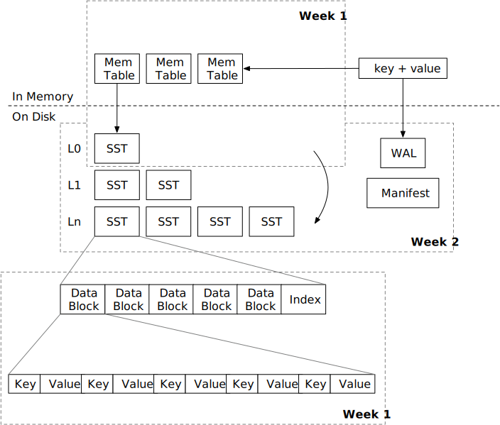

# LSM in a Week

[](https://github.com/skyzh/mini-lsm/actions/workflows/main.yml)

Build a simple key-value storage engine in a week! And extend your LSM engine on the second + third week.

## [Book](https://skyzh.github.io/mini-lsm)

The Mini-LSM book is available at [https://skyzh.github.io/mini-lsm](https://skyzh.github.io/mini-lsm). You may follow this guide and implement the Mini-LSM storage engine. We have 3 weeks (parts) of the course, each of them consists of 7 days (chapters).

## Community

You may join skyzh's Discord server and study with the mini-lsm community.

[](https://skyzh.dev/join/discord)

**Add Your Solution**

If you finished at least one full week of this course, you can add your solution to the community solution list at [SOLUTIONS.md](./SOLUTIONS.md). You can submit a pull request and we might do a quick review of your code in return of your hard work.

## Development

**For Students**

You should modify code in `mini-lsm-starter` directory.

```
cargo x install-tools
cargo x copy-test --week 1 --day 1
cargo x scheck
cargo run --bin mini-lsm-cli
cargo run --bin compaction-simulator
```

**For Course Developers**

You should modify `mini-lsm` and `mini-lsm-mvcc`

```
cargo x install-tools
cargo x check
cargo x book
```

If you changed public API in the reference solution, you might also need to synchronize it to the starter crate.
To do this, use `cargo x sync`.

## Code Structure

* mini-lsm: the final solution code for <= week 2
* mini-lsm-mvcc: the final solution code for week 3 MVCC
* mini-lsm-starter: the starter code
* mini-lsm-book: the course

We have another repo mini-lsm-solution-checkpoint at [https://github.com/skyzh/mini-lsm-solution-checkpoint](https://github.com/skyzh/mini-lsm-solution-checkpoint). In this repo, each commit corresponds to a chapter in the course. We will not update the solution checkpoint very often.

## Demo

You can run the reference solution by yourself to gain an overview of the system before you start.

```
cargo run --bin mini-lsm-cli-ref
cargo run --bin mini-lsm-cli-mvcc-ref
```

And we have a compaction simulator to experiment with your compaction algorithm implementation,

```
cargo run --bin compaction-simulator-ref
cargo run --bin compaction-simulator-mvcc-ref
```

## Course Structure

We have 3 weeks + 1 extra week (in progress) for this course.

* Week 1: Storage Format + Engine Skeleton
* Week 2: Compaction and Persistence
* Week 3: Multi-Version Concurrency Control
* The Extra Week / Rest of Your Life: Optimizations (unlikely to be available in 2025...)



| Week + Chapter | Topic                                                       |
| -------------- | ----------------------------------------------------------- |
| 1.1            | Memtable                                                    |
| 1.2            | Merge Iterator                                              |
| 1.3            | Block                                                       |
| 1.4            | Sorted String Table (SST)                                   |
| 1.5            | Read Path                                                   |
| 1.6            | Write Path                                                  |
| 1.7            | SST Optimizations: Prefix Key Encoding + Bloom Filters      |
| 2.1            | Compaction Implementation                                   |
| 2.2            | Simple Compaction Strategy (Traditional Leveled Compaction) |
| 2.3            | Tiered Compaction Strategy (RocksDB Universal Compaction)   |
| 2.4            | Leveled Compaction Strategy (RocksDB Leveled Compaction)    |
| 2.5            | Manifest                                                    |
| 2.6            | Write-Ahead Log (WAL)                                       |
| 2.7            | Batch Write and Checksums                                   |
| 3.1            | Timestamp Key Encoding                                      |
| 3.2            | Snapshot Read - Memtables and Timestamps                    |
| 3.3            | Snapshot Read - Transaction API                             |
| 3.4            | Watermark and Garbage Collection                            |
| 3.5            | Transactions and Optimistic Concurrency Control             |
| 3.6            | Serializable Snapshot Isolation                             |
| 3.7            | Compaction Filters                                          |

## Related Projects

mini-lsm inspired several projects used in production.

* [SlateDB](https://slatedb.io/docs/architecture/) is an LSM engine over the object storage system.
* [Tonbo](https://tonbo.io/about) stores parquet files directly on the object storage and organizes them in an LSM tree structure.

## License

The Mini-LSM starter code and solution are under [Apache 2.0 license](LICENSE). The author reserves the full copyright of the course materials (markdown files and figures).
