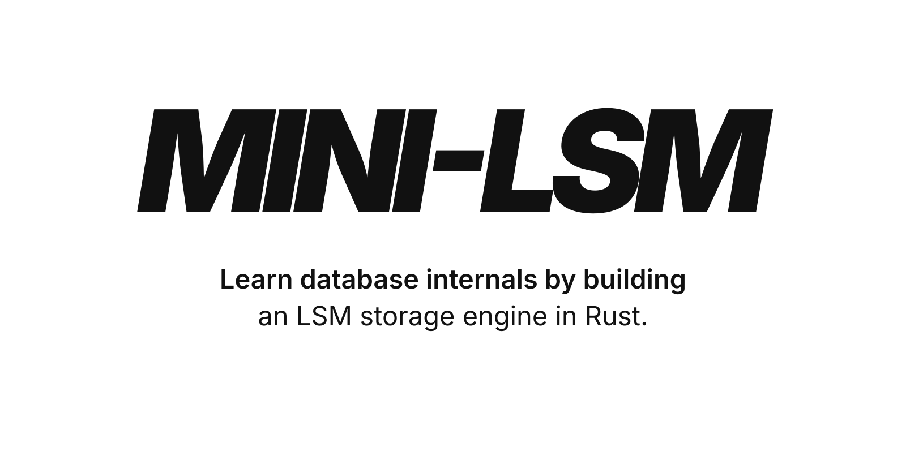
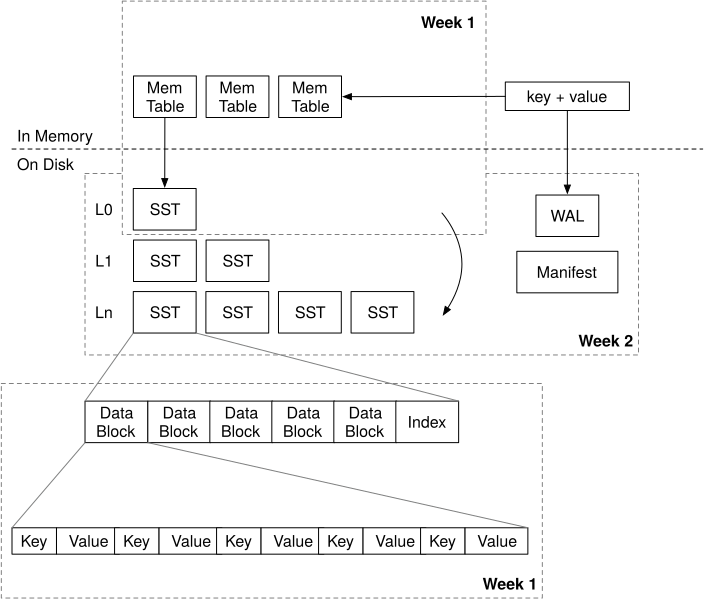

# Mini-LSM: Build a Database Storage Engine in Rust

[](https://github.com/skyzh/mini-lsm/actions/workflows/main.yml)

Mini-LSM is a hands-on course in database internals for systems and backend engineers. Build an LSM-tree storage engine from memtables and SSTs through compaction, crash recovery, MVCC, and transactions.

**[Start the guided three-week course](https://skyzh.github.io/mini-lsm)** · **[Try the coding-agent track](https://skyzh.github.io/mini-lsm/agent-fast-forward-overview.html) (in progress)**

Week 1 produces a working storage engine. Weeks 2 and 3 add production-inspired compaction, durability, concurrency control, and multi-version transactions.

## What You Will Build



By the end of the course, your engine will include:

* an ordered in-memory write buffer and immutable SST files;
* point lookups and range scans over merged memory and disk state;
* multiple compaction strategies and background maintenance;
* a manifest and write-ahead log for crash recovery; and
* snapshots, MVCC garbage collection, optimistic concurrency control, and serializable validation for tracked keys.

Mini-LSM focuses on the storage layer of a database. It does not cover SQL parsing, query optimization, replication, or distributed consensus.

## Choose a Learning Path

| Path | Best for | Format | Status |
| --- | --- | --- | --- |
| [Guided course](https://skyzh.github.io/mini-lsm/00-overview.html) | Learners who want to implement and reason through each subsystem | Three weeks, with seven chapters per week | Complete |
| [Coding-agent track](https://skyzh.github.io/mini-lsm/agent-fast-forward-overview.html) | Learners who want an agent to handle mechanical implementation without outsourcing system design | Three planned days built around decision stops, focused code slices, and adversarial tests | Days 1–2 available |

You need basic Rust, but you do not need prior knowledge of LSM trees, compaction, MVCC, or transaction isolation. The course is a good fit if you have used systems such as PostgreSQL, MySQL, Redis, or RocksDB and want to understand what happens below their APIs.

## Community

You may join skyzh's Discord server and study with the mini-lsm community.

[](https://skyzh.dev/join/discord)

**Add Your Solution**

If you finished at least one full week of this course, you can add your solution to the community solution list at [SOLUTIONS.md](./SOLUTIONS.md) by submitting a pull request.

## Development

**For Students**

You should modify code in `mini-lsm-starter` directory.

```
cargo x install-tools
cargo x copy-test --week 1 --day 1
cargo x scheck
cargo run --bin mini-lsm-cli
cargo run --bin compaction-simulator
```

**For Course Developers**

You should modify `mini-lsm` and `mini-lsm-mvcc`

```
cargo x install-tools
cargo x check
cargo x book
```

If you changed public API in the reference solution, you might also need to synchronize it to the starter crate.
To do this, use `cargo x sync`.

## Code Structure

* mini-lsm: the final solution code for <= week 2
* mini-lsm-mvcc: the final solution code for week 3 MVCC
* mini-lsm-starter: the starter code
* mini-lsm-book: the course

We have another repo mini-lsm-solution-checkpoint at [https://github.com/skyzh/mini-lsm-solution-checkpoint](https://github.com/skyzh/mini-lsm-solution-checkpoint). In this repo, each commit corresponds to a chapter in the course. We will not update the solution checkpoint very often.

## Demo

You can run the reference solution by yourself to gain an overview of the system before you start.

```
cargo run --bin mini-lsm-cli-ref
cargo run --bin mini-lsm-cli-mvcc-ref
```

And we have a compaction simulator to experiment with your compaction algorithm implementation,

```
cargo run --bin compaction-simulator-ref
cargo run --bin compaction-simulator-mvcc-ref
```

## Guided Course Structure

The guided course has three complete weeks and an open-ended collection of future optimizations.

* Week 1: Storage Format + Engine Skeleton
* Week 2: Compaction and Persistence
* Week 3: Multi-Version Concurrency Control
* The Rest of Your Life: Optional optimizations (TBD)

| Week + Chapter | Topic                                                       |
| -------------- | ----------------------------------------------------------- |
| 1.1            | Memtable                                                    |
| 1.2            | Merge Iterator                                              |
| 1.3            | Block                                                       |
| 1.4            | Sorted String Table (SST)                                   |
| 1.5            | Read Path                                                   |
| 1.6            | Write Path                                                  |
| 1.7            | SST Optimizations: Prefix Key Encoding + Bloom Filters      |
| 2.1            | Compaction Implementation                                   |
| 2.2            | Simple Compaction Strategy (Traditional Leveled Compaction) |
| 2.3            | Tiered Compaction Strategy (RocksDB Universal Compaction)   |
| 2.4            | Leveled Compaction Strategy (RocksDB Leveled Compaction)    |
| 2.5            | Manifest                                                    |
| 2.6            | Write-Ahead Log (WAL)                                       |
| 2.7            | Batch Write and Checksums                                   |
| 3.1            | Timestamp Key Encoding                                      |
| 3.2            | Snapshot Read - Memtables and Timestamps                    |
| 3.3            | Snapshot Read - Transaction API                             |
| 3.4            | Watermark and Garbage Collection                            |
| 3.5            | Transactions and Optimistic Concurrency Control             |
| 3.6            | Serializable Snapshot Isolation                             |
| 3.7            | Compaction Filters                                          |

## Related Projects

mini-lsm inspired several projects used in production.

* [SlateDB](https://slatedb.io/docs/design/overview/) is an LSM engine over the object storage system.
* [Tonbo](https://tonbo.io/about) stores parquet files directly on the object storage and organizes them in an LSM tree structure.

## License

The Mini-LSM starter code and solution are under [Apache 2.0 license](LICENSE). The author reserves the full copyright of the course materials (markdown files and figures).
