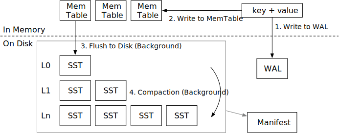
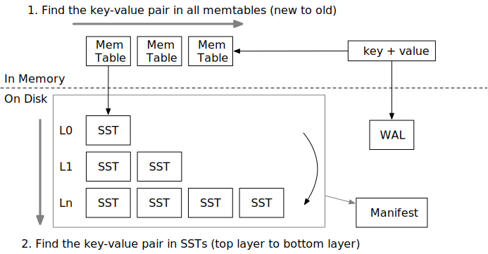

# Mini-LSM Course Overview

## Overview of LSM

An LSM storage engine generally contains 3 parts:

1. Write-ahead log to persist temporary data for recovery.
2. SSTs on the disk for maintaining a tree structure.
3. Mem-tables in memory for batching small writes.

The storage engine generally provides the following interfaces:

* `Put(key, value)`: store a key-value pair in the LSM tree.
* `Delete(key)`: remove a key and its corresponding value.
* `Get(key)`: get the value corresponding to a key.
* `Scan(range)`: get a range of key-value pairs.

To ensure persistence,

* `Sync()`: ensure all the operations before `sync` are persisted to the disk.

Some engines choose to combine `Put` and `Delete` into a single operation called `WriteBatch`, which accepts a batch
of key value pairs.

In this tutorial, we assume the LSM tree is using leveled compaction algorithm, which is commonly used in real-world
systems.

### Write Path

The write path of LSM contains 4 steps:

1. Write the key-value pair to write-ahead log, so that it can be recovered after the storage engine crashes.
2. Write the key-value pair to memtable. After (1) and (2) completes, we can notify the user that the write operation
   is completed.
3. When a memtable is full, we will freeze them into immutable memtables, and will flush them to the disk as SST files in the background.
4. We will compact some files in some level into lower levels to maintain a good shape for the LSM tree, so that read
   amplification is low.

### Read Path

When we want to read a key,

1. We will first probe all the memtables from latest to oldest.
2. If the key is not found, we will then search the entire LSM tree containing SSTs to find the data.

There are two types of read: lookup and scan. Lookup finds one key in the LSM tree, while scan iterates all keys within a range in the storage engine. We will cover both of them throughout the tutorial.

## Tutorial Structure

We have 3 parts (weeks) for this tutorial. In the first week, we will focus on the storage structure and the storage format of an LSM storage engine. In the second week, we will dive into compactions in depth and implement persistence support for the storage engine. In the third week, we will implement multi-version concurrency control.

* [The First Week: Mini-LSM](./week1-overview.md)
* [The Second Week: Compaction and Persistence](./week2-overview.md)
* [The Third Week: Multi-Version Concurrency Control](./week3-overview.md)

To set up the environment, please take a look at [Environment Setup](./00-get-started.md).

{{#include copyright.md}}
