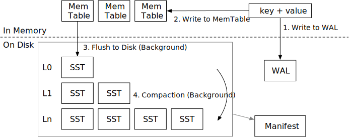
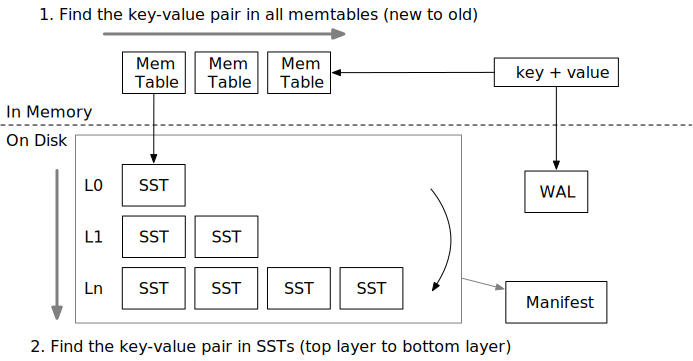
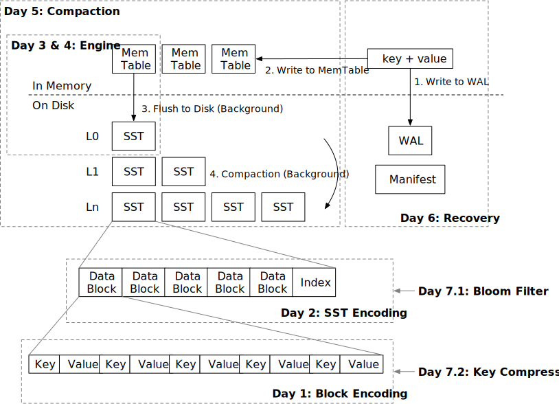

# Overview

In this tutorial, you will learn how to build a simple LSM-Tree storage engine in the Rust programming language.

## What is LSM, and Why LSM?

Log-structured merge tree is a data structure to maintain key-value pairs. This data structure is widely used in
distributed database systems like [TiDB](https://www.pingcap.com) and [CockroachDB](https://www.cockroachlabs.com) as
their underlying storage engine. [RocksDB](http://rocksdb.org), based on [LevelDB](https://github.com/google/leveldb),
is an implementation of LSM-Tree storage engine. It provides a wide range of key-value access functionalities and is
used in a lot of production systems.

Generally speaking, LSM Tree is an append-friendly data structure. It is more intuitive to compare LSM to other
key-value data structure like RB-Tree and B-Tree. For RB-Tree and B-Tree, all data operations are in-place. That is to
say, when you update the value corresponding to the key, the value will be overwritten at its original memory or disk
space. But in an LSM Tree, all write operations, i.e., insertions, updates, deletions, are performed in somewhere else.
These operations will be batched into SST (sorted string table) files and be written to the disk. Once written to the
disk, the file will not be changed. These operations are applied lazily on disk with a special task called compaction.
The compaction job will merge multiple SST files and remove unused data.

This architectural design makes LSM tree easy to work with.

1. Data are immutable on persistent storage, which means that it is easier to offload the background tasks (compaction)
   to remote servers. It is also feasible to directly store and serve data from cloud-native storage systems like S3.
2. An LSM tree can balance between read, write and space amplification by changing the compaction algorithm. The data
   structure itself is super versatile and can be optimized for different workloads.

In this tutorial, we will learn how to build an LSM-Tree-based storage engine in the Rust programming language.

## Overview of LSM

An LSM storage engine generally contains 3 parts:

1. Write-ahead log to persist temporary data for recovery.
2. SSTs on the disk for maintaining a tree structure.
3. Mem-tables in memory for batching small writes.

The storage engine generally provides the following interfaces:

* `Put(key, value)`: store a key-value pair in the LSM tree.
* `Delete(key)`: remove a key and its corresponding value.
* `Get(key)`: get the value corresponding to a key.

To ensure persistence,

* `Sync()`: ensure all the operations before `sync` are persisted to the disk.

Some engines choose to combine `Put` and `Delete` into a single operation called `WriteBatch`, which accepts a batch
of key value pairs.

In this tutorial, we assume the LSM tree is using leveled compaction algorithm, which is commonly used in real-world
systems.

## Write Flow

The write flow of LSM contains 4 steps:

1. Write the key-value pair to write-ahead log, so that it can be recovered after the storage engine crashes.
2. Write the key-value pair to memtable. After (1) and (2) completes, we can notify the user that the write operation
   is completed.
3. When a memtable is full, we will flush it to the disk as an SST file in the background.
4. We will compact some files in some level into lower levels to maintain a good shape for the LSM tree, so that read
   amplification is low.

## Read Flow

When we want to read a key,

1. We will first probe all the memtables from latest to oldest.
2. If the key is not found, we will then search the entire LSM tree containing SSTs to find the data.

## Tutorial Overview

In this tutorial, we will build the LSM tree structure in 7 days:

* Day 1: Block encoding. SSTs are composed of multiple data blocks. We will implement the block encoding.
* Day 2: SST encoding.
* Day 3: Engine. In this day we will get a functional (but not persistent) key-value engine with `get`, `put`, `delete`
  API.
* Day 4: Block cache. To reduce disk I/O and maximize performance, we will use moka-rs to build a block cache for the
  LSM tree.
* Day 5: Compaction. Now it's time to maintain a leveled structure for SSTs.
* Day 6: Recovery. We will implement WAL and manifest so that the engine can recover after restart.
* Day 7: Bloom filter and key compression. They are widely-used optimizations in LSM tree structures.

## Development Guide

We provide you starter code (see `mini-lsm-starter` crate), where we simply replace all function body with
`unimplemented!()`. You can start your project based on this starter code. We provide test cases, but they are very
simple. We recommend you to think carefully about your implementation and write test cases by yourself.

* You can use `cargo x scheck` to run all test cases and do style check in your codebase.
* You can use `cargo x copy-test dayX` to copy test cases to the starter code.

## About the Author

As of writing (at the end of 2022), Chi is a first-year master's student in Carnegie Mellon University. He has 5 years'
experience with the Rust programming language since 2018. He has been working on a variety of database systems including
[TiKV][db1], [AgateDB][db2], [TerarkDB][db3], [RisingLight][db4], and [RisingWave][db5]. In his first semester in CMU,
he worked as a teaching assistant for CMU's [15-445/645 Intro to Database Systems][15445-course] course, where
he built a new SQL processing layer for the BusTub educational database system, added more query optimization stuff into
the course, and made the course [more challenging than ever before][tweet]. Chi is interested in exploring how the Rust
programming language can fit in the database world. Check out his [previous tutorial](type-exercise) on building a
vectorized expression framework if you are also interested in that topic.

[db1]: https://github.com/tikv/tikv
[db2]: https://github.com/tikv/agatedb
[db3]: https://github.com/bytedance/terarkdb
[db4]: https://github.com/risinglightdb/risinglight
[db5]: https://github.com/risingwavelabs/risingwave
[15445-course]: https://15445.courses.cs.cmu.edu/fall2022/
[tweet]: https://twitter.com/andy_pavlo/status/1598137241016360961
[type-exercise]: https://github.com/skyzh/type-exercise-in-rust
