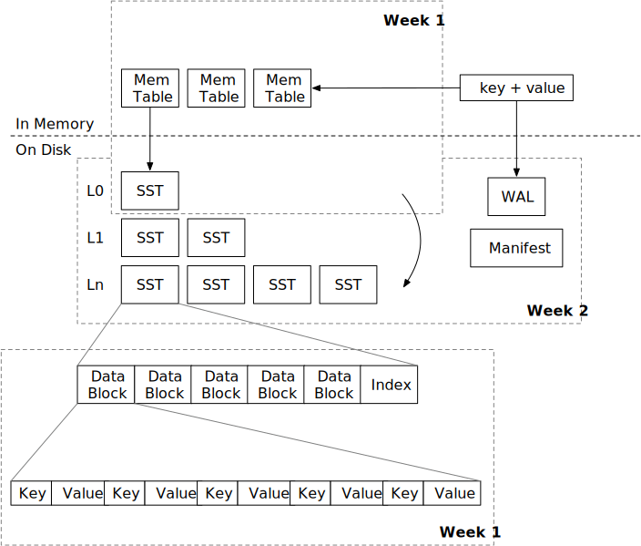
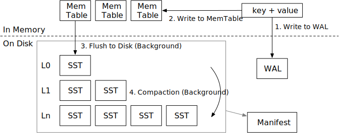
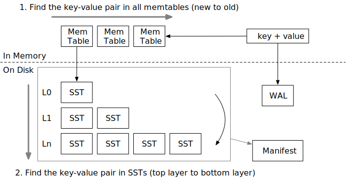

<!--
  mini-lsm-book © 2022-2025 by Alex Chi Z is licensed under CC BY-NC-SA 4.0
-->

# Mini-LSM Course Overview

## Course Structure

This course has three parts, or weeks. In the first week, you will focus on the structure and storage format of an LSM storage engine. In the second week, you will explore compaction in depth and add persistence to the storage engine. In the third week, you will implement multiversion concurrency control (MVCC).

* [The First Week: Mini-LSM](./week1-overview.md)
* [The Second Week: Compaction and Persistence](./week2-overview.md)
* [The Third Week: Multi-Version Concurrency Control](./week3-overview.md)

Follow [Environment Setup](./00-get-started.md) to prepare your development environment.

## Overview of LSM

An LSM storage engine generally has three components:

1. A write-ahead log that persists recent data for recovery.
2. SSTs on disk that form the LSM-tree structure.
3. Memtables in memory that batch small writes.

The storage engine generally provides the following interfaces:

* `Put(key, value)`: Stores a key-value pair in the LSM tree.
* `Delete(key)`: Removes a key and its corresponding value.
* `Get(key)`: Retrieves the value associated with a key.
* `Scan(range)`: Retrieves a range of key-value pairs.

It may also provide an operation that establishes a persistence boundary:

* `Sync()`: Ensures that all preceding operations have been persisted to disk.

Some engines combine `Put` and `Delete` into a single operation called `WriteBatch`, which accepts a batch of updates.

The overview diagrams assume a leveled compaction layout, which is common in production systems. In Week 2, you will implement and compare several compaction strategies.

### Write Path

The LSM write path has four steps:

1. Write the key-value pair to the write-ahead log so that it can be recovered after a crash.
2. Write the key-value pair to the mutable memtable. After steps 1 and 2 are complete, the engine can report that the write has completed.
3. In the background, freeze a full mutable memtable, making it immutable, and flush it to disk as an SST file.
4. Also in the background, compact files from one or more levels into lower levels. This maintains the shape of the LSM tree and limits read amplification.

### Read Path

To read a key, the engine:

1. Probes the memtables from newest to oldest.
2. If the memtables do not determine the result, searches the SSTs in the LSM tree.

There are two types of reads: lookups and scans. A lookup finds one key in the LSM tree, whereas a scan iterates over all keys within a range. The course covers both.

{{#include copyright.md}}
