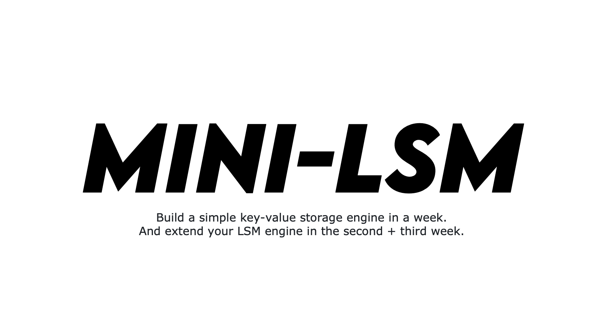

<!--
  mini-lsm-book © 2022-2025 by Alex Chi Z is licensed under CC BY-NC-SA 4.0
-->

# Preface

This course teaches you how to build a simple LSM-Tree storage engine in Rust.

## What is LSM, and Why LSM?

Log-structured merge trees are data structures that maintain key-value pairs. This data structure is widely used in
distributed database systems like [TiDB](https://www.pingcap.com) and [CockroachDB](https://www.cockroachlabs.com) as
their underlying storage engine. [RocksDB](http://rocksdb.org), based on [LevelDB](https://github.com/google/leveldb),
is an implementation of LSM-Tree storage engines. It provides many key-value access functionalities and is
used in many production systems.

Generally speaking, LSM Tree is an append-friendly data structure. It is more intuitive to compare LSM to other
key-value data structures like RB-Tree and B-Tree. For RB-Tree and B-Tree, all data operations are in place. That is to
say, when you want to update the value corresponding to the key, the engine will overwrite its original memory or disk
space with the new value. But in an LSM Tree, all write operations, i.e., insertions, updates, deletions, are lazily applied to the storage.
The engine batches these operations into SST (sorted string table) files and writes them to the disk. Once written to the
disk, the engine will not directly modify them. In a particular background task called compaction, the engine will merge these files to apply the updates and deletions.

This architectural design makes LSM trees easy to work with.

1. Data are immutable on persistent storage. Concurrency control is more straightforward. Offloading the background tasks (compaction) to remote servers is possible. Storing and serving data directly from cloud-native storage systems like S3 is also feasible.
2. Changing the compaction algorithm allows the storage engine to balance between read, write, and space amplification. The data structure is versatile, and by adjusting the compaction parameters, we can optimize the LSM structure for different workloads.

This course will teach you how to build an LSM-tree-based storage engine in the Rust programming language.

## Prerequisites

* You should know the basics of the Rust programming language. Reading [the Rust book](https://doc.rust-lang.org/book/) is enough.
* You should know the basic concepts of key-value storage engines, i.e., why we need a complex design to achieve persistence. If you have no experience with database systems and storage systems before, you can implement Bitcask in [PingCAP Talent Plan](https://github.com/pingcap/talent-plan/tree/master/courses/rust/projects/project-2).
* Knowing the basics of an LSM tree is not a requirement, but we recommend you read something about it, e.g., the overall idea of LevelDB. Knowing them beforehand would familiarize you with concepts like mutable and immutable mem-tables, SST, compaction, WAL, etc.

## What should you expect from this course

After taking this course, you should deeply understand how an LSM-based storage system works, gain hands-on experience in designing such systems, and apply what you have learned in your study and career. You will understand the design tradeoffs in such storage systems and find optimal ways to design an LSM-based storage system to meet your workload requirements/goals. This very in-depth course covers all the essential implementation details and design choices of modern storage systems (i.e., RocksDB) based on the author's experience in several LSM-like storage systems, and you will be able to directly apply what you have learned in both industry and academia.

### Structure

The course is an extensive course with several parts (weeks). Each week has seven chapters; you can finish each within 2 to 3 hours. The first six chapters of each part will instruct you to build a working system, and the last chapter of each week will be a *snack time* chapter that implements some easy things over what you have built in the previous six days. Each chapter will have required tasks, *check your understanding* questions, and bonus tasks.

### Testing

We provide a full test suite and some CLI tools for you to validate if your solution is correct. Note that the test suite is not exhaustive, and your solution might not be 100% correct after passing all test cases. You might need to fix earlier bugs when implementing later parts of the system. We recommend you think thoroughly about your implementation, especially when there are multi-thread operations and race conditions.

### Solution

We have a solution that implements all the functionalities as required in the course in the mini-lsm main repo. At the same time, we also have a mini-lsm solution checkpoint repo where each commit corresponds to a chapter in the course. 

Keeping such a checkpoint repo up-to-date with the mini-lsm course is challenging because each bug fix or new feature must go through all commits (or checkpoints). Therefore, this repo might not use the latest starter code or incorporate the latest features from the mini-lsm course.

**TL;DR: We do not guarantee the solution checkpoint repo contains a correct solution, passes all tests, or has the correct doc comments.** For a correct implementation and the solution after implementing everything, please look at the solution in the main repo instead. [https://github.com/skyzh/mini-lsm/tree/main/mini-lsm](https://github.com/skyzh/mini-lsm/tree/main/mini-lsm).

If you are stuck at some part of the course or need help determining where to implement functionality, you can refer to this repo for help. You may compare the diff between commits to know what has been changed. You might need to modify some functions in the mini-lsm course multiple times throughout the chapters, and you can understand what exactly is expected to be implemented for each chapter in this repo.

You may access the solution checkpoint repo at [https://github.com/skyzh/mini-lsm-solution-checkpoint](https://github.com/skyzh/mini-lsm-solution-checkpoint).

### Feedbacks

Your feedback is greatly appreciated. We have rewritten the whole course from scratch in 2024 based on the feedback from the students. Please share your learning experience and help us continuously improve the course. Welcome to the [Discord community](https://skyzh.dev/join/discord) and share your experience.

The long story of why we rewrote it: The course was originally planned as a general guidance that students start from an empty directory and implement whatever they want based on the specifications we had. We had minimal tests that checked if the behavior was correct. However, the original course was too open-ended, which caused huge obstacles to the learning experience. As students do not have an overview of the whole system beforehand and the instructions are vague, sometimes it is hard for them to know why a design decision is made and what they need to achieve a goal. Some parts of the course were so compact that delivering the expected contents within just one chapter was impossible. Therefore, we completely redesigned the course for an easier learning curve and clearer learning goals. The original one-week course is now split into two weeks (the first week on storage format and the second week on deep-dive compaction), with an extra part on MVCC. We hope you find this course interesting and helpful in your study and career. We want to thank everyone who commented in [Feedback after coding day 1](https://github.com/skyzh/mini-lsm/issues/11) and [Hello, when is the next update plan for the course?](https://github.com/skyzh/mini-lsm/issues/7) -- Your feedback greatly helped us improve the course.

### License

The source code of this course is licensed under Apache 2.0, while the book is licensed under CC BY-NC-SA 4.0.

### Will this course be free forever?

Yes! Everything publicly available now will be free forever and receive lifetime updates and bug fixes. Meanwhile, we might provide paid code review and office hour services. For the DLC part (*rest of your life* chapters), we do not have plans to finish them as of 2024 and have yet to decide whether they will be publicly available.

## Community

You may join skyzh's Discord server and study with the mini-lsm community.

## Get Started

Now, you can get an overview of the LSM structure in [Mini-LSM Course Overview](./00-overview.md).

## About the Author

As of writing (at the beginning of 2024), Chi obtained his master's degree in Computer Science from Carnegie Mellon University and his bachelor's degree from Shanghai Jiao Tong University. He has been working on a variety of database systems, including [TiKV][db1], [AgateDB][db2], [TerarkDB][db3], [RisingWave][db4], and [Neon][db5]. Since 2022, he has worked as a teaching assistant for [CMU's Database Systems course](https://15445.courses.cs.cmu) for three semesters on the BusTub educational system, where he added a lot of new features and more challenges to the course (check out the redesigned [query execution](https://15445.courses.cs.cmu.edu/fall2022/project3/) project and the super challenging [multi-version concurrency control](https://15445.courses.cs.cmu.edu/fall2023/project4/) project). Besides working on the BusTub educational system, he also maintains the [RisingLight](https://github.com/risinglightdb/risinglight) educational database system. Chi is interested in exploring how the Rust programming language can fit into the database world. Check out his previous course on building a vectorized expression framework [type-exercise-in-rust](https://github.com/skyzh/type-exercise-in-rust) and on building a vector database [write-you-a-vector-db](https://github.com/skyzh/write-you-a-vector-db) if you are also interested in that topic.

[db1]: https://github.com/tikv/tikv
[db2]: https://github.com/tikv/agatedb
[db3]: https://github.com/bytedance/terarkdb
[db4]: https://github.com/risingwavelabs/risingwave
[db5]: https://github.com/neondatabase/neon

{{#include copyright.md}}
