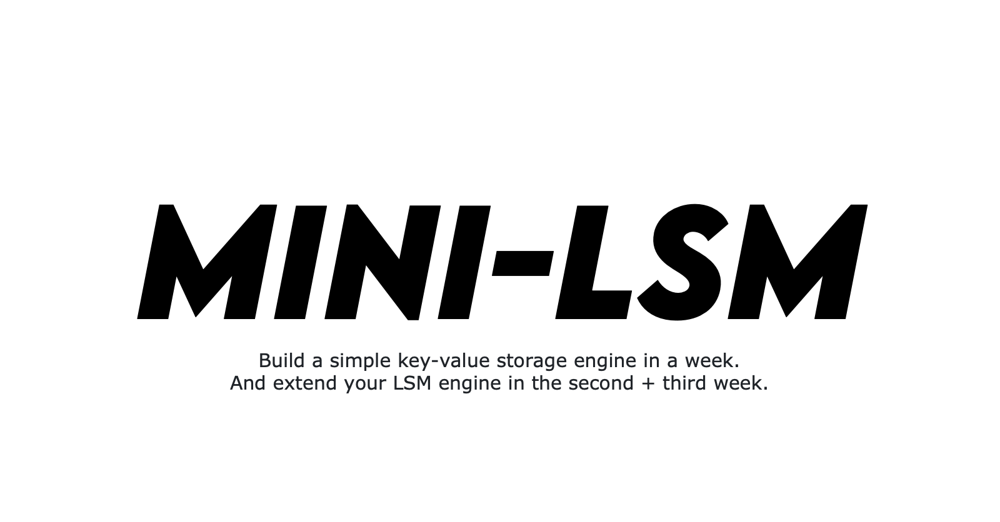

<!--
  mini-lsm-book © 2022-2026 by Alex Chi Z is licensed under CC BY-NC-SA 4.0
-->

# Preface

This course teaches you how to build a simple LSM-tree storage engine in Rust.

## What Is an LSM Tree, and Why Use One?

Log-structured merge trees are data structures for maintaining key-value pairs. They are widely used as the underlying
storage engines in distributed database systems such as [TiDB](https://www.pingcap.com) and
[CockroachDB](https://www.cockroachlabs.com). [RocksDB](http://rocksdb.org), which is based on
[LevelDB](https://github.com/google/leveldb), is an LSM-tree storage engine that provides a rich key-value interface and
is used in many production systems.

Generally speaking, an LSM tree is an append-friendly data structure. It is easiest to understand by comparing it with
other key-value data structures, such as red-black trees and B-trees. In those structures, updates happen in place: when
you update the value associated with a key, the engine overwrites the value in its original memory or disk location. In
an LSM tree, however, writes—including insertions, updates, and deletions—are applied to persistent storage lazily. The
engine batches these operations into sorted-string table (SST) files and writes them to disk. Once written, SST files are
immutable. A background process called compaction merges these files and applies their updates and deletions.

This architectural design makes LSM trees easy to work with.

1. Data on persistent storage is immutable, which makes concurrency control more straightforward. Compaction can be offloaded to remote servers, and data can be stored and served directly from cloud-native storage systems such as S3.
2. Changing the compaction algorithm lets the storage engine balance read, write, and space amplification. By tuning compaction parameters, we can optimize the LSM tree for different workloads.

This course will teach you how to build an LSM-tree-based storage engine in the Rust programming language.

## Prerequisites

* You should know the basics of the Rust programming language. Reading [The Rust Programming Language](https://doc.rust-lang.org/book/) is sufficient.
* You should understand the basic concepts behind key-value storage engines, including why persistence requires a more complex design. If you have no prior experience with database or storage systems, consider implementing Bitcask through the [PingCAP Talent Plan](https://github.com/pingcap/talent-plan/tree/master/courses/rust/projects/project-2).
* You do not need to know how an LSM tree works, but we recommend reading an introduction, such as an overview of LevelDB. This background will familiarize you with concepts such as mutable and immutable memtables, SSTs, compaction, and write-ahead logs (WALs).

## What Should You Expect from This Course?

After completing this course, you should have a deep understanding of how an LSM-based storage system works and hands-on experience designing one. You will learn the tradeoffs involved and how to choose a design that meets the requirements of a particular workload. Drawing on the author's experience with several LSM-based systems, the course covers the essential implementation details and design choices found in modern storage systems such as RocksDB. You can apply what you learn in both industry and academia.

### Structure

The course consists of several parts, or weeks. Each week has seven chapters, and you can complete each chapter in two to three hours. The first six chapters of each week guide you through building a working system. The final chapter is a *snack time* chapter in which you implement a few approachable improvements to what you built over the previous six days. Each chapter includes required tasks, *Test Your Understanding* questions, and bonus tasks.

### Testing

We provide a comprehensive test suite and several command-line tools to help you validate your solution. The test suite is not exhaustive, so passing every test does not guarantee that your solution is completely correct. You might need to fix earlier bugs while implementing later parts of the system. Think carefully about your implementation, especially when it involves multithreaded operations and potential race conditions.

### Solution

The main Mini-LSM repository contains a reference solution that implements all functionality required by the course. We also maintain a solution-checkpoint repository in which each commit corresponds to a chapter.

Keeping the checkpoint repository synchronized with the Mini-LSM course is challenging because every bug fix or new feature must be applied to every relevant commit. Consequently, this repository might not use the latest starter code or include the course's latest features.

**TL;DR: We do not guarantee that the solution-checkpoint repository contains a correct solution, passes every test, or has accurate documentation comments.** For the complete reference implementation, see the [`mini-lsm` crate in the main repository](https://github.com/skyzh/mini-lsm/tree/main/mini-lsm).

If you get stuck or need help determining where to implement functionality, you can consult the checkpoint repository. Compare adjacent commits to see what changed in each chapter. Because you will modify some functions several times during the course, these diffs can clarify exactly what each chapter expects you to implement.

You may access the solution checkpoint repo at [https://github.com/skyzh/mini-lsm-solution-checkpoint](https://github.com/skyzh/mini-lsm-solution-checkpoint).

### Feedback

Your feedback is greatly appreciated. In 2024, we rewrote the entire course from scratch in response to student feedback. Please share your learning experience and help us continue improving the course in the [Discord community](https://skyzh.dev/join/discord).

Here is the longer story behind the rewrite. The original course offered general guidance: students started with an empty directory and implemented their own designs from our specifications. A minimal test suite checked the resulting behavior. This approach proved too open-ended and created significant obstacles to learning. Without an overview of the complete system—and with instructions that were sometimes vague—students found it difficult to understand why a design decision was made or what they needed to accomplish. Some sections were also too dense to fit comfortably into a single chapter.

We therefore redesigned the course to provide a gentler learning curve and clearer goals. The original one-week course is now split into two weeks: the first covers storage formats, and the second takes a deep dive into compaction. A third part covers MVCC. We hope you find the course interesting and useful in your studies and career. We thank everyone who commented on [Feedback after coding day 1](https://github.com/skyzh/mini-lsm/issues/11) and [Hello, when is the next update plan for the course?](https://github.com/skyzh/mini-lsm/issues/7)—your feedback greatly helped us improve the course.

### License

The source code of this course is licensed under Apache 2.0, while the book is licensed under CC BY-NC-SA 4.0.

### Will this course be free forever?

Yes! Everything that is publicly available now will remain free and receive ongoing updates and bug fixes. We might also provide paid code-review and office-hours services. As of 2024, we had no plans to finish the downloadable-content portion (the *rest of your life* chapters) and had not decided whether it would be publicly available.

## Community

You may join skyzh's Discord server and study with the mini-lsm community.

## Get Started

Next, read the [Mini-LSM Course Overview](./00-overview.md) for an introduction to the LSM structure.

## About the Author

At the time of writing in early 2024, Chi held a master's degree in computer science from Carnegie Mellon University and a bachelor's degree from Shanghai Jiao Tong University. He had worked on several database systems, including [TiKV][db1], [AgateDB][db2], [TerarkDB][db3], [RisingWave][db4], and [Neon][db5]. Beginning in 2022, he served for three semesters as a teaching assistant for [CMU's Database Systems course](https://15445.courses.cs.cmu), working on the BusTub educational system. There, he added new features and challenges to the course, including the redesigned [query execution](https://15445.courses.cs.cmu.edu/fall2022/project3/) project and the demanding [multi-version concurrency control](https://15445.courses.cs.cmu.edu/fall2023/project4/) project. He also maintains the [RisingLight](https://github.com/risinglightdb/risinglight) educational database system. Chi is interested in exploring Rust's role in the database world. If you share that interest, see his earlier courses on building a vectorized expression framework, [type-exercise-in-rust](https://github.com/skyzh/type-exercise-in-rust), and a vector database, [write-you-a-vector-db](https://github.com/skyzh/write-you-a-vector-db).

[db1]: https://github.com/tikv/tikv
[db2]: https://github.com/tikv/agatedb
[db3]: https://github.com/bytedance/terarkdb
[db4]: https://github.com/risingwavelabs/risingwave
[db5]: https://github.com/neondatabase/neon

{{#include copyright.md}}
