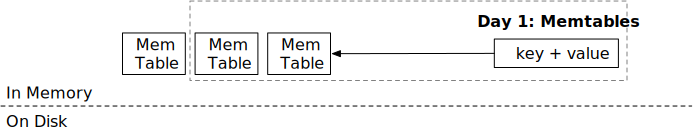
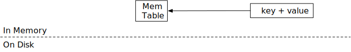
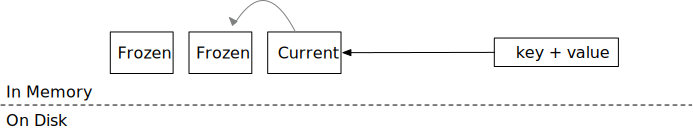

<!--
  mini-lsm-book © 2022-2025 by Alex Chi Z is licensed under CC BY-NC-SA 4.0
-->

# Memtables



In this chapter, you will:

* Implement memtables based on skiplists.
* Implement freezing memtable logic.
* Implement LSM read path `get` for memtables.

To copy the test cases into the starter code and run them,

```
cargo x copy-test --week 1 --day 1
cargo x scheck
```

## Task 1: SkipList Memtable

In this task, you will need to modify:

```
src/mem_table.rs
```

Firstly, let us implement the in-memory structure of an LSM storage engine -- the memtable. We choose [crossbeam's skiplist implementation](https://docs.rs/crossbeam-skiplist/latest/crossbeam_skiplist/) as the data structure of the memtable as it supports lock-free concurrent read and write. We will not cover in-depth how a skiplist works, and in a nutshell, it is an ordered key-value map that easily allows concurrent read and write.

crossbeam-skiplist provides similar interfaces to the Rust std's `BTreeMap`: insert, get, and iter. The only difference is that the modification interfaces (i.e., `insert`) only require an immutable reference to the skiplist, instead of a mutable one. Therefore, in your implementation, you should not take any mutex when implementing the memtable structure.

You will also notice that the `MemTable` structure does not have a `delete` interface. In the mini-lsm implementation, deletion is represented as a key corresponding to an empty value.

In this task, you will need to implement `MemTable::get` and `MemTable::put` to enable modifications of the memtable. Note that `put` should always overwrite a key if it already exists. You won't have multiple entries of the same key in a single memtable.

We use the `bytes` crate for storing the data in the memtable. `bytes::Byte` is similar to `Arc<[u8]>`. When you clone the `Bytes`, or get a slice of `Bytes`, the underlying data will not be copied, and therefore cloning it is cheap. Instead, it simply creates a new reference to the storage area and the storage area will be freed when there are no reference to that area.

## Task 2: A Single Memtable in the Engine

In this task, you will need to modify:

```
src/lsm_storage.rs
```

Now, we will add our first data structure, the memtable, to the LSM state. In `LsmStorageState::create`, you will find that when a LSM structure is created, we will initialize a memtable of id 0. This is the **mutable memtable** in the initial state. At any point of the time, the engine will have only one single mutable memtable. A memtable usually has a size limit (i.e., 256MB), and it will be frozen to an immutable memtable when it reaches the size limit.

Taking a look at `lsm_storage.rs`, you will find there are two structures that represents a storage engine: `MiniLSM` and `LsmStorageInner`. `MiniLSM` is a thin wrapper for `LsmStorageInner`. You will implement most of the functionalities in `LsmStorageInner`, until week 2 compaction.

`LsmStorageState` stores the current structure of the LSM storage engine. For now, we will only use the `memtable` field, which stores the current mutable memtable. In this task, you will need to implement `LsmStorageInner::get`, `LsmStorageInner::put`, and `LsmStorageInner::delete`. All of them should directly dispatch the request to the current memtable.



Your `delete` implementation should simply put an empty slice for that key, and we call it a *delete tombstone*. Your `get` implementation should handle this case correspondingly.

To access the memtable, you will need to take the `state` lock. As our memtable implementation only requires an immutable reference for `put`, you ONLY need to take the read lock on `state` in order to modify the memtable. This allows concurrent access to the memtable from multiple threads.

## Task 3: Write Path - Freezing a Memtable

In this task, you will need to modify:

```
src/lsm_storage.rs
src/mem_table.rs
```



A memtable cannot continuously grow in size, and we will need to freeze them (and later flush to the disk) when it reaches the size limit. You may find the memtable size limit, which is **equal to the SST size limit** (not `num_memtables_limit`), in the `LsmStorageOptions`. This is not a hard limit and you should freeze the memtable at best effort.

In this task, you will need to compute the approximate memtable size when put/delete a key in the memtable. This can be computed by simply adding the total number of bytes of keys and values when `put` is called. If a key is put twice, though the skiplist only contains the latest value, you may count it twice in the approximate memtable size. Once a memtable reaches the limit, you should call `force_freeze_memtable` to freeze the memtable and create a new one.

The `state: Arc<RwLock<Arc<LsmStorageState>>>` field in `LsmStorageInner` is structured this way to manage the LSM tree's overall state concurrently and safely, primarily using a Copy-on-Write (CoW) strategy:

1. Inner `Arc<LsmStorageState>`: This holds an **immutable snapshot** of the actual `LsmStorageState` (which contains memtable lists, SST references, etc.). Cloning this `Arc` is very cheap (just an atomic reference count increment) and gives any reader a consistent, unchanging view of the state for the duration of their operation.

2. `RwLock<Arc<LsmStorageState>>`: This read-write lock protects the *pointer* to the current `Arc<LsmStorageState>` (the active snapshot).
    * **Readers** acquire a read lock, clone the `Arc<LsmStorageState>` (getting their own reference to the current snapshot), and then quickly release the read lock. They can then work with their snapshot without further locking.
    * **Writers** (when modifying the state, e.g., freezing a memtable) will:
        * Create a *new* `LsmStorageState` instance, often by cloning the data from the current snapshot and then applying modifications.
        * Wrap this new state in a new `Arc<LsmStorageState>`.
        * Acquire the write lock on the `RwLock`.
        * Replace the old `Arc<LsmStorageState>` with the new one.
        * Release the write lock.

3. Outer `Arc<RwLock<...>>`: This allows the `RwLock` itself (and thus the mechanism for accessing and updating the state) to be shared safely across multiple threads or parts of your application that might need to interact with `LsmStorageInner`.

This CoW approach ensures that readers always see a valid, consistent state snapshot and experience minimal blocking. Writers update the state atomically by swapping out the entire state snapshot, reducing the time critical locks are held and thus improving concurrency.

Because there could be multiple threads getting data into the storage engine, `force_freeze_memtable` might be called concurrently from multiple threads. You will need to think about how to avoid race conditions in this case.

There are multiple places where you may want to modify the LSM state: freeze a mutable memtable, flush memtable to SST, and GC/compaction. During all of these modifications, there could be I/O operations. An intuitive way to structure the locking strategy is to:

```rust,no_run
fn freeze_memtable(&self) {
    let state = self.state.write();
    state.immutable_memtable.push(/* something */);
    state.memtable = MemTable::create();
}
```

...that you modify everything in LSM state's write lock.

This works fine for now. However, consider the case where you want to create a write-ahead log file for every memtables you have created.

```rust,no_run
fn freeze_memtable(&self) {
    let state = self.state.write();
    state.immutable_memtable.push(/* something */);
    state.memtable = MemTable::create_with_wal()?; // <- could take several milliseconds
}
```

Now when we freeze the memtable, no other threads could have access to the LSM state for several milliseconds, which creates a spike of latency.

To solve this problem, we can put I/O operations outside of the lock region.

```rust,no_run
fn freeze_memtable(&self) {
    let memtable = MemTable::create_with_wal()?; // <- could take several milliseconds
    {
        let state = self.state.write();
        state.immutable_memtable.push(/* something */);
        state.memtable = memtable;
    }
}
```

Then, we do not have costly operations within the state write lock region. Now, consider the case that the memtable is about to reach the capacity limit and two threads successfully put two keys into the memtable, both of them discovering the memtable reaches capacity limit after putting the two keys. They will both do a size check on the memtable and decide to freeze it. In this case, we might create one empty memtable which is then immediately frozen.

To solve the problem, all state modification should be synchronized through the state lock.

```rust,no_run
fn put(&self, key: &[u8], value: &[u8]) {
    // put things into the memtable, checks capacity, and drop the read lock on LSM state
    if memtable_reaches_capacity_on_put {
        let state_lock = self.state_lock.lock();
        if /* check again current memtable reaches capacity */ {
            self.freeze_memtable(&state_lock)?;
        }
    }
}
```

You will notice this kind of pattern very often in future chapters. For example, for L0 flush,

```rust,no_run
fn force_flush_next_imm_memtable(&self) {
    let state_lock = self.state_lock.lock();
    // get the oldest memtable and drop the read lock on LSM state
    // write the contents to the disk
    // get the write lock on LSM state and update the state
}
```

This ensures only one thread will be able to modify the LSM state while still allowing concurrent access to the LSM storage.

In this task, you will need to modify `put` and `delete` to respect the soft capacity limit on the memtable. When it reaches the limit, call `force_freeze_memtable` to freeze the memtable. Note that we do not have test cases over this concurrent scenario, and you will need to think about all possible race conditions on your own. Also, remember to check lock regions to ensure the critical sections are the minimum required.

You can simply assign the next memtable id as `self.next_sst_id()`. Note that the `imm_memtables` stores the memtables from the latest one to the earliest one. That is to say, `imm_memtables.first()` should be the last frozen memtable.

## Task 4: Read Path - Get

In this task, you will need to modify:

```
src/lsm_storage.rs
```

Now that you have multiple memtables, you may modify your read path `get` function to get the latest version of a key. Ensure that you probe the memtables from the latest one to the earliest one.

## Test Your Understanding

* Why doesn't the memtable provide a `delete` API?
* Does it make sense for the memtable to store all write operations instead of only the latest version of a key? For example, the user puts a->1, a->2, and a->3 into the same memtable.
* Is it possible to use other data structures as the memtable in LSM? What are the pros/cons of using the skiplist?
* Why do we need a combination of `state` and `state_lock`? Can we only use `state.read()` and `state.write()`?
* Why does the order to store and to probe the memtables matter? If a key appears in multiple memtables, which version should you return to the user?
* Is the memory layout of the memtable efficient / does it have good data locality? (Think of how `Byte` is implemented and stored in the skiplist...) What are the possible optimizations to make the memtable more efficient?
* So we are using `parking_lot` locks in this course. Is its read-write lock a fair lock? What might happen to the readers trying to acquire the lock if there is one writer waiting for existing readers to stop?
* After freezing the memtable, is it possible that some threads still hold the old LSM state and wrote into these immutable memtables? How does your solution prevent it from happening?
* There are several places that you might first acquire a read lock on state, then drop it and acquire a write lock (these two operations might be in different functions but they happened sequentially due to one function calls the other). How does it differ from directly upgrading the read lock to a write lock? Is it necessary to upgrade instead of acquiring and dropping and what is the cost of doing the upgrade?

We do not provide reference answers to the questions, and feel free to discuss about them in the Discord community.

## Bonus Tasks

* **More Memtable Formats.** You may implement other memtable formats. For example, BTree memtable, vector memtable, and ART memtable.

{{#include copyright.md}}
