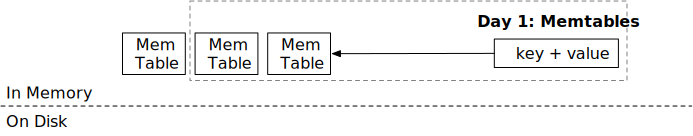
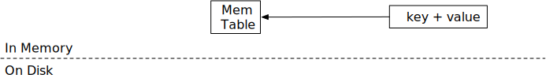

<!--
  mini-lsm-book © 2022-2025 by Alex Chi Z is licensed under CC BY-NC-SA 4.0
-->

# Memtables



By the end of this chapter, you will be able to:

* Implement memtables based on skiplists.
* Implement the logic for freezing memtables.
* Implement the memtable portion of the LSM `get` read path.
* Explain how snapshot ordering, tombstones, and the two state locks preserve correct point reads during concurrent writes.

To copy the test cases into the starter code and run them:

```
cargo x copy-test --week 1 --day 1
cargo x scheck
```

## Before You Begin

The starter engine exposes `get`, `put`, and `delete`, but it does not yet have a functioning storage structure. This chapter introduces its first source of truth: one mutable memtable, followed by zero or more immutable memtables awaiting a flush.

Keep these invariants in mind while implementing the tasks:

1. The engine has exactly one current mutable memtable.
2. `imm_memtables` is ordered from newest to oldest.
3. The first version of a key found while probing from newest to oldest determines the result. An empty value is a tombstone and therefore determines that the key is absent; the search must not continue to an older value.
4. Structural changes such as replacing the mutable memtable are serialized, even though reads and writes within a memtable can proceed concurrently.

> **Predict before coding:** Suppose the mutable memtable contains `a -> delete`, the newest immutable memtable contains `a -> 2`, and the oldest contains `a -> 1`. What should `get(a)` return? Which result would you get if you probed the memtables in the opposite order?

## Task 1: SkipList Memtable

In this task, you will need to modify:

```
src/mem_table.rs
```

First, let us implement the in-memory structure of an LSM storage engine: the memtable. We use [crossbeam-skiplist](https://docs.rs/crossbeam-skiplist/latest/crossbeam_skiplist/) because it supports lock-free concurrent reads and writes. We will not explore skiplists in depth. For this course, you can think of a skiplist as an ordered key-value map that supports concurrent access efficiently.

`crossbeam-skiplist` provides methods similar to those on the Rust standard library's `BTreeMap`, including `insert`, `get`, and `iter`. The important difference is that mutating methods such as `insert` require only an immutable reference to the skiplist, rather than a mutable one. Your memtable implementation therefore does not need an additional mutex.

You will also notice that `MemTable` does not have a `delete` method. In Mini-LSM, a key associated with an empty value represents a deletion.

In this task, implement `MemTable::get` and `MemTable::put`. The `put` method should overwrite an existing entry with the same key, so a single memtable never contains multiple entries for one key.

We use the `bytes` crate to store data in the memtable. `bytes::Bytes` is similar to `Arc<[u8]>`: cloning or slicing a `Bytes` value does not copy its underlying data, so both operations are inexpensive. Instead, each operation creates another reference to the same storage, which is freed when no references remain.

## Task 2: A Single Memtable in the Engine

In this task, you will need to modify:

```
src/lsm_storage.rs
```

Now, add the memtable to the LSM state. `LsmStorageState::create` initializes memtable 0, which is the initial **mutable memtable**. At any point in time, the engine has exactly one mutable memtable. A memtable usually has a size limit—for example, 256 MB—and is frozen into an immutable memtable when it reaches that limit.

In `lsm_storage.rs`, two structs represent the storage engine: `MiniLsm` and `LsmStorageInner`. `MiniLsm` is a thin wrapper around `LsmStorageInner`. Until you begin implementing compaction in Week 2, you will add most functionality to `LsmStorageInner`.

`LsmStorageState` describes the current structure of the LSM storage engine. For now, you will use only its `memtable` field, which stores the current mutable memtable. Implement `LsmStorageInner::get`, `LsmStorageInner::put`, and `LsmStorageInner::delete`, dispatching each request directly to that memtable.



Your `delete` implementation should store an empty slice for the key. This entry is called a *deletion tombstone*. Your `get` implementation should recognize the tombstone and report that the key does not exist.

To access the memtable, acquire the `state` lock. Because `MemTable::put` requires only an immutable reference, you need only a read lock on `state`, even when writing to the memtable. This design allows multiple threads to access the memtable concurrently.

## Task 3: Write Path - Freezing a Memtable

In this task, you will need to modify:

```
src/lsm_storage.rs
src/mem_table.rs
```


A memtable cannot grow indefinitely, so you must freeze it—and later flush it to disk—when it reaches its size limit. `LsmStorageOptions::target_sst_size` serves as both the target SST size and the approximate memtable capacity. Do not confuse it with `num_memtable_limit`. This capacity is a soft limit, so freezing is a best-effort operation.

In this task, track the approximate memtable size whenever you put or delete a key. You can estimate it by adding the key and value lengths on every call to `put`. If a key is written twice, you may count both writes even though the skiplist retains only the latest value. Once the memtable reaches the limit, call `force_freeze_memtable` to freeze it and create a new mutable memtable.

The `state: Arc<RwLock<Arc<LsmStorageState>>>` field in `LsmStorageInner` uses a copy-on-write (CoW) strategy to manage the LSM tree's structural state safely and concurrently:

1. Inner `Arc<LsmStorageState>`: This holds a structurally **immutable snapshot** of `LsmStorageState`, including the memtable lists and SST references. Cloning the `Arc` is inexpensive—it only increments an atomic reference count—and gives a reader a consistent view of the structure for the duration of an operation.

2. `RwLock<Arc<LsmStorageState>>`: This read-write lock protects the pointer to the active snapshot.
    * **Readers** acquire a read lock, clone the `Arc<LsmStorageState>`, and promptly release the lock. They can then work from their snapshot without holding the global state lock.
    * **Writers** acquire the write lock, clone the underlying `LsmStorageState`, apply structural changes to the clone, wrap it in a new `Arc`, and replace the active snapshot.

3. Outer `Arc<RwLock<...>>`: This lets multiple threads safely share the lock and, through it, access and update the active snapshot.

This CoW approach gives readers a valid, consistent snapshot with minimal blocking. Writers atomically replace the entire structural snapshot, which keeps critical sections short and improves concurrency.

Because multiple threads can write to the storage engine, they might call `force_freeze_memtable` concurrently. You must prevent races between those calls.

Several operations modify the LSM state: freezing a mutable memtable, flushing a memtable to an SST, and performing garbage collection or compaction. These operations can involve I/O. One intuitive locking strategy is to perform the entire state change under the write lock:

```rust,no_run
fn freeze_memtable(&self) {
    let mut guard = self.state.write();
    let mut snapshot = guard.as_ref().clone();
    let old_memtable = std::mem::replace(
        &mut snapshot.memtable,
        Arc::new(MemTable::create(self.next_sst_id())),
    );
    snapshot.imm_memtables.insert(0, old_memtable);
    *guard = Arc::new(snapshot);
}
```

This approach works for now. However, consider creating a write-ahead log file for every memtable:

```rust,no_run
fn freeze_memtable(&self) -> Result<()> {
    let mut guard = self.state.write();
    let id = self.next_sst_id();
    let memtable = Arc::new(MemTable::create_with_wal(
        id,
        self.path_of_wal(id),
    )?); // <- Could take several milliseconds.
    // Clone and update the structural snapshot here.
    // ...
    Ok(())
}
```

While the memtable is being frozen, no other thread can access the LSM state for several milliseconds, creating a latency spike.

To avoid this problem, perform I/O outside the critical section:

```rust,no_run
fn freeze_memtable(&self) -> Result<()> {
    let id = self.next_sst_id();
    let memtable = Arc::new(MemTable::create_with_wal(
        id,
        self.path_of_wal(id),
    )?); // <- Could take several milliseconds.
    {
        let mut guard = self.state.write();
        let mut snapshot = guard.as_ref().clone();
        let old_memtable = std::mem::replace(&mut snapshot.memtable, memtable);
        snapshot.imm_memtables.insert(0, old_memtable);
        *guard = Arc::new(snapshot);
    }
    Ok(())
}
```

The state write lock now contains no expensive operations. Next, suppose that a memtable is about to reach its capacity and two threads each add a key. Both threads observe that the memtable has reached its capacity and decide to freeze it. Without additional synchronization, one of them might freeze the newly created empty memtable immediately after the other thread installs it.

To prevent this race, serialize all state modifications with `state_lock` and recheck the condition after acquiring it:

```rust,no_run
fn put(&self, key: &[u8], value: &[u8]) {
    // Write to the memtable, check its capacity, and release the state read lock.
    if memtable_reaches_capacity_on_put {
        let state_lock = self.state_lock.lock();
        if /* the current memtable still exceeds its capacity */ {
            self.freeze_memtable(&state_lock)?;
        }
    }
}
```

You will see this pattern often in later chapters. For example, an L0 flush follows this outline:

```rust,no_run
fn force_flush_next_imm_memtable(&self) {
    let state_lock = self.state_lock.lock();
    // Get the oldest memtable, then release the state read lock.
    // Write the contents to disk.
    // Acquire the state write lock and install the updated snapshot.
}
```

This approach ensures that only one thread modifies the LSM state at a time while still allowing concurrent access to the storage engine.

Modify `put` and `delete` to respect the memtable's soft capacity limit. When the memtable reaches that limit, call `force_freeze_memtable`. The test suite does not cover this concurrent scenario, so consider the possible races carefully. Keep each critical section as small as possible.

Assign the next memtable ID with `self.next_sst_id()`. The `imm_memtables` vector stores memtables from newest to oldest, so `imm_memtables.first()` is the most recently frozen memtable.

## Task 4: Read Path - Get

In this task, you will need to modify:

```
src/lsm_storage.rs
```

Now that you have multiple memtables, update the read-path `get` method to retrieve the latest version of a key. Probe the memtables from newest to oldest.

## Chapter Checkpoint

Your engine should now support `put`, `delete`, and `get` across one mutable and several immutable memtables. It should freeze a full memtable without blocking unrelated state access during expensive work or immediately freezing the replacement memtable.

In addition to passing the tests, verify that you can locate the code responsible for each invariant from the beginning of the chapter. Construct a two-memtable example for an overwritten key and another for a tombstone, then confirm that reversing the probe order would produce the wrong result.

## Test Your Understanding

Answer the correctness questions with reference to your implementation. For questions about a possible race or wrong result, give a concrete execution or input rather than only a general explanation.

### Correctness and Concurrency

* Why doesn't the memtable provide a `delete` API?
* Does it make sense for a memtable to store every write instead of only the latest version of a key? For example, suppose a user writes `a -> 1`, `a -> 2`, and `a -> 3` to the same memtable.
* Why do we need a combination of `state` and `state_lock`? Can we only use `state.read()` and `state.write()`?
* Construct the smallest example in which probing memtables in the wrong order returns a stale value. Then construct one in which it resurrects a deleted value.
* After a memtable is frozen, could a thread that still holds an old LSM-state snapshot write to that now-immutable memtable? How does your solution prevent this?
* In several places, you might acquire a state read lock, release it, and then acquire a write lock. The two operations may occur in different functions that call one another. How does this differ from directly upgrading a read lock to a write lock? Is an upgrade necessary, and what does it cost?

### Performance and Design

* Could an LSM tree use other data structures for its memtable? What are the advantages and disadvantages of a skiplist?
* Is the memtable's memory layout efficient? Does it have good data locality? Consider how `Bytes` is implemented and stored in the skiplist. How could you optimize the memtable's layout?
* This course uses `parking_lot` locks. Is its read-write lock fair? What might happen to readers waiting to acquire the lock when a writer is already waiting for the current readers to release it?

We do not provide reference answers to these questions, so feel free to discuss them in the Discord community.

## Bonus Tasks

* **More Memtable Formats.** Implement other memtable formats, such as B-tree, vector, or adaptive radix tree (ART) memtables.

{{#include copyright.md}}
