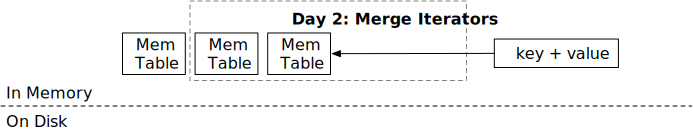

# Merge Iterator



In this chapter, you will:

* Implement memtable iterator.
* Implement merge iterator.
* Implement LSM read path `scan` for memtables.


To copy the test cases into the starter code and run them,

```
cargo x copy-test --week 1 --day 2
cargo x scheck
```

## Task 1: Memtable Iterator

In this chapter, we will implement the LSM `scan` interface. `scan` returns a range of key-value pairs in order using an iterator API. In the previous chapter, you have implemented the `get` API and the logic to create immutable memtables, and your LSM state should now have multiple memtables. You will need to first create iterators on a single memtable, then create a merge iterator on all memtables, and finally implement the range limit for the iterators.

In this task, you will need to modify:

```
src/mem_table.rs
```

All LSM iterators implement the `StorageIterator` trait. It has 4 functions: `key`, `value`, `next`, and `is_valid`. When the iterator is created, its cursor will stop on some element, and `key` / `value` will return the first key in the memtable/block/SST satisfying the start condition (i.e., start key). These two interfaces will return a `&[u8]` to avoid copy. Note that this iterator interface is different from the Rust-style iterator.

`next` moves the cursor to the next place. `is_valid` returns if the iterator has reached the end or errored. You can assume `next` will only be called when `is_valid` returns true. There will be a `FusedIterator` wrapper for iterators that block calls to `next` when the iterator is not valid to avoid users from misusing the iterators.

Back to the memtable iterator. You should have found out that the iterator does not have any lifetime associated with that. Imagine that you create a `Vec<u64>` and call `vec.iter()`, the iterator type will be something like `VecIterator<'a>`, where `'a` is the lifetime of the `vec` object. The same applies to `SkipMap`, where its `iter` API returns an iterator with a lifetime. However, in our case, we do not want to have such lifetimes on our iterators to avoid making the system overcomplicated (and hard to compile...).

If the iterator does not have a lifetime generics parameter, we should ensure that *whenever the iterator is being used, the underlying skiplist object is not freed*. The only way to achieve that is to put the `Arc<SkipMap>` object into the iterator itself. To define such a structure,

```rust,no_run
pub struct MemtableIterator {
    map: Arc<SkipMap<Bytes, Bytes>>,
    iter: SkipMapRangeIter<'???>,
}
```

Okay, here is the problem: we want to express that the lifetime of the iterator is the same as the `map` in the structure. How can we do that?

This is the first and most tricky Rust language thing that you will ever meet in this tutorial -- self-referential structure. If it is possible to write something like:

```rust,no_run
pub struct MemtableIterator { // <- with lifetime 'this
    map: Arc<SkipMap<Bytes, Bytes>>,
    iter: SkipMapRangeIter<'this>,
}
```

Then the problem is solved! You can do this with the help of some third-party libraries like `ouroboros`. It provides an easy way to define self-referential structure. It is also possible to do this with unsafe Rust (and indeed, `ouroboros` itself uses unsafe Rust internally...)

We have already defined the self-referential `MemtableIterator` fields for you, and you will need to implement `MemtableIterator` and the `Memtable::scan` API.

## Task 2: Merge Iterator

In this task, you will need to modify:

```
src/iterators/merge_iterator.rs
```

Now that you have multiple memtables and you will create multiple memtable iterators. You will need to merge the results from the memtables and return the latest version of each key to the user.

`MergeIterator` maintains a binary heap internally. Note that you will need to handle errors (i.e., when an iterator is not valid) and ensure that the latest version of a key-value pair comes out.

For example, if we have the following data:

```
iter1: b->del, c->4, d->5
iter2: a->1, b->2, c->3
iter3: e->4
```

The sequence that the merge iterator outputs should be:

```
a->1, b->del, c->4, d->5, e->4
```

The constructor of the merge iterator takes a vector of iterators. We assume the one with a lower index (i.e., the first one) has the latest data.

When using the Rust binary heap, you may find the `peek_mut` function useful.

```rust,no_run
let Some(mut inner) = heap.peek_mut() {
    *inner += 1; // <- do some modifications to the inner item
}
// When the PeekMut reference gets dropped, the binary heap gets reordered automatically.

let Some(mut inner) = heap.peek_mut() {
    PeekMut::pop(inner) // <- pop it out from the heap
}
```

One common pitfall is on error handling. For example,

```rust,no_run
let Some(mut inner_iter) = self.iters.peek_mut() {
    inner_iter.next()?; // <- will cause problem
}
```

If `next` returns an error (i.e., due to disk failure, network failure, checksum error, etc.), it is no longer valid. However, when we go out of the if condition and return the error to the caller, `PeekMut`'s drop will try move the element within the heap, which causes an access to an invalid iterator. Therefore, you will need to do all error handling by yourself instead of using `?` within the scope of `PeekMut`.

We want to avoid dynamic dispatch as much as possible, and therefore we do not use `Box<dyn StorageIterator>` in the system. Instead, we prefer static dispatch using generics. Also note that `StorageIterator` uses generic associated type (GAT), so that it can support both `KeySlice` and `&[u8]` as the key type. We will change `KeySlice` to include the timestamp in week 3 and using a separate type for it now can make the transition more smooth.

Starting this section, we will use `Key<T>` to represent LSM key types and distinguish them from values in the type system. You should use provided APIs of `Key<T>` instead of directly accessing the inner value. We will add timestamp to this key type in part 3, and using the key abstraction will make the transition more smooth. For now, `KeySlice` is equivalent to `&[u8]`, `KeyVec` is equivalent to `Vec<u8>`, and `KeyBytes` is equivalent to `Bytes`.

## Task 3: LSM Iterator + Fused Iterator

In this task, you will need to modify:

```
src/lsm_iterator.rs
```

We use the `LsmIterator` structure to represent the internal LSM iterators. You will need to modify this structure multiple times throughout the tutorial when more iterators are added into the system. For now, because we only have multiple memtables, it should be defined as:

```rust,no_run
type LsmIteratorInner = MergeIterator<MemTableIterator>;
```

You may go ahead and implement the `LsmIterator` structure, which calls the corresponding inner iterator, and also skip deleted keys.

We do not test `LsmIterator` in this task. There will be an integration test in task 4.

Then, we want to provide extra safety on the iterator to avoid users from misusing them. Users should not call `key`, `value`, or `next` when the iterator is not valid. At the same time, they should not use the iterator anymore if `next` returns an error. `FusedIterator` is a wrapper around an iterator to normalize the behaviors across all iterators. You can go ahead and implement it by yourself.

## Task 4: Read Path - Scan

In this task, you will need to modify:

```
src/lsm_storage.rs
```

We are finally there -- with all iterators you have implemented, you can finally implement the `scan` interface of the LSM engine. You can simply construct an LSM iterator with the memtable iterators (remember to put the latest memtable at the front of the merge iterator), and your storage engine will be able to handle the scan request.

## Test Your Understanding

* What is the time/space complexity of using your merge iterator?
* Why do we need a self-referential structure for memtable iterator?
* If a key is removed (there is a delete tombstone), do you need to return it to the user? Where did you handle this logic?
* If a key has multiple versions, will the user see all of them? Where did you handle this logic?
* If we want to get rid of self-referential structure and have a lifetime on the memtable iterator (i.e., `MemtableIterator<'a>`, where `'a` = memtable or `LsmStorageInner` lifetime), is it still possible to implement the `scan` functionality?
* What happens if (1) we create an iterator on the skiplist memtable (2) someone inserts new keys into the memtable (3) will the iterator see the new key?
* What happens if your key comparator cannot give the binary heap implementation a stable order?
* Why do we need to ensure the merge iterator returns data in the iterator construction order?
* Is it possible to implement a Rust-style iterator (i.e., `next(&self) -> (Key, Value)`) for LSM iterators? What are the pros/cons?
* The scan interface is like `fn scan(&self, lower: Bound<&[u8]>, upper: Bound<&[u8]>)`. How to make this API compatible with Rust-style range (i.e., `key_a..key_b`)? If you implement this, try to pass a full range `..` to the interface and see what will happen.
* The starter code provides the merge iterator interface to store `Box<I>` instead of `I`. What might be the reason behind that?

We do not provide reference answers to the questions, and feel free to discuss about them in the Discord community.

## Bonus Tasks

* **Foreground Iterator.** In this tutorial we assumed that all operations are short, so that we can hold reference to mem-table in the iterator. If an iterator is held by users for a long time, the whole mem-table (which might be 256MB) will stay in the memory even if it has been flushed to disk. To solve this, we can provide a `ForegroundIterator` / `LongIterator` to our user. The iterator will periodically create new underlying storage iterator so as to allow garbage collection of the resources.

{{#include copyright.md}}
