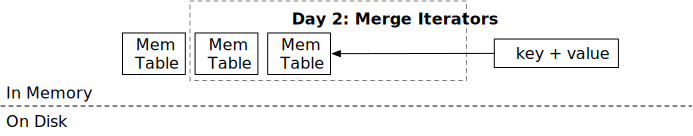

<!--
  mini-lsm-book © 2022-2026 by Alex Chi Z is licensed under CC BY-NC-SA 4.0
-->

# Merge Iterator



By the end of this chapter, you will be able to:

* Implement a memtable iterator.
* Implement a merge iterator.
* Implement the memtable portion of the LSM `scan` read path.
* Explain how cursor validity, source precedence, and tombstone filtering combine to produce one logical sorted view.

To copy the test cases into the starter code and run them:

```
cargo x copy-test --week 1 --day 2
cargo x scheck
```

## Before You Begin

The engine can now resolve a point lookup across multiple memtables, but it cannot return a range of keys. A scan must combine several independently sorted sources without materializing their full contents.

The iterator stack divides that responsibility across layers:

- `MemTableIterator` exposes one sorted memtable.
- `MergeIterator` combines sources of the same type, removes duplicate versions, and gives lower-indexed—that is, newer—sources precedence.
- `LsmIterator` removes tombstones from the user-visible stream.
- `FusedIterator` makes invalid and errored states safe for callers.

The core invariant is: **the output is sorted, and each user key appears at most once with the value from the newest input containing that key.** Tombstones participate in precedence before `LsmIterator` hides them.

> **Predict before coding:** Merge `iter1 = [b->delete, c->4]` with `iter2 = [a->1, b->2, c->3]`, where `iter1` is newer. Write the internal merged stream first, including tombstones, and then the user-visible stream. What breaks if tombstones are removed before duplicate versions are resolved?

## Task 1: Memtable Iterator

In this chapter, you will implement the LSM `scan` interface, which uses an iterator to return an ordered range of key-value pairs. In the previous chapter, you implemented `get` and the logic for creating immutable memtables, so your LSM state can now contain several memtables. You will first create an iterator over one memtable, then merge iterators from all memtables, and finally enforce the requested key range.

In this task, you will need to modify:

```
src/mem_table.rs
```

All LSM iterators implement the `StorageIterator` trait. Its four core methods are `key`, `value`, `next`, and `is_valid`. If you are familiar with Rust's standard-library `Iterator` trait, you will notice that `StorageIterator` works differently. It uses a cursor-based API, a pattern common in database systems and inspired by RocksDB's iterators. See [`iterator_base.h`](https://github.com/facebook/rocksdb/blob/main/include/rocksdb/iterator_base.h) and [`iterator.h`](https://github.com/facebook/rocksdb/blob/main/include/rocksdb/iterator.h) for reference.

When an iterator is created, its cursor points to the first entry in the memtable, block, or SST that satisfies the lower bound. The `value` method returns `&[u8]`, while `key` returns the iterator's associated borrowed key type—for example, `KeySlice`. These borrowed return values avoid copying key and value data.

From the caller's perspective, the typical usage pattern is:

```rust
let mut iter: impl StorageIterator = ...;
while iter.is_valid() {
    let key = iter.key();
    let value = iter.value();
    // Process key and value
    iter.next()?; // Advance to the next item, handling potential errors
}
```

The core `StorageIterator` methods have distinct responsibilities:

* `next()`: Attempts to move the cursor to the next element. It returns a `Result` so that it can report errors such as I/O failures. A successful call does not guarantee that the new position is valid; the cursor may have reached the end.
* `is_valid()`: Reports whether the current cursor points to a valid data element. It does *not* advance the iterator.

After every call to `next()`, including a successful one, your implementation must update its internal state so that `is_valid()` accurately reports whether the new cursor position contains an item.

In summary, `next` advances the cursor, and `is_valid` reports whether that cursor still identifies an item. You may assume that callers invoke `next` only while `is_valid` returns `true`. Later, you will implement a `FusedIterator` wrapper that normalizes behavior after an iterator becomes invalid or returns an error.

Now return to the memtable iterator. You may have noticed that its public type has no lifetime parameter. If you create a `Vec<u64>` and call `vec.iter()`, the iterator's type contains a lifetime such as `VecIterator<'a>`, where `'a` is tied to the vector. The same is true of `SkipMap::iter`. For Mini-LSM, however, we avoid exposing such lifetimes on storage iterators because doing so would complicate the entire system.

Because the iterator has no lifetime parameter, it must ensure that *the underlying skiplist remains alive for as long as the iterator is in use*. We do this by storing an `Arc<SkipMap>` inside the iterator itself. A first attempt might look like this:

```rust,no_run
pub struct MemtableIterator {
    map: Arc<SkipMap<Bytes, Bytes>>,
    iter: SkipMapRangeIter<'???>,
}
```

The problem is that we need to express that `iter` borrows `map`, another field in the same struct. How can we represent that relationship?

This is the first particularly tricky Rust concept in the course: a self-referential struct. If Rust allowed us to write the following, the problem would be solved:

```rust,no_run
pub struct MemtableIterator { // <- with lifetime 'this
    map: Arc<SkipMap<Bytes, Bytes>>,
    iter: SkipMapRangeIter<'this>,
}
```

Third-party crates such as `ouroboros` provide a safe interface for defining this kind of self-referential struct. You could also implement it with unsafe Rust; in fact, `ouroboros` uses unsafe Rust internally.

We have used [`ouroboros`](https://docs.rs/ouroboros/latest/ouroboros/attr.self_referencing.html) to define the self-referential fields of `MemTableIterator` for you. Implement its iterator logic and the `MemTable::scan` API using the provided structure.

## Task 2: Merge Iterator

In this task, you will need to modify:

```
src/iterators/merge_iterator.rs
```

Because the LSM state can contain multiple memtables, a scan creates multiple memtable iterators. Merge their results and return only the latest version of each key.

`MergeIterator` maintains a binary heap internally. A binary heap is a natural way to merge `n` sorted iterators because it efficiently identifies the iterator whose current key is smallest. The heap orders the iterator with the smallest current key first. When several iterators have the same current key, it orders the newest one first. Handle errors and exhausted iterators carefully, and ensure that the merge emits only the latest version of each key-value pair.

For example, if we have the following data:

```
iter1: b->del, c->4, d->5
iter2: a->1, b->2, c->3
iter3: e->4
```

The merge iterator should produce:

```
a->1, b->del, c->4, d->5, e->4
```

The merge iterator's constructor accepts a vector of iterators. An iterator with a lower index—closer to the front of the vector—contains newer data.

When using Rust's binary heap, you may find `peek_mut` useful:

```rust,no_run
let Some(mut inner) = heap.peek_mut() {
    *inner += 1; // Modify the top item.
}
// When PeekMut is dropped, the binary heap is reordered automatically.

let Some(mut inner) = heap.peek_mut() {
    PeekMut::pop(inner) // Remove the top item from the heap.
}
```

A common pitfall involves error handling. For example:

```rust,no_run
let Some(mut inner_iter) = self.iters.peek_mut() {
    inner_iter.next()?; // Problematic.
}
```

If `next` returns an error—for example, because of a disk, network, or checksum failure—the iterator must no longer remain in the heap. When the scope exits, however, `PeekMut::drop` attempts to restore the heap order and may access that invalid iterator. Handle the error explicitly and remove the iterator instead of using `?` while the `PeekMut` guard is alive.

We avoid dynamic dispatch where practical, so the system does not use `Box<dyn StorageIterator>`. Instead, it uses generics and static dispatch. `StorageIterator` also uses a generic associated type (GAT) for its borrowed key type, allowing different iterators to return types such as `KeySlice` or `&[u8]`. In Week 3, `KeySlice` will include a timestamp; introducing the key abstraction now makes that transition smoother.

From this section onward, use `Key<T>` for LSM keys so that the type system can distinguish keys from values. Use the provided `Key<T>` methods instead of accessing the wrapped value directly. In Week 3, you will add a timestamp to this type, and the abstraction will make that transition smoother. For now, `KeySlice` wraps `&[u8]`, `KeyVec` wraps `Vec<u8>`, and `KeyBytes` wraps `Bytes`.

## Task 3: LSM Iterator + Fused Iterator

In this task, you will need to modify:

```
src/lsm_iterator.rs
```

`LsmIterator` represents the storage engine's internal iterator. You will modify it several times as you add more iterator types. For now, the engine contains only memtables, so its inner type should be:

```rust,no_run
type LsmIteratorInner = MergeIterator<MemTableIterator>;
```

Implement `LsmIterator` by delegating to the inner iterator and skipping deletion tombstones.

This task does not test `LsmIterator` directly; Task 4 includes an integration test.

Next, add safeguards against iterator misuse. Callers must not invoke `key` or `value` while an iterator is invalid, and they must not continue using it after `next` returns an error. `FusedIterator` wraps another iterator to normalize these behaviors. Implement it using the contract documented in the starter code.

## Task 4: Read Path - Scan

In this task, you will need to modify:

```
src/lsm_storage.rs
```

With these iterators in place, you can implement the LSM engine's `scan` interface. Construct an `LsmIterator` from the memtable iterators, placing the newest memtable first in the merge iterator. The storage engine will then be able to serve scan requests.

## Chapter Checkpoint

The engine should now scan any requested range across its mutable and immutable memtables. A scan returns sorted, unique, live keys and respects the same newest-first precedence as `get`.

After the tests pass, trace one key that appears in three memtables through every iterator layer. Identify exactly where its older versions are discarded and where its tombstone, if present, becomes invisible to the caller. Also confirm that `next()` returning `Ok(())` does not imply that the iterator remains valid.

## Test Your Understanding

### Correctness

* If a key is removed (there is a delete tombstone), do you need to return it to the user? Where did you handle this logic?
* If a key has multiple versions, will the user see all of them? Where did you handle this logic?
* What happens if your key comparator cannot give the binary heap implementation a stable order?
* Why must the merge iterator resolve duplicate keys according to iterator construction order?
* Construct a minimal input that produces a duplicate key if `MergeIterator::next` advances only the currently visible child and not every child positioned at that key.

### Rust and API Design

* Why do we need a self-referential struct for the memtable iterator?
* If we replace the self-referential struct with a lifetime on the memtable iterator—for example, `MemTableIterator<'a>`, where `'a` is tied to a memtable or `LsmStorageInner`—can we still implement `scan`?
* Could you implement a Rust-style iterator—for example, one with `next(&mut self) -> Option<(Key, Value)>`—for LSM iterators? What are the advantages and disadvantages?
* The scan interface resembles `fn scan(&self, lower: Bound<&[u8]>, upper: Bound<&[u8]>)`. How could you make it accept Rust range syntax such as `key_a..key_b`? If you implement this API, try passing the full range `..` and observe what happens.
* The starter code provides the merge iterator interface to store `Box<I>` instead of `I`. What might be the reason behind that?

### Performance and Concurrent Behavior

* What are the time and space complexities of building and advancing your merge iterator in terms of the number of input iterators?
* Suppose that (1) you create an iterator over the skiplist memtable and (2) another thread inserts keys into that memtable. Will the iterator see the new keys? Design a small experiment rather than relying only on the type signature.

We do not provide reference answers to these questions, so feel free to discuss them in the Discord community.

## Bonus Tasks

* **Foreground Iterator.** This course assumes that all operations are short, so an iterator can retain a reference to a memtable. If a user holds an iterator for a long time, the entire memtable—which might occupy 256 MB—remains in memory even after it has been flushed to disk. To address this issue, provide a `ForegroundIterator` or `LongIterator` that periodically creates a new underlying storage iterator, allowing the old resources to be reclaimed.

{{#include copyright.md}}
