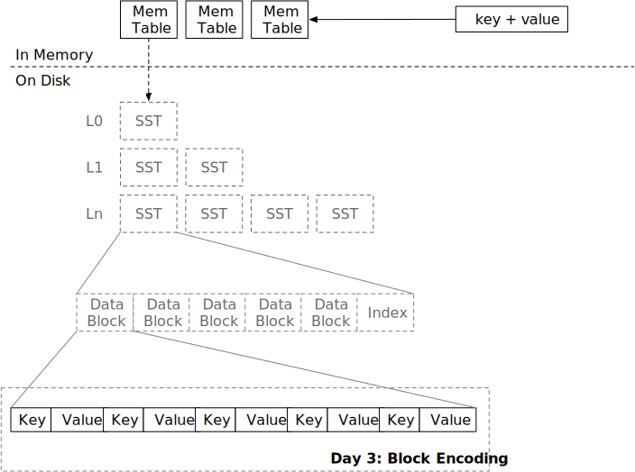

<!--
  mini-lsm-book © 2022-2025 by Alex Chi Z is licensed under CC BY-NC-SA 4.0
-->

# Block



In this chapter, you will:

* Implement SST block encoding.
* Implement SST block decoding and block iterator.


To copy the test cases into the starter code and run them,

```
cargo x copy-test --week 1 --day 3
cargo x scheck
```

## Task 1: Block Builder

You have already implemented all in-memory structures for an LSM storage engine in the previous two chapters. Now it's time to build the on-disk structures. The basic unit of the on-disk structure is blocks. Blocks are usually of 4-KB size (the size may vary depending on the storage medium), which is equivalent to the page size in the operating system and the page size on an SSD. A block stores ordered key-value pairs. An SST is composed of multiple blocks. When the number of memtables exceed the system limit, it will flush the memtable as an SST. In this chapter, you will implement the encoding and decoding of a block.

In this task, you will need to modify:

```
src/block/builder.rs
src/block.rs
```

The block encoding format in our course is as follows:

```plaintext
----------------------------------------------------------------------------------------------------
|             Data Section             |              Offset Section             |      Extra      |
----------------------------------------------------------------------------------------------------
| Entry #1 | Entry #2 | ... | Entry #N | Offset #1 | Offset #2 | ... | Offset #N | num_of_elements |
----------------------------------------------------------------------------------------------------
```

Each entry is a key-value pair.

```plaintext
-----------------------------------------------------------------------
|                           Entry #1                            | ... |
-----------------------------------------------------------------------
| key_len (2B) | key (keylen) | value_len (2B) | value (varlen) | ... |
-----------------------------------------------------------------------
```

Key length and value length are both 2 bytes, which means their maximum lengths are 65535. (Internally stored as `u16`)

We assume that keys will never be empty, and values can be empty. An empty value means that the corresponding key has been deleted in the view of other parts of the system. For the `BlockBuilder` and `BlockIterator`, we just treat the empty value as-is.

At the end of each block, we will store the offsets of each entry and the total number of entries. For example, if
the first entry is at 0th position of the block, and the second entry is at 12th position of the block.

```
-------------------------------
|offset|offset|num_of_elements|
-------------------------------
|   0  |  12  |       2       |
-------------------------------
```

The footer of the block will be as above. Each of the number is stored as `u16`.

The block has a size limit, which is `target_size`. Unless the first key-value pair exceeds the target block size, you should ensure that the encoded block size is always less than or equal to `target_size`. (In the provided code, the `target_size` here is essentially the `block_size`)

The `BlockBuilder` will produce the data part and unencoded entry offsets when `build` is called. The information will be stored in the `Block` structure. As key-value entries are stored in raw format and offsets are stored in a separate vector, this reduces unnecessary memory allocations and processing overhead when decoding data —— what you need to do is to simply copy the raw block data to the `data` vector and decode the entry offsets every 2 bytes, *instead of* creating something like `Vec<(Vec<u8>, Vec<u8>)>` to store all the key-value pairs in one block in memory. This compact memory layout is very efficient.

In `Block::encode` and `Block::decode`, you will need to encode/decode the block in the format as indicated above.

## Task 2: Block Iterator

In this task, you will need to modify:

```
src/block/iterator.rs
```

Now that we have an encoded block, we will need to implement the `BlockIterator` interface, so that the user can lookup/scan keys in the block.

`BlockIterator` can be created with an `Arc<Block>`. If `create_and_seek_to_first` is called, it will be positioned at the first key in the block. If `create_and_seek_to_key` is called, the iterator will be positioned at the first key that is `>=` the provided key. For example, if `1, 3, 5` is in a block.

```rust,no_run
let mut iter = BlockIterator::create_and_seek_to_key(block, b"2");
assert_eq!(iter.key(), b"3");
```

The above `seek 2` will make the iterator to be positioned at the next available key of `2`, which in this case is `3`.

The iterator should copy `key` from the block and store them inside the iterator (we will have key compression in the future and you will have to do so). For the value, you should only store the begin/end offset in the iterator without copying them.

When `next` is called, the iterator will move to the next position. If we reach the end of the block, we can set `key` to empty and return `false` from `is_valid`, so that the caller can switch to another block if possible.

## Test Your Understanding

* What is the time complexity of seeking a key in the block?
* Where does the cursor stop when you seek a non-existent key in your implementation?
* So `Block` is simply a vector of raw data and a vector of offsets. Can we change them to `Byte` and `Arc<[u16]>`, and change all the iterator interfaces to return `Byte` instead of `&[u8]`? (Assume that we use `Byte::slice` to return a slice of the block without copying.) What are the pros/cons?
* What is the endian of the numbers written into the blocks in your implementation?
* Is your implementation prune to a maliciously-built block? Will there be invalid memory access, or OOMs, if a user deliberately construct an invalid block?
* Can a block contain duplicated keys?
* What happens if the user adds a key larger than the target block size?
* Consider the case that the LSM engine is built on object store services (S3). How would you optimize/change the block format and parameters to make it suitable for such services?
* Do you love bubble tea? Why or why not?

We do not provide reference answers to the questions, and feel free to discuss about them in the Discord community.

## Bonus Tasks

* **Backward Iterators.** You may implement `prev` for your `BlockIterator` so that you will be able to iterate the key-value pairs reversely. You may also have a variant of backward merge iterator and backward SST iterator (in the next chapter) so that your storage engine can do a reverse scan.

{{#include copyright.md}}
