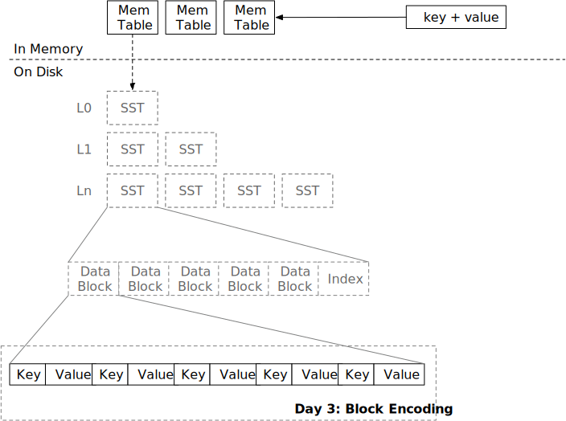

<!--
  mini-lsm-book © 2022-2025 by Alex Chi Z is licensed under CC BY-NC-SA 4.0
-->

# Block



By the end of this chapter, you will be able to:

* Implement SST block encoding.
* Implement SST block decoding and a block iterator.
* Reason about format invariants, size accounting, lower-bound seeks, and the trust boundary of a decoder.


To copy the test cases into the starter code and run them:

```
cargo x copy-test --week 1 --day 3
cargo x scheck
```

## Before You Begin

The engine currently stores every key-value pair in memtables. Blocks are the first encoded representation you will design: a compact sequence of sorted entries plus an index of their starting offsets.

Preserve these format invariants:

1. Encoding and decoding are inverses for every valid block.
2. Entry offsets are ordered and refer to valid positions in the data section.
3. The footer contains exactly one offset per entry and the encoded entry count.
4. Except when the first entry alone exceeds the target, adding an entry must not make the encoded block larger than `target_size`.
5. Seeking positions the iterator at the first key greater than or equal to the target, or makes it invalid if no such key exists.

> **Predict before coding:** Before looking at `BlockBuilder::add`, write a formula for the encoded size after adding one key-value pair. Include the key length, value length, entry offset, and element count. Which bytes are paid once per block, and which are paid once per entry?

## Task 1: Block Builder

In the previous two chapters, you implemented the in-memory structures for an LSM storage engine. Now it is time to build the on-disk structures. Their basic unit is the block, which stores sorted key-value pairs. Blocks are often 4 KiB—the typical size of an operating-system page and an SSD page—although the ideal size depends on the storage medium. An SST consists of multiple blocks. When enough immutable memtables accumulate, the engine flushes the oldest one to an SST. In this chapter, you will implement block encoding and decoding.

In this task, you will need to modify:

```
src/block/builder.rs
src/block.rs
```

The block encoding format in our course is as follows:

```plaintext
----------------------------------------------------------------------------------------------------
|             Data Section             |              Offset Section             |      Extra      |
----------------------------------------------------------------------------------------------------
| Entry #1 | Entry #2 | ... | Entry #N | Offset #1 | Offset #2 | ... | Offset #N | num_of_elements |
----------------------------------------------------------------------------------------------------
```

Each entry is a key-value pair.

```plaintext
-----------------------------------------------------------------------
|                           Entry #1                            | ... |
-----------------------------------------------------------------------
| key_len (2B) | key (keylen) | value_len (2B) | value (varlen) | ... |
-----------------------------------------------------------------------
```

The key and value lengths are each encoded in 2 bytes as `u16` values, so their maximum encoded length is 65,535 bytes.

We assume that keys are never empty, but values may be. Other parts of the system interpret an empty value as a deletion marker, or tombstone. `BlockBuilder` and `BlockIterator` simply preserve the empty value.

At the end of each block, we store the offset of every entry followed by the total number of entries. For example, suppose the first entry starts at byte 0 and the second starts at byte 12:

```
-------------------------------
|offset|offset|num_of_elements|
-------------------------------
|   0  |  12  |       2       |
-------------------------------
```

The block footer then has the layout shown above. Every number in the footer is stored as a `u16`.

Each block has a size limit, `target_size`, which corresponds to `block_size` in the provided code. Unless the first key-value pair alone exceeds this limit, ensure that the encoded block is no larger than `target_size`.

When `BlockBuilder::build` is called, it produces the raw data section and the unencoded entry offsets, which are stored in a `Block`. Keeping raw key-value data contiguous and storing offsets separately avoids unnecessary allocations and decoding work. Copy the raw block data into the `data` vector and decode one entry offset every 2 bytes, rather than materializing all entries as a structure such as `Vec<(Vec<u8>, Vec<u8>)>`. This compact layout is efficient.

Implement `Block::encode` and `Block::decode` according to the format above.

## Task 2: Block Iterator

In this task, you will need to modify:

```
src/block/iterator.rs
```

Now that you have an encoded block, implement `BlockIterator` so that callers can look up and scan keys within it.

Create a `BlockIterator` from an `Arc<Block>`. `create_and_seek_to_first` positions it at the first key in the block. `create_and_seek_to_key` positions it at the first key greater than or equal to the requested key. For example, suppose a block contains `1`, `3`, and `5`:

```rust,no_run
let mut iter = BlockIterator::create_and_seek_to_key(block, b"2");
assert_eq!(iter.key(), b"3");
```

Seeking to `2` positions the iterator at the next available key, which is `3`.

The iterator should copy the current key from the block and store it internally; this will be necessary when you add key compression. For the value, store only its start and end offsets instead of copying its bytes.

When `next` is called, advance the iterator by one entry. At the end of the block, set `key` to empty so that `is_valid` returns `false`; the caller can then move to another block if one is available.

## Chapter Checkpoint

You should now be able to build a block, serialize it, decode it, iterate from its first key, and seek to any lower bound. Test keys that exist, keys between entries, and keys before and after the block's range.

Passing the supplied tests demonstrates behavior for valid blocks. It does not prove that arbitrary bytes can be decoded safely. Identify which assumptions your decoder makes about trusted input and which checks a production decoder would need before indexing or allocating.

## Test Your Understanding

### Correctness and Format

* What is the time complexity of seeking a key in the block?
* Where does the cursor stop when you seek a non-existent key in your implementation?
* What endianness does your implementation use for numbers written to blocks?
* Can a block contain duplicated keys?
* What happens if the user adds a key larger than the target block size?

### Safety and Robustness

* Is your implementation vulnerable to a maliciously constructed block? Could invalid input cause an out-of-bounds access or an out-of-memory condition?
* Construct three malformed blocks: one with an impossible entry count, one with a non-monotonic or out-of-range offset, and one with a length that extends beyond the data section. Where would the current decoder fail for each input, and what validation would reject it cleanly?

### Performance and Design

* `Block` is simply a vector of raw data and a vector of offsets. Could we change them to `Bytes` and `Arc<[u16]>`, then change the iterator interfaces to return `Bytes` instead of `&[u8]`? Assume that we use `Bytes::slice` to return a slice without copying. What are the advantages and disadvantages?
* Suppose the LSM engine uses an object-storage service such as S3. How would you adapt the block format and its parameters to suit that environment?

### Snack Break

* Do you love bubble tea? Why or why not?

We do not provide reference answers to these questions. Feel free to discuss them in the Discord community.

## Bonus Tasks

* **Backward Iterators.** Implement `prev` for `BlockIterator` to iterate over key-value pairs in reverse. You can also implement backward variants of the merge iterator and, in the next chapter, the SST iterator so that the storage engine can perform reverse scans.

{{#include copyright.md}}
