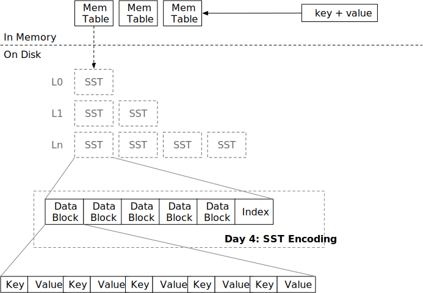

# Sorted String Table (SST)



In this chapter, you will:

* Implement SST encoding and metadata encoding.
* Implement SST decoding and iterator.
  

To copy the test cases into the starter code and run them,

```
cargo x copy-test --week 1 --day 4
cargo x scheck
```

## Task 1: SST Builder

In this task, you will need to modify:

```
src/table/builder.rs
src/table.rs
```

SSTs are composed of data blocks and index blocks stored on the disk. Usually, data blocks are lazily loaded -- they will not be loaded into the memory until a user requests it. Index blocks can also be loaded on-demand, but in this tutorial, we make simple assumptions that all SST index blocks (meta blocks) can fit in memory (actually we do not have a designated index block implementation.) Generally, an SST file is of 256MB size.

The SST builder is similar to block builder -- users will call `add` on the builder. You should maintain a `BlockBuilder` inside SST builder and split blocks when necessary. Also, you will need to maintain block metadata `BlockMeta`, which includes the first/last keys in each block and the offsets of each block. The `build` function will encode the SST, write everything to disk using `FileObject::create`, and return an `SsTable` object.

The encoding of SST is like:

```plaintext
-------------------------------------------------------------------------------------------
|         Block Section         |          Meta Section         |          Extra          |
-------------------------------------------------------------------------------------------
| data block | ... | data block |            metadata           | meta block offset (u32) |
-------------------------------------------------------------------------------------------
```

You also need to implement `estimated_size` function of `SsTableBuilder`, so that the caller can know when can it start a new SST to write data. The function don't need to be very accurate. Given the assumption that data blocks contain much more data than meta block, we can simply return the size of data blocks for `estimated_size`.

Besides SST builder, you will also need to complete the encoding/decoding of block metadata, so that `SsTableBuilder::build` can produce a valid SST file.

## Task 2: SST Iterator

In this task, you will need to modify:

```
src/table/iterator.rs
src/table.rs
```

Like `BlockIterator`, you will need to implement an iterator over an SST. Note that you should load data on demand. For example, if your iterator is at block 1, it should not hold any other block content in memory until it reaches the next block.

`SsTableIterator` should implement the `StorageIterator` trait, so that it can be composed with other iterators in the future.

One thing to note is `seek_to_key` function. Basically, you will need to do binary search on block metadata to find which block might possibly contain the key. It is possible that the key does not exist in the LSM tree so that the block iterator will be invalid immediately after a seek. For example,

```plaintext
--------------------------------------
| block 1 | block 2 |   block meta   |
--------------------------------------
| a, b, c | e, f, g | 1: a/c, 2: e/g |
--------------------------------------
```

We recommend only using the first key of each block to do the binary search so as to reduce the complexity of your implementation. If we do `seek(b)` in this SST, it is quite simple -- using binary search, we can know block 1 contains keys `a <= keys < e`. Therefore, we load block 1 and seek the block iterator to the corresponding position.

But if we do `seek(d)`, we will position to block 1, if we only use first key as the binary search criteria, but seeking `d` in block 1 will reach the end of the block. Therefore, we should check if the iterator is invalid after the seek, and switch to the next block if necessary. Or you can leverage the last key metadata to directly position to a correct block, it is up to you.

## Task 3: Block Cache

In this task, you will need to modify:

```
src/table/iterator.rs
src/table.rs
```

You can implement a new `read_block_cached` function on `SsTable` .

We use `moka-rs` as our block cache implementation. Blocks are cached by `(sst_id, block_id)` as the cache key. You may use `try_get_with` to get the block from cache if it hits the cache / populate the cache if it misses the cache. If there are multiple requests reading the same block and cache misses, `try_get_with` will only issue a single read request to the disk and broadcast the result to all requests.

At this point, you may change your table iterator to use `read_block_cached` instead of `read_block` to leverage the block cache.

## Test Your Understanding

* What is the time complexity of seeking a key in the SST?
* Where does the cursor stop when you seek a non-existent key in your implementation?
* Is it possible (or necessary) to do in-place updates of SST files?
* An SST is usually large (i.e., 256MB). In this case, the cost of copying/expanding the `Vec` would be significant. Does your implementation allocate enough space for your SST builder in advance? How did you implement it?
* Looking at the `moka` block cache, why does it return `Arc<Error>` instead of the original `Error`?
* Does the usage of a block cache guarantee that there will be at most a fixed number of blocks in memory? For example, if you have a `moka` block cache of 4GB and block size of 4KB, will there be more than 4GB/4KB number of blocks in memory at the same time?
* Is it possible to store columnar data (i.e., a table of 100 integer columns) in an LSM engine? Is the current SST format still a good choice?
* Consider the case that the LSM engine is built on object store services (i.e., S3). How would you optimize/change the SST format/parameters and the block cache to make it suitable for such services?
* For now, we load the index of all SSTs into the memory. Assume you have a 16GB memory reserved for the indexes, can you estimate the maximum size of the database your LSM system can support? (That's why you need an index cache!)

We do not provide reference answers to the questions, and feel free to discuss about them in the Discord community.

## Bonus Tasks

* **Explore different SST encoding and layout.** For example, in the [Lethe: Enabling Efficient Deletes in LSMs](https://disc-projects.bu.edu/lethe/) paper, where the author adds secondary key support to SST.
  * Or you can use B+ Tree as the SST format instead of sorted blocks.
* **Index Blocks.** Split block indexes and block metadata into index blocks, and load them on-demand.
* **Index Cache.** Use a separate cache for indexes apart from the data block cache.
* **I/O Optimizations.** Align blocks to 4KB boundary and use direct I/O to bypass the system page cache.

{{#include copyright.md}}
