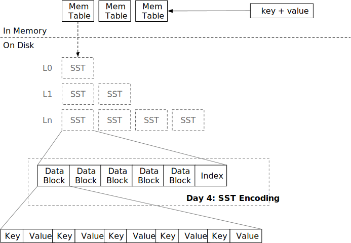

<!--
  mini-lsm-book © 2022-2026 by Alex Chi Z is licensed under CC BY-NC-SA 4.0
-->

# Sorted String Table (SST)



By the end of this chapter, you will be able to:

* Implement SST encoding and metadata encoding.
* Implement SST decoding and an SST iterator.
* Explain how block metadata, lazy loading, and caching support lower-bound seeks without loading an entire SST.
  
To copy the test cases into the starter code and run them:

```
cargo x copy-test --week 1 --day 4
cargo x scheck
```

## Before You Begin

A block provides sorted storage and seeks within a small byte range. An SST composes many blocks into an immutable file and adds enough metadata to locate the block that may contain a requested key.

The main invariants are:

1. Blocks and their metadata appear in the same key order.
2. Each `BlockMeta` records the encoded block's offset and its actual first and last keys.
3. An iterator directly retains only the block it currently needs and advances to the next block when a seek lands beyond the current one. The cache may retain other blocks independently.
4. A lower-bound seek never skips a key greater than or equal to the target.
5. The block cache identifies a block by both its SST ID and block index; blocks from different SSTs must never collide.

> **Predict before coding:** An SST contains block 1 with `[a, b, c]` and block 2 with `[e, f, g]`. If block selection uses only first-key metadata, which block is initially selected by `seek(d)`? What must the iterator do next to satisfy lower-bound seek semantics?

## Task 1: SST Builder

In this task, you will need to modify:

```
src/table/builder.rs
src/table.rs
```

SSTs consist of data blocks and index information stored on disk. Data blocks are usually loaded lazily: they remain on disk until a read requires them. Index blocks can also be loaded on demand, but this course assumes that the metadata for every SST fits in memory; we do not implement separate index blocks. An SST file is commonly around 256 MB.

The SST builder resembles the block builder: callers add entries through `add`. Maintain a `BlockBuilder` within `SsTableBuilder` and finish the current block when necessary. You must also maintain `BlockMeta` for each block, including its offset and its first and last keys. The `build` function encodes the SST, writes it to disk with `FileObject::create`, and returns an `SsTable`.

The SST encoding has the following layout:

```plaintext
-------------------------------------------------------------------------------------------
|         Block Section         |          Meta Section         |          Extra          |
-------------------------------------------------------------------------------------------
| data block | ... | data block |            metadata           | meta block offset (u32) |
-------------------------------------------------------------------------------------------
```

Implement `SsTableBuilder::estimated_size` so that callers can decide when to begin a new SST. The estimate does not need to be exact. Because the data blocks are much larger than the metadata, returning the size of the encoded data blocks is sufficient.

You must also implement block-metadata encoding and decoding so that `SsTableBuilder::build` can produce a valid SST file.

## Task 2: SST Iterator

In this task, you will need to modify:

```
src/table/iterator.rs
src/table.rs
```

As with `BlockIterator`, implement an iterator over an SST. Load data blocks on demand: while the iterator is in block 1, for example, it should not retain any other block's contents.

`SsTableIterator` should implement the `StorageIterator` trait, so that it can be composed with other iterators in the future.

Pay particular attention to `seek_to_key`. Use a binary search over block metadata to find the block that may contain the requested key. Because the key might not exist, the block iterator may become invalid immediately after the seek. For example:

```plaintext
--------------------------------------
| block 1 | block 2 |   block meta   |
--------------------------------------
| a, b, c | e, f, g | 1: a/c, 2: e/g |
--------------------------------------
```

To keep the implementation simple, we recommend using only the first key of each block in the binary search. For `seek(b)`, the search shows that block 1 covers the candidate range `a <= key < e`. Load block 1 and seek its iterator to the appropriate position.

For `seek(d)`, however, searching only the first keys also selects block 1, and seeking within that block reaches its end. After a seek, check whether the iterator is invalid and advance to the next block if necessary. Alternatively, use the last-key metadata to select the correct block directly.

## Task 3: Block Cache

In this task, you will need to modify:

```
src/table/iterator.rs
src/table.rs
```

Implement a new `read_block_cached` function on `SsTable`.

We use [`moka-rs`](https://docs.rs/moka/latest/moka/) for the block cache, with `(sst_id, block_id)` as the cache key. Use `try_get_with` to return a cached block on a hit or load and cache it on a miss. If concurrent requests miss on the same block, `try_get_with` performs one disk read and shares the result among the requests.

Update the table iterator to call `read_block_cached` instead of `read_block`.

## Chapter Checkpoint

You should now be able to build and reopen a multi-block SST, seek across block boundaries, and iterate without keeping every data block in memory. Run seeks for the first and last key of each block, for a key between two blocks, and for a key greater than the SST's last key.

Inspect the block-reading path after the tests pass. Explain when a disk read occurs, what remains resident because of the iterator, and what remains reachable through the cache. These lifetimes are related but not identical.

## Test Your Understanding

### Correctness and Format

* What is the time complexity of seeking a key in the SST?
* Where does the cursor stop when you seek a non-existent key in your implementation?
* Is it possible (or necessary) to do in-place updates of SST files?

### Caching and Memory

* An SST is usually large—for example, 256 MB—so repeatedly copying or growing its `Vec` can be expensive. Does your implementation reserve enough space for the SST builder in advance? How?
* Looking at the `moka` block cache, why does it return `Arc<Error>` instead of the original `Error`?
* Does using a block cache guarantee that at most a fixed number of blocks exist in memory? For example, with a 4 GB `moka` cache and 4 KiB blocks, can more than `4 GB / 4 KiB` blocks be alive at once? Account for references held outside the cache.

### Storage Design

* Can an LSM engine store columnar data, such as a table with 100 integer columns? Would the current SST format still be a good choice?
* Suppose the LSM engine uses an object-storage service such as S3. How would you adapt the SST format, its parameters, and the block cache to suit that environment?
* For now, we load the metadata for every SST into memory. If 16 GB of memory is reserved for this metadata, can you estimate the maximum database size the LSM system could support? This limitation motivates an index cache.

We do not provide reference answers to these questions. Feel free to discuss them in the Discord community.

## Bonus Tasks

* **Explore Different SST Encodings and Layouts.** For example, the authors of [Lethe: Enabling Efficient Deletes in LSMs](https://disc-projects.bu.edu/lethe/) add secondary-key support to SSTs.
  * Alternatively, use a B+ tree rather than sorted blocks as the SST format.
* **Index Blocks.** Split block indexes and block metadata into index blocks, and load them on-demand.
* **Index Cache.** Use a separate cache for indexes apart from the data block cache.
* **I/O Optimizations.** Align blocks to 4 KiB boundaries and use direct I/O to bypass the system page cache.

{{#include copyright.md}}
