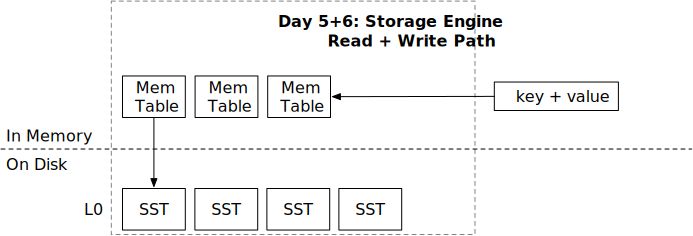

<!--
  mini-lsm-book © 2022-2025 by Alex Chi Z is licensed under CC BY-NC-SA 4.0
-->

# Read Path



In this chapter, you will:

* Integrate SST into the LSM read path.
* Implement LSM read path `get` with SSTs.
* Implement LSM read path `scan` with SSTs.

To copy the test cases into the starter code and run them,

```
cargo x copy-test --week 1 --day 5
cargo x scheck
```

## Task 1: Two Merge Iterator

In this task, you will need to modify:

```
src/iterators/two_merge_iterator.rs
```

You have already implemented a merge iterator that merges iterators of the same type (i.e., memtable iterators). Now that we have implemented the SST formats, we have both on-disk SST structures and in-memory memtables. When we scan from the storage engine, we will need to merge data from both memtable iterators and SST iterators into a single one. In this case, we need a `TwoMergeIterator<X, Y>` that merges two different types of iterators.

You can implement `TwoMergeIterator` in `two_merge_iterator.rs`. As we only have two iterators here, we do not need to maintain a binary heap. Instead, we can simply use a flag to indicate which iterator to read. Similar to `MergeIterator`, if the same key is found in both of the iterator, the first iterator takes the precedence.

## Task 2: Read Path - Scan

In this task, you will need to modify:

```
src/lsm_iterator.rs
src/lsm_storage.rs
```

After implementing `TwoMergeIterator`, we can change the `LsmIteratorInner` to have the following type:

```rust,no_run
type LsmIteratorInner =
    TwoMergeIterator<MergeIterator<MemTableIterator>, MergeIterator<SsTableIterator>>;
```

So that our internal iterator of the LSM storage engine will be an iterator combining both data from the memtables and the SSTs.

Currently, our SST iterator doesn't support an end bound for scans. To address this, you'll need to implement this boundary check within the `LsmIterator` itself. This involves updating the `LsmIterator::new` constructor to accept an `end_bound` parameter:

```rust,no_run
pub(crate) fn new(iter: LsmIteratorInner, end_bound: Bound<Bytes>) -> Result<Self> {}
```

You will then need to modify the `LsmIterator`'s iteration logic to ensure it stops when the keys from the inner iterator reach or exceed this specified `end_bound`.

Our test cases will generate some memtables and SSTs in `l0_sstables`, and you will need to scan all of these data out correctly in this task. You do not need to flush SSTs until next chapter. Therefore, you can go ahead and modify your `LsmStorageInner::scan` interface to create a merge iterator over all memtables and SSTs, so as to finish the read path of your storage engine.

Because `SsTableIterator::create` involves I/O operations and might be slow, we do not want to do this in the `state` critical section. Therefore, you should firstly take read the `state` and clone the `Arc` of the LSM state snapshot. Then, you should drop the lock. After that, you can go through all L0 SSTs and create iterators for each of them, then create a merge iterator to retrieve the data.

```rust,no_run
fn scan(&self) {
    let snapshot = {
        let guard = self.state.read();
        Arc::clone(&guard)
    };
    // create iterators and seek them
}
```

In the LSM storage state, we only store the SST ids in the `l0_sstables` vector. You will need to retrieve the actual SST object from the `sstables` hash map.

## Task 3: Read Path - Get

In this task, you will need to modify:

```
src/lsm_storage.rs
```

For get requests, it will be processed as lookups in the memtables, and then scans on the SSTs. You can create a merge iterator over all SSTs after probing all memtables. You can seek to the key that the user wants to lookup. There are two possibilities of the seek: the key is the same as what the user probes, and the key is not the same / does not exist. You should only return the value to the user when the key exists and is the same as probed. You should also reduce the critical section of the state lock as in the previous section. Also remember to handle deleted keys.

## Test Your Understanding

* Consider the case that a user has an iterator that iterates the whole storage engine, and the storage engine is 1TB large, so that it takes ~1 hour to scan all the data. What would be the problems if the user does so? (This is a good question and we will ask it several times at different points of the course...)
* Another popular interface provided by some LSM-tree storage engines is multi-get (or vectored get). The user can pass a list of keys that they want to retrieve. The interface returns the value of each of the key. For example, `multi_get(vec!["a", "b", "c", "d"]) -> a=1,b=2,c=3,d=4`. Obviously, an easy implementation is to simply doing a single get for each of the key. How will you implement the multi-get interface, and what optimizations you can do to make it more efficient? (Hint: some operations during the get process will only need to be done once for all keys, and besides that, you can think of an improved disk I/O interface to better support this multi-get interface).

We do not provide reference answers to the questions, and feel free to discuss about them in the Discord community.

## Bonus Tasks

* **The Cost of Dynamic Dispatch.** Implement a `Box<dyn StorageIterator>` version of merge iterators and benchmark to see the performance differences.
* **Parallel Seek.** Creating a merge iterator requires loading the first block of all underlying SSTs (when you create `SSTIterator`). You may parallelize the process of creating iterators.

{{#include copyright.md}}
