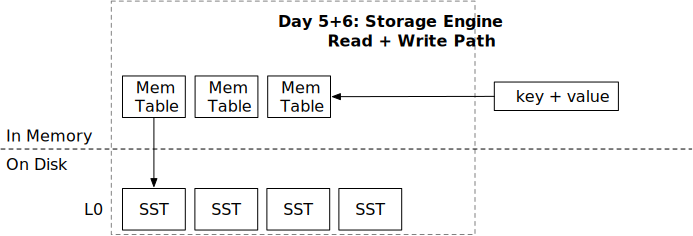

<!--
  mini-lsm-book © 2022-2025 by Alex Chi Z is licensed under CC BY-NC-SA 4.0
-->

# Write Path



By the end of this chapter, you will be able to:

* Implement the LSM write path with L0 flush.
* Implement the logic to correctly update the LSM state.
* Explain the state transition that makes a flushed SST visible without losing or duplicating an immutable memtable.
* Use key-range metadata to skip SSTs without changing read results.


To copy the test cases into the starter code and run them:

```
cargo x copy-test --week 1 --day 6
cargo x scheck
```

## Before You Begin

The read path can consume SSTs, but the Day 5 tests created those SSTs directly. This chapter completes the write path: the engine itself will turn the oldest immutable memtable into an SST and atomically install it in L0.

The important invariants are:

1. Only the oldest immutable memtable is selected for the next flush.
2. `state_lock` serializes the flush with other structural changes.
3. Building and writing the SST occurs outside the `state` read-write lock.
4. Installing the SST removes exactly the memtable that was flushed, inserts the `SsTable` into `sstables`, and inserts its ID at the front—the newest side—of `l0_sstables` in one snapshot update.
5. SST filtering may exclude a file only when its key range cannot contribute to the request. An optimization must not change query results.

> **Predict before coding:** Suppose `imm_memtables` contains IDs `[7, 6, 5]` from newest to oldest and `l0_sstables` contains `[4, 3]`. Write both vectors after one correct flush. Which assertions would detect flushing the wrong memtable or installing the wrong SST ID?

## Task 1: Flush Memtable to SST

At this point, the in-memory and on-disk structures are ready, and the storage engine can read and merge data from them. You will now implement flushing—the process of moving data from memory to disk—and complete Week 1 of Mini-LSM.

In this task, you will need to modify:

```
src/lsm_storage.rs
src/mem_table.rs
```

Modify `LsmStorageInner::force_flush_next_imm_memtable` and `MemTable::flush`. In `LsmStorageInner::open`, create the database directory if it does not exist. Flushing a memtable requires three steps:

* Select a memtable to flush.
* Create an SST file from that memtable.
* Remove the memtable from the immutable-memtable list and add the new SST to L0.

We have not yet discussed level 0 (L0). It contains SST files produced directly by memtable flushes, so their key ranges may overlap. During Week 1, all on-disk SSTs remain in L0. In Week 2, you will explore how leveled and tiered compaction strategies organize SSTs efficiently.

Creating an SST is computationally expensive and involves I/O. Do not hold the `state` read-write lock throughout this work: doing so could block other operations and cause large latency spikes. The `state_lock` mutex serializes operations that modify the LSM-tree state. Use both locks carefully to prevent races while keeping critical sections short.

The test suite does not exercise all concurrent cases, so reason carefully about synchronization. The last memtable in `imm_memtables` is the oldest and therefore the one to flush.

<details>

<summary>Spoiler: L0 Flush Pseudocode</summary>

```rust,no_run
fn force_flush_next_imm_memtable(&self) -> Result<()> {
    let _state_lock = self.state_lock.lock();

    let memtable_to_flush = {
        let guard = self.state.read();
        guard.imm_memtables.last().unwrap().clone()
    };

    let sst_id = memtable_to_flush.id();
    let sst = build_sst_from_memtable(&memtable_to_flush, sst_id)?;

    {
        let mut guard = self.state.write();
        let mut snapshot = guard.as_ref().clone();
        let removed = snapshot.imm_memtables.pop().unwrap();
        assert_eq!(removed.id(), sst_id);
        snapshot.l0_sstables.insert(0, sst_id);
        snapshot.sstables.insert(sst_id, sst);
        *guard = Arc::new(snapshot);
    }

    Ok(())
}
```

</details>

## Task 2: Flush Trigger

In this task, you will need to modify:

```
src/lsm_storage.rs
src/compact.rs
```

When the number of immutable memtables reaches the `num_memtable_limit` configured in the storage options, flush the oldest one to disk. A background flush thread performs this work. The `MiniLsm` wrapper already contains the code needed to start the thread and signal it to stop.

Implement `LsmStorageInner::trigger_flush` in `compact.rs` and `MiniLsm::close` in `lsm_storage.rs`. The background thread calls `trigger_flush` every 50 milliseconds. When the number of memtables reaches the limit, call `force_flush_next_imm_memtable`. When the user calls `close`, signal the background threads to stop and wait for the flush thread—and, in Week 2, the compaction thread—to finish.

## Task 3: Filter the SSTs

Now that you have a working storage engine, use `mini-lsm-cli` to interact with it:

```shell
cargo run --bin mini-lsm-cli -- --compaction none
```

At the prompt, run:

```
fill 1000 3000
get 2333
flush
fill 1000 3000
get 2333
flush
get 2333
scan 2000 2333
```

If you insert more data, you can observe the background thread automatically flushing memtables to L0 without an explicit `flush` command.

Finally, implement a simple SST-filtering optimization. Using the requested key or key range and each SST's first and last keys, exclude SSTs that cannot contribute any results. The merge iterator then avoids reading those files.

In this task, you will need to modify:

```
src/lsm_storage.rs
src/iterators/*
src/lsm_iterator.rs
```

Update the read path to skip SSTs that cannot contain the requested key or overlap the requested range. Also implement `num_active_iterators` so the tests can verify the optimization. For `MergeIterator` and `TwoMergeIterator`, return the sum of their children's active-iterator counts. If you retained the starter code's `MergeIterator` fields, remember to include `MergeIterator::current`. For `LsmIterator` and `FusedIterator`, delegate to the inner iterator.

You can implement helper functions like `range_overlap` and `key_within` to simplify your code.

## Chapter Checkpoint

Mini-LSM should now create its own SSTs, flush automatically when the immutable-memtable limit is reached, shut down its background threads cleanly, and avoid opening SSTs whose key ranges cannot affect a read.

After the tests pass, record the state before and after a manual flush: the mutable memtable ID, immutable-memtable IDs, L0 IDs, and keys in the `sstables` map. Confirm that one logical copy of every key remains visible throughout the transition. Then run the same reads with SST filtering disabled and confirm that only the iterator count—not the results—changes.

## Test Your Understanding

### Correctness and State Transitions

* What happens if a user requests to delete a key twice?
* Why must the state update verify that the memtable removed from `imm_memtables` has the ID used to build the SST?
* Construct an interleaving that would corrupt the state if two flushes selected the same oldest memtable without `state_lock`.
* For each combination of included, excluded, and unbounded scan bounds, state the condition under which an SST range can be safely excluded.

### Memory and Performance

* How much memory, or how many blocks, are loaded at the same time when an iterator is initialized? Measure `num_active_iterators` during a scan and explain why it changes.

### Production Design

* Suppose users want to *fork* an LSM tree: after ingesting data, they create two identical datasets and modify them independently. A simple but inefficient implementation copies every SST and in-memory structure to a new directory. Because on-disk SSTs are immutable, the fork can instead reuse its parent's files. How could you implement this efficiently without copying data? See [Neon Branching](https://neon.tech/docs/introduction/branching).
* Imagine a multitenant LSM system hosting 10,000 databases on one machine with 128 GB of memory. If each memtable has a 256 MB size limit, how much memory would all memtables require?
  * You clearly do not have enough memory for all of them to reach that limit simultaneously. If each tenant still has a separate memtable, how could you design the flush policy to fit within the global memory budget? Would sharing one memtable among tenants—for example, by encoding a tenant ID in each key prefix—make sense?

We do not provide reference answers to these questions. Feel free to discuss them in the Discord community.

## Bonus Tasks

* **Implement Write/L0 Stalls.** When the number of memtables grows too far beyond the limit, pause user writes. After implementing compaction in Week 2, you can also add write stalls based on the number of L0 SSTs.
* **Prefix Scan.** You may filter more SSTs by implementing the prefix scan interface and using the prefix information.

{{#include copyright.md}}
