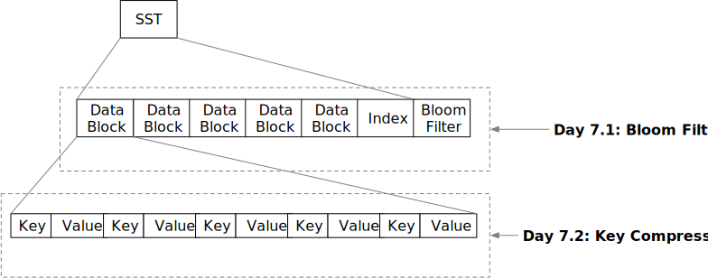

<!--
  mini-lsm-book © 2022-2025 by Alex Chi Z is licensed under CC BY-NC-SA 4.0
-->

# Snack Time: SST Optimizations



In the previous chapter, you already built a storage engine with get/scan/put support. At the end of this week, we will implement some easy but important optimizations of SST formats. Welcome to Mini-LSM's week 1 snack time!

In this chapter, you will:

* Implement bloom filter on SSTs and integrate into the LSM read path `get`.
* Implement key compression in SST block format.


To copy the test cases into the starter code and run them,

```
cargo x copy-test --week 1 --day 7
cargo x scheck
```

## Task 1: Bloom Filters

Bloom filters are probabilistic data structures that maintains a set of keys. You can add keys to a bloom filter, and you can know what key may exist / must not exist in the set of keys being added to the bloom filter.

You usually need to have a hash function in order to construct a bloom filter, and a key can have multiple hashes. Let us take a look at the below example. Assume that we already have hashes of some keys and the bloom filter has 7 bits.

[Note: If you want to understand bloom filters better, look [here](https://samwho.dev/bloom-filters/)]

```plaintext 
hash1 = ((character - a) * 13) % 7
hash2 = ((character - a) * 11) % 7
b -> 6 4
c -> 5 1
d -> 4 5
e -> 3 2
g -> 1 3
h -> 0 0
```

If we insert b, c, d into the 7-bit bloom filter, we will get:

```
    bit  0123456
insert b     1 1
insert c  1   1
insert d     11
result   0101111
```

When probing the bloom filter, we generate the hashes for a key, and see if the corresponding bit has been set. If all of them are set to true, then the key may exist in the bloom filter. Otherwise, the key must NOT exist in the bloom filter.

For `e -> 3 2`, as the bit 2 is not set, it should not be in the original set. For `g -> 1 3`, because two bits are all set, it may or may not exist in the set. For `h -> 0 0`, both of the bits (actually it's one bit) are not set, and therefore it should not be in the original set.

```
b -> maybe (actual: yes)
c -> maybe (actual: yes)
d -> maybe (actual: yes)
e -> MUST not (actual: no)
g -> maybe (actual: no)
h -> MUST not (actual: no)
```

Remember that at the end of last chapter, we implemented SST filtering based on key range. Now, on the `get` read path, we can also use the bloom filter to ignore SSTs that do not contain the key that the user wants to lookup, therefore reducing the number of files to be read from the disk.

In this task, you will need to modify:

```
src/table/bloom.rs
```

In the implementation, you will build a bloom filter from key hashes (which are u32 numbers). For each of the hash, you will need to set `k` bits. The bits are computed by:

```rust,no_run
let delta = (h >> 17) | (h << 15); // h is the key hash
for _ in 0..k {
    // TODO: use the hash to set the corresponding bit
    h = h.wrapping_add(delta);
}
```

We provide all the skeleton code for doing the magic mathematics. You only need to implement the procedure of building a bloom filter and probing a bloom filter.

## Task 2: Integrate Bloom Filter on the Read Path

In this task, you will need to modify:

```
src/table/builder.rs
src/table.rs
src/lsm_storage.rs
```

For the bloom filter encoding, you can append the bloom filter to the end of your SST file. You will need to store the bloom filter offset at the end of the file, and compute meta offsets accordingly.

```plaintext
-----------------------------------------------------------------------------------------------------
|         Block Section         |                            Meta Section                           |
-----------------------------------------------------------------------------------------------------
| data block | ... | data block | metadata | meta block offset | bloom filter | bloom filter offset |
|                               |  varlen  |         u32       |    varlen    |        u32          |
-----------------------------------------------------------------------------------------------------
```

We use the `farmhash` crate to compute the hashes of the keys. When building the SST, you will need also to build the bloom filter by computing the key hash using `farmhash::fingerprint32`. You will need to encode/decode the bloom filters with the block meta. You can choose false positive rate 0.01 for your bloom filter. You may need to add new fields to the structures apart from the ones provided in the starter code as necessary.

After that, you can modify the `get` read path to filter SSTs based on bloom filters.

We do not have integration test for this part and you will need to ensure that your implementation still pass all previous chapter tests.

## Task 3: Key Prefix Encoding + Decoding

In this task, you will need to modify:

```
src/block/builder.rs
src/block/iterator.rs
```

As the SST file stores keys in order, it is possible that the user stores keys of the same prefix, and we can compress the prefix in the SST encoding so as to save space.

We compare the current key with the first key in the block. We store the key as follows:

```
key_overlap_len (u16) | rest_key_len (u16) | key (rest_key_len)
```

The `key_overlap_len` indicates how many bytes are the same as the first key in the block. For example, if we see a record: `5|3|LSM`, where the first key in the block is `mini-something`, we can recover the current key to `mini-LSM`.

After you finish the encoding, you will also need to implement decoding in the block iterator. You may need to add new fields to the structures apart from the ones provided in the starter code as necessary.

## Test Your Understanding

* How does the bloom filter help with the SST filtering process? What kind of information can it tell you about a key? (may not exist/may exist/must exist/must not exist)
* Consider the case that we need a backward iterator. Does our key compression affect backward iterators?
* Can you use bloom filters on scan?
* What might be the pros/cons of doing key-prefix encoding over adjacent keys instead of with the first key in the block?

We do not provide reference answers to the questions, and feel free to discuss about them in the Discord community.

{{#include copyright.md}}
