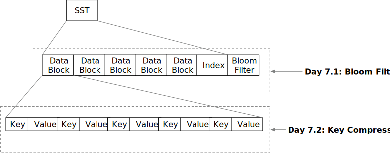

<!--
  mini-lsm-book © 2022-2026 by Alex Chi Z is licensed under CC BY-NC-SA 4.0
-->

# Snack Time: SST Optimizations



In the previous chapter, you completed a storage engine that supports `get`, `scan`, and `put`. To finish the week, you will implement two approachable but important SST-format optimizations. Welcome to Week 1's snack-time chapter!

By the end of this chapter, you will be able to:

* Implement Bloom filters for SSTs and integrate them into the `get` path.
* Implement key-prefix compression in the SST block format.
* Explain why both optimizations preserve correctness despite discarding lookup work or repeated bytes.


To copy the test cases into the starter code and run them:

```
cargo x copy-test --week 1 --day 7
cargo x scheck
```

## Before You Begin

The engine completed in Day 6 is functionally correct. Today's changes must preserve its results while reducing I/O and storage space.

Keep these invariants in mind:

1. A Bloom-filter negative result must be definitive: an SST skipped after a negative probe cannot contain the key. Positive results may be false and therefore still require a lookup.
2. The builder and reader hash exactly the same key bytes with the same function.
3. Prefix encoding followed by decoding reconstructs every original key exactly.
4. Each compressed key is defined relative to the first key in its block, so it can be decoded without decoding every preceding entry.
5. These optimizations may change I/O counts and encoded sizes, but never the key-value pairs returned by `get` or `scan`.

> **Predict before coding:** A Bloom filter returns “may contain” for a key that is absent from an SST. What extra work occurs, and why is the final result still correct? Now consider a filter that incorrectly returns “definitely absent” for a present key. Which storage-engine guarantee is violated?

## Task 1: Bloom Filters

A Bloom filter is a probabilistic data structure that represents set membership. After adding keys, you can ask whether a key may belong to the set or definitely does not belong to it. False positives are possible; false negatives are not.

Constructing a Bloom filter requires hashing each key, usually to several bit positions. Consider the following example, in which each key has two hashes and the filter contains 7 bits:

For a more detailed introduction, see [Bloom Filters by Example](https://samwho.dev/bloom-filters/).

```plaintext 
hash1 = ((character - a) * 13) % 7
hash2 = ((character - a) * 11) % 7
b -> 6 4
c -> 5 1
d -> 4 5
e -> 3 2
g -> 1 3
h -> 0 0
```

Inserting `b`, `c`, and `d` produces this filter:

```
    bit  0123456
insert b     1 1
insert c  1   1
insert d     11
result   0101111
```

To probe the filter, hash the key and inspect the corresponding bits. If every bit is set, the key may belong to the original set. If any bit is clear, the key definitely does not belong to the set.

For `e -> 3 2`, bit 2 is clear, so `e` is definitely absent. For `g -> 1 3`, both bits are set, so `g` may or may not be present. For `h -> 0 0`, the single referenced bit is clear, so `h` is definitely absent.

```
b -> maybe (actual: yes)
c -> maybe (actual: yes)
d -> maybe (actual: yes)
e -> MUST not (actual: no)
g -> maybe (actual: no)
h -> MUST not (actual: no)
```

In the previous chapter, you filtered SSTs by key range. On the `get` path, a Bloom filter can additionally exclude SSTs that definitely do not contain the requested key, reducing disk reads.

In this task, you will need to modify:

```
src/table/bloom.rs
```

Build the Bloom filter from `u32` key hashes. For each hash, set `k` bits using the following sequence:

```rust,no_run
let delta = (h >> 17) | (h << 15); // h is the key hash
for _ in 0..k {
    // TODO: use the hash to set the corresponding bit
    h = h.wrapping_add(delta);
}
```

The starter code provides the remaining calculations. Implement the procedures for building and probing the filter.

## Task 2: Integrate Bloom Filter on the Read Path

In this task, you will need to modify:

```
src/table/builder.rs
src/table.rs
src/lsm_storage.rs
```

Append the encoded Bloom filter to the SST file and store its offset at the end. Account for that new section when reading the metadata offset.

```plaintext
-----------------------------------------------------------------------------------------------------
|         Block Section         |                            Meta Section                           |
-----------------------------------------------------------------------------------------------------
| data block | ... | data block | metadata | meta block offset | bloom filter | bloom filter offset |
|                               |  varlen  |         u32       |    varlen    |        u32          |
-----------------------------------------------------------------------------------------------------
```

Use the `farmhash` crate to hash keys. While building the SST, compute each key's hash with `farmhash::fingerprint32`, then build and encode the Bloom filter. When opening an SST, decode both its block metadata and its Bloom filter. Use a false-positive rate of 0.01. Add fields to the provided structures as needed.

Then update the `get` path to filter SSTs with their Bloom filters.

There is no integration test specifically for this optimization, so ensure that all tests from earlier chapters still pass.

## Task 3: Key Prefix Encoding + Decoding

In this task, you will need to modify:

```
src/block/builder.rs
src/block/iterator.rs
```

Because an SST stores keys in sorted order, nearby keys often share a prefix. Encoding that prefix only once can save space.

Compare each key with the first key in its block, and encode it as follows:

```
key_overlap_len (u16) | rest_key_len (u16) | key (rest_key_len)
```

`key_overlap_len` is the length of the shared prefix, in bytes. For example, if the first key is `mini-something`, the record `5|3|LSM` reconstructs the key `mini-LSM`.

After implementing the encoding, update the block iterator to reconstruct keys while decoding. Add fields to the provided structures as needed.

## Chapter Checkpoint

Your Week 1 engine should now avoid many unnecessary SST reads on point lookups and avoid storing shared key-prefix bytes repeatedly. All tests from earlier chapters should continue to pass because neither optimization changes logical behavior.

Measure or inspect three things: the encoded size of a block containing keys with a long shared prefix, the number of SST iterators created by a point lookup rejected by several Bloom filters, and the result of probing known-present and known-absent keys. Explain why each observation follows from the invariants above.

## Test Your Understanding

### Correctness

* How does a Bloom filter help filter SSTs? Which claims can it make about a key: may not exist, may exist, must exist, or must not exist?
* If we need a backward iterator, how does this key compression affect it?
* Can Bloom filters help with scans?

### Format and Design

* What are the advantages and disadvantages of prefix-encoding each key relative to the previous key rather than the first key in the block?
* Why must the first key in a block have an overlap length of zero? What malformed or circular representation could result otherwise?
* Compare the encoded sizes of keys that share a long prefix, keys that share no prefix, and one key larger than the target block size. When does prefix encoding provide little or no benefit?

We do not provide reference answers to these questions. Feel free to discuss them in the Discord community.

{{#include copyright.md}}
