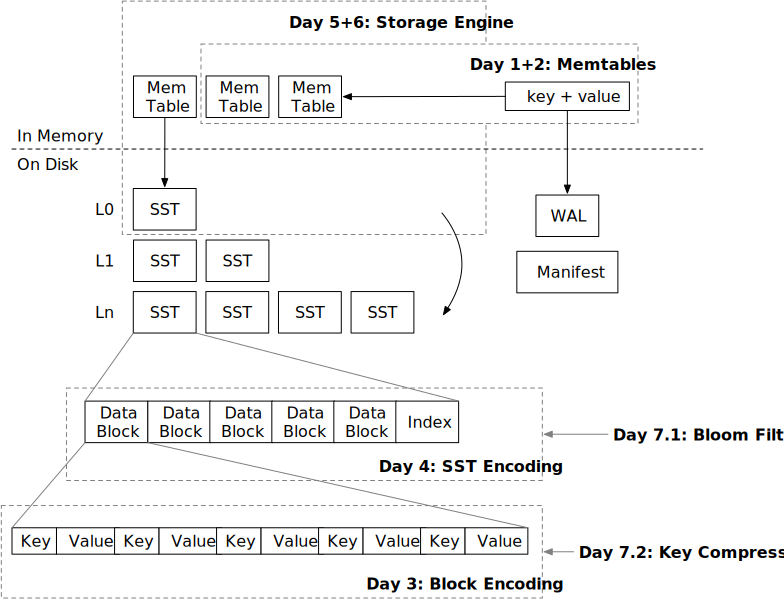

<!--
  mini-lsm-book © 2022-2025 by Alex Chi Z is licensed under CC BY-NC-SA 4.0
-->

# Week 1 Overview: Mini-LSM

In the first week of the course, you will build necessary storage formats for the storage engine, the read path and the write path of the system, and have a working implementation of an LSM-based key-value store. There are 7 chapters (days) for this part.

* [Day 1: Memtable](./week1-01-memtable.md). You will implement the in-memory read and write path of the system.
* [Day 2: Merge Iterator](./week1-02-merge-iterator.md). You will extend what you have built in day 1 and implement a `scan` interface for your system.
* [Day 3: Block Encoding](./week1-03-block.md). Now we start the first step of the on-disk structure and build the encoding/decoding of the blocks.
* [Day 4: SST Encoding](./week1-04-sst.md). SSTs are composed of blocks and at the end of the day, you will have the basic building blocks of the LSM on-disk structure.
* [Day 5: Read Path](./week1-05-read-path.md). Now that we have both in-memory and on-disk structures, we can combine them together and have a fully-working read path for the storage engine.
* [Day 6: Write Path](./week1-06-write-path.md). In day 5, the test harness generates the structures, and in day 6, you will control the SST flushes by yourself. You will implement flush to level-0 SST and the storage engine is complete.
* [Day 7: SST Optimizations](./week1-07-sst-optimizations.md). We will implement several SST format optimizations and improve the performance of the system.

At the end of the week, your storage engine should be able to handle all get/scan/put requests. The only missing parts are persisting the LSM state to disk and a more efficient way of organizing the SSTs on the disk. You will have a working **Mini-LSM** storage engine.

{{#include copyright.md}}
