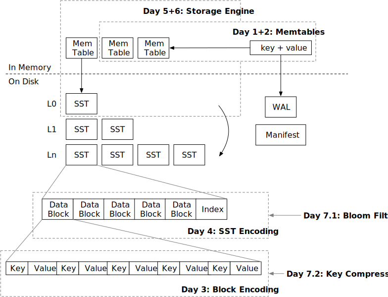

<!--
  mini-lsm-book © 2022-2026 by Alex Chi Z is licensed under CC BY-NC-SA 4.0
-->

# Week 1 Overview: Mini-LSM

In the first week, you will build the storage engine's core formats, read path, and write path. By the end of its seven chapters, you will have a working LSM-based key-value store.

| Chapter | Before | After |
| --- | --- | --- |
| [Day 1: Memtable](./week1-01-memtable.md) | The storage interfaces are stubs. | The engine supports in-memory point reads, writes, deletes, and memtable freezing. |
| [Day 2: Merge Iterator](./week1-02-merge-iterator.md) | The engine can query one key at a time. | It can scan an ordered range across multiple memtables. |
| [Day 3: Block Encoding](./week1-03-block.md) | All data structures are in memory. | Key-value pairs can be encoded into and decoded from an on-disk block format. |
| [Day 4: SST Encoding](./week1-04-sst.md) | The engine has individual blocks. | Blocks form seekable SSTs whose data is loaded on demand and cached. |
| [Day 5: Read Path](./week1-05-read-path.md) | Memtables and SSTs have separate iterators. | Point reads and scans produce one logical view across both. |
| [Day 6: Write Path](./week1-06-write-path.md) | The test harness creates SSTs for you. | The engine flushes frozen memtables to L0 and filters irrelevant SSTs. |
| [Day 7: SST Optimizations](./week1-07-sst-optimizations.md) | The engine is correct but performs avoidable I/O and stores repeated key bytes. | Bloom filters reduce point-read I/O, and prefix encoding makes blocks smaller. |

## How to Use This Week

The implementation is the laboratory in which you explore the design. Passing the tests is an important checkpoint, but it is not the final learning goal: the provided tests cannot cover every boundary condition, malformed input, or concurrent execution.

For each chapter:

1. Read the capability and core-invariant sections before writing code.
2. Predict the behavior of the small examples without running them.
3. Implement the tasks and run the chapter tests.
4. Answer the correctness questions with evidence from your implementation. When a question asks what can go wrong, construct a minimal counterexample or test.
5. Compare with the reference solution only after making a serious attempt. A different implementation can still be correct if it preserves the same invariants.

You may use an LLM or other coding tools, but treat generated code as an untrusted contribution: identify the invariants first, review the result against them, and add tests that exercise behavior not covered by the supplied suite. The ability to explain, challenge, and validate an implementation matters more than who typed it.

At the end of the week, your storage engine should be able to handle `get`, `scan`, `put`, and `delete` requests. The remaining work is to persist the LSM state across restarts and organize SSTs on disk more efficiently. You will have a working **Mini-LSM** storage engine.

Before moving to Week 2, check that you can explain:

- why each component introduced this week is necessary;
- the central correctness invariant of each component;
- one plausible bug in each component and a test that exposes it;
- which data is in memory, which data is on disk, and which structure owns each piece;
- how the read and write paths choose the newest visible value for a key.

{{#include copyright.md}}
