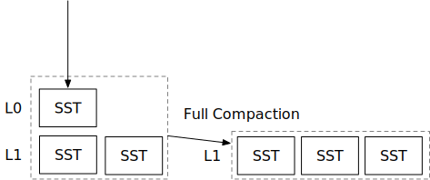

<!--
  mini-lsm-book © 2022-2026 by Alex Chi Z is licensed under CC BY-NC-SA 4.0
-->

# Compaction Implementation



By the end of this chapter, you will be able to:

* Implement the compaction logic that combines some files and produces new files.
* Install a compaction result without losing SSTs flushed concurrently.
* Update the LSM read path to incorporate non-overlapping sorted runs.
* Explain why iterator priority and the destination level determine whether a tombstone can be discarded.

To copy the test cases into the starter code and run them:

```
cargo x copy-test --week 2 --day 1
cargo x scheck
```

<div class="warning">

Read the [Week 2 overview](./week2-overview.md) before beginning this chapter for an introduction to compaction and amplification.

</div>

## Before You Begin

At the end of Week 1, every flush creates a new L0 SST. L0 files can have overlapping key ranges and are stored from newest to oldest. This chapter introduces L1, one sorted run whose SSTs have non-overlapping key ranges and are ordered by their first keys.

Keep these invariants in mind while implementing the tasks:

1. When several inputs contain the same key, the iterator representing the newest source must win.
2. L0 may overlap, but the SSTs produced for L1 must be ordered and non-overlapping.
3. A tombstone may be discarded only when the compaction includes every possible older version of that key. In this chapter, full compaction targets the bottom level, so that condition holds.
4. Merging and writing output SSTs happens outside `state_lock`. Installing the result happens while holding it, and must remove only the files named by the task. An L0 SST flushed after the task was created must remain in the new state.
5. If every surviving entry is a tombstone, compaction produces no SST rather than building an empty one.

> **Predict before coding:** A full-compaction task captures L0 files `[5, 4]` and L1 files `[1, 2]`. While it is writing output SSTs, file 6 is flushed to the front of L0. Which files should remain in L0 after the result is installed? If the newest value of `k` in file 5 is a tombstone and an older value is in file 1, should either entry appear in the output?

## Task 1: Compaction Implementation

In this task, implement the core compaction operation: merge a set of SSTs into a sorted run. You will need to modify:

```
src/compact.rs
```

Specifically, implement the `force_full_compaction` and `compact` functions. `force_full_compaction` chooses the files and installs the result in the LSM state. `compact` performs the merge and returns a set of new SSTs.

Use `MergeIterator` to merge every SST captured by the task, then write the surviving entries through `SsTableBuilder`. Split the output when it reaches the target SST size. After the merge finishes, install the output as the L1 sorted run and remove the obsolete inputs from the state and filesystem. At this stage, SSTs appear only in L0 or L1, so `LsmStorageState::levels` contains one entry.

Compaction should not block L0 flushes. Do not hold `state_lock` while merging files and writing outputs. Acquire it only when installing the result, and release it immediately after the structural update and manifest record are complete.

You may assume that only one compaction runs at a time. The SSTs installed in L1 must be sorted by first key and have non-overlapping key ranges.

<details>

<summary>Spoilers: Compaction Pseudo Code</summary>

```rust,no_run
fn force_full_compaction(&self) {
    let ssts_to_compact = {
        let state = self.state.read();
        state.l0_sstables + state.levels[0]
    };
    let new_ssts = self.compact(FullCompactionTask(ssts_to_compact))?;
    {
        let state_lock = self.state_lock.lock();
        let state = self.state.write();
        state.l0_sstables.remove(/* the ones being compacted */);
        state.levels[0] = new_ssts; // new SSTs added to L1
    };
    std::fs::remove(ssts_to_compact)?;
}
```

</details>

For now, `compact` needs to handle only `ForceFullCompaction`, whose task lists the input SSTs. Preserve source priority so that the newest version of each key reaches the output.

Because this task includes every SST, retain only the newest version of each key. If that version is a tombstone, omit it from the output. Later chapters compact only part of the tree, so they cannot always discard tombstones.

Before moving on, account for these two cases:

* How does your implementation retain an L0 SST flushed while compaction is in progress?
* Can a reader using an older state snapshot finish after the input filenames are unlinked? On Unix-like systems, an open file remains accessible until its final handle is closed.

## Task 2: Concat Iterator

In this task, you will need to modify:

```
src/iterators/concat_iterator.rs
```

A sorted run does not need a merge iterator: its SSTs are ordered and have non-overlapping ranges, so a concat iterator can visit them sequentially. Store the SST objects and create only the active child iterator. Creating every child in advance would read the first block of every SST unnecessarily.

## Task 3: Integrate with the Read Path

In this task, you will need to modify:

```
src/lsm_iterator.rs
src/lsm_storage.rs
src/compact.rs
```

Now update the two-level read path to use the concat iterator for L1.

Change the inner iterator type of `LsmStorageIterator`. Merge the memtable and L0 iterators first, then use `TwoMergeIterator` to combine that newer stream with the L1 concat iterator.

You can also change your compaction implementation to leverage the concat iterator.

Implement `num_active_iterators` for the concat iterator. For this exercise, it should always report one active iterator.

To test your implementation interactively,

```shell
cargo run --bin mini-lsm-cli-ref -- --compaction none # reference solution
cargo run --bin mini-lsm-cli -- --compaction none # your solution
```

And then,

```
fill 1000 3000
flush
fill 1000 3000
flush
full_compaction
fill 1000 3000
flush
full_compaction
get 2333
scan 2000 2333
```

## Chapter Checkpoint

Your engine should now compact the captured L0 and L1 inputs into zero or more ordered L1 SSTs, retain L0 files created after the task snapshot, and serve `get` and `scan` through both overlapping and non-overlapping sources.

In addition to passing the tests, verify three cases explicitly:

1. Give two input SSTs the same key and confirm that reversing their merge priority changes the result.
2. Compact an input containing only tombstones and confirm that no empty SST is created.
3. Seek a concat iterator into the second or later SST and confirm that it opens only the active child iterator.

## Test Your Understanding

Answer correctness questions with a concrete LSM state or execution. For amplification questions, state what you count in the numerator and denominator.

### Correctness and Concurrency

* Construct the smallest input in which reversing L0 iterator priority preserves a stale value. Then construct one in which it resurrects a deleted value.
* Why is it safe to discard tombstones during this chapter's full compaction? Give a counterexample showing why the same rule is unsafe when compacting into a non-bottom level.
* How does your implementation retain an L0 SST flushed while compaction is writing its output?
* What should `apply_compaction_result` do when compaction produces no SSTs?
* If your implementation removes the original SST files immediately after installing the new state, can a reader using an older state snapshot still finish? How does the answer depend on filesystem semantics?
* What ordering and non-overlap properties must hold before `SstConcatIterator` is safe to use?

### Performance and Design

* What are the definitions of read/write/space amplifications? (This is covered in the overview chapter)
* What are the ways to accurately compute the read/write/space amplifications, and what are the ways to estimate them?
* Is it correct that a key will take some storage space even if a user requests to delete it?
* Because compaction consumes read and write bandwidth, should the engine postpone or pause it during heavy foreground traffic? What new problem could that create? Read [SILK: Preventing Latency Spikes in Log-Structured Merge Key-Value Stores](https://www.usenix.org/conference/atc19/presentation/balmau).
* Is it a good idea to use/fill the block cache for compactions? Or is it better to fully bypass the block cache when compaction?
* Does it make sense to have a `struct ConcatIterator<I: StorageIterator>` in the system?
* Some researchers/engineers propose to offload compaction to a remote server or a serverless lambda function. What are the benefits, and what might be the potential challenges and performance impacts of doing remote compaction? (Think of the point when a compaction completes and what happens to the block cache on the next read request...)

We do not provide reference answers to these questions, so feel free to discuss them in the Discord community.

{{#include copyright.md}}
