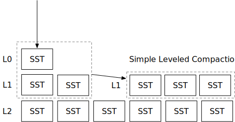

<!--
  mini-lsm-book © 2022-2025 by Alex Chi Z is licensed under CC BY-NC-SA 4.0
-->

# Simple Compaction Strategy



In this chapter, you will:

* Implement a simple leveled compaction strategy and simulate it on the compaction simulator.
* Start compaction as a background task and implement a compaction trigger in the system.

To copy the test cases into the starter code and run them,

```
cargo x copy-test --week 2 --day 2
cargo x scheck
```

<div class="warning">

It might be helpful to take a look at [week 2 overview](./week2-overview.md) before reading this chapter to have a general overview of compactions.

</div>

## Task 1: Simple Leveled Compaction

In this chapter, we are going to implement our first compaction strategy -- simple leveled compaction. In this task, you will need to modify:

```
src/compact/simple_leveled.rs
```

Simple leveled compaction is similar the original LSM paper's compaction strategy. It maintains a number of levels for the LSM tree. When a level (>= L1) is too large, it will merge all of this level's SSTs with next level. The compaction strategy is controlled by 3 parameters as defined in `SimpleLeveledCompactionOptions`.

* `size_ratio_percent`: lower level number of files / upper level number of files. In reality, we should compute the actual size of the files. However, we simplified the equation to use number of files to make it easier to do the simulation. When the ratio is too low (upper level has too many files), we should trigger a compaction.
* `level0_file_num_compaction_trigger`: when the number of SSTs in L0 is larger than or equal to this number, trigger a compaction of L0 and L1.
* `max_levels`: the number of levels (excluding L0) in the LSM tree.

Assume size_ratio_percent=200 (Lower level should have 2x number of files as the upper level), max_levels=3, level0_file_num_compaction_trigger=2, let us take a look at the below example.

Assume the engine flushes two L0 SSTs. This reaches the `level0_file_num_compaction_trigger`, and your controller should trigger an L0->L1 compaction.

```
--- After Flush ---
L0 (2): [1, 2]
L1 (0): []
L2 (0): []
L3 (0): []
--- After Compaction ---
L0 (0): []
L1 (2): [3, 4]
L2 (0): []
L3 (0): []
```

Now, L2 is empty while L1 has two files. The size ratio percent for L1 and L2 is `(L2/L1) * 100 = (0/2) * 100 = 0 < size_ratio_percent (200)`. Therefore, we will trigger a L1+L2 compaction to push the data lower to L2. The same applies to L2 and these two SSTs will be placed at the bottom-most level after 2 compactions.

```
--- After Compaction ---
L0 (0): []
L1 (0): []
L2 (2): [5, 6]
L3 (0): []
--- After Compaction ---
L0 (0): []
L1 (0): []
L2 (0): []
L3 (2): [7, 8]
```

Continue flushing SSTs, we will find:

```
L0 (0): []
L1 (0): []
L2 (2): [13, 14]
L3 (2): [7, 8]
```

At this point, `L3/L2= (1 / 1) * 100 = 100 < size_ratio_percent (200)`. Therefore, we need to trigger a compaction between L2 and L3.

```
--- After Compaction ---
L0 (0): []
L1 (0): []
L2 (0): []
L3 (4): [15, 16, 17, 18]
```

As we flush more SSTs, we will possibly end up at a state as follows:

```
--- After Flush ---
L0 (2): [19, 20]
L1 (0): []
L2 (0): []
L3 (4): [15, 16, 17, 18]
--- After Compaction ---
L0 (0): []
L1 (0): []
L2 (2): [23, 24]
L3 (4): [15, 16, 17, 18]
```

Because `L3/L2 = (4 / 2) * 100 = 200 >= size_ratio_percent (200)`, we do not need to merge L2 and L3 and will end up with the above state. Simple leveled compaction strategy always compact a full level, and keep a fanout size between levels, so that the lower level is always some multiplier times larger than the upper level.

We have already initialized the LSM state to have `max_level` levels. You should first implement `generate_compaction_task` that generates a compaction task based on the above 3 criteria. After that, implement `apply_compaction_result`. We recommend you implement L0 trigger first, run a compaction simulation, and then implement the size ratio trigger, and then run a compaction simulation. To run the compaction simulation,

```shell
cargo run --bin compaction-simulator-ref simple # Reference solution
cargo run --bin compaction-simulator simple # Your solution
```

The simulator will flush an L0 SST into the LSM state, run your compaction controller to generate a compaction task, and then apply the compaction result. Each time a new SST gets flushed, it will repetitively call the controller until no compaction needs to be scheduled, and therefore you should ensure your compaction task generator will converge.

In your compaction implementation, you should reduce the number of active iterators (i.e., use concat iterator) as much as possible. Also, remember that merge order matters, and you will need to ensure that the iterators you create produces key-value pairs in the correct order, when multiple versions of a key appear.

Also, note that some parameters in the implementation is 0-based, and some of them are 1-based. Be careful when you use the `level` as an index in a vector.

**Note: we do not provide fine-grained unit tests for this part. You can run the compaction simulator and compare with the output of the reference solution to see if your implementation is correct.**

## Task 2: Compaction Thread

In this task, you will need to modify:

```
src/compact.rs
```

Now that you have implemented your compaction strategy, you will need to run it in a background thread, so as to compact the files in the background. In `compact.rs`, `trigger_compaction` will be called every 50ms, and you will need to:

1. generate a compaction task, if no task needs to be scheduled, return ok.
2. run the compaction and get a list of new SSTs.
3. Similar to `force_full_compaction` you have implemented in the previous chapter, update the LSM state.

## Task 3: Integrate with the Read Path

In this task, you will need to modify:

```
src/lsm_storage.rs
```

Now that you have multiple levels of SSTs, you can modify your read path to include the SSTs from the new levels. You will need to update the scan/get function to include all levels below L1. Also, you might need to change the `LsmStorageIterator` inner type again.

To test your implementation interactively,

```shell
cargo run --bin mini-lsm-cli-ref -- --compaction simple # reference solution
cargo run --bin mini-lsm-cli -- --compaction simple # your solution
```

And then,

```
fill 1000 3000
flush
fill 1000 3000
flush
fill 1000 3000
flush
get 2333
scan 2000 2333
```

You may print something, for example, the compaction task information, when the compactor triggers a compaction.

## Test Your Understanding

* What is the estimated write amplification of leveled compaction?
* What is the estimated read amplification of leveled compaction?
* Is it correct that a key will only be purged from the LSM tree if the user requests to delete it and it has been compacted in the bottom-most level?
* Is it a good strategy to periodically do a full compaction on the LSM tree? Why or why not?
* Actively choosing some old files/levels to compact even if they do not violate the level amplifier would be a good choice, is it true? (Look at the [Lethe](https://disc-projects.bu.edu/lethe/) paper!)
* If the storage device can achieve a sustainable 1GB/s write throughput and the write amplification of the LSM tree is 10x, how much throughput can the user get from the LSM key-value interfaces?
* Can you merge L1 and L3 directly if there are SST files in L2? Does it still produce correct result?
* So far, we have assumed that our SST files use a monotonically increasing id as the file name. Is it okay to use `<level>_<begin_key>_<end_key>.sst` as the SST file name? What might be the potential problems with that? (You can ask yourself the same question in week 3...)
* What is your favorite boba shop in your city? (If you answered yes in week 1 day 3...)

We do not provide reference answers to the questions, and feel free to discuss about them in the Discord community.

{{#include copyright.md}}
