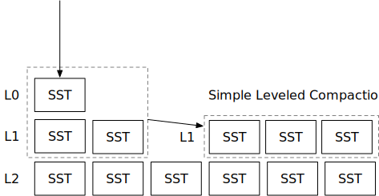

<!--
  mini-lsm-book © 2022-2026 by Alex Chi Z is licensed under CC BY-NC-SA 4.0
-->

# Simple Compaction Strategy



By the end of this chapter, you will be able to:

* Implement a simple leveled compaction strategy and simulate it on the compaction simulator.
* Run compaction as a background task and install its results safely.
* Extend point reads and scans across multiple non-overlapping levels.
* Explain how level ratios, merge priority, and bottom-level tombstone removal affect correctness and amplification.

To copy the test cases into the starter code and run them:

```
cargo x copy-test --week 2 --day 2
cargo x scheck
```

<div class="warning">

Read the [Week 2 overview](./week2-overview.md) before beginning this chapter for an introduction to compaction and amplification.

</div>

## Before You Begin

Day 1 compacted the entire database into L1 on demand. Simple leveled compaction introduces a controller that chooses one adjacent pair of levels at a time and a background thread that repeatedly asks the controller for work.

Keep these invariants in mind:

1. L0 is ordered from newest to oldest and may overlap. Each level from L1 downward is one sorted, non-overlapping run.
2. In a merge, the upper level contains newer versions than the lower level and must win on duplicate keys. For L0, individual files also need newest-to-oldest priority.
3. `generate_compaction_task` must eventually return `None`; otherwise, the simulator and background worker cannot converge.
4. Applying an L0 task removes exactly the captured L0 files, not files flushed after the task was generated.
5. Tombstones are preserved until the task's lower level is the bottom-most level.

> **Predict before coding:** With `size_ratio_percent = 200`, suppose L1 has two files, L2 has three, and L3 has eight. Which adjacent pair should be compacted next? If a new L0 file is flushed while that task runs, should applying the result change L0?

## Task 1: Simple Leveled Compaction

In this task, implement the first scheduling policy: simple leveled compaction. You will need to modify:

```
src/compact/simple_leveled.rs
```

Simple leveled compaction is similar to the strategy in the original LSM-tree paper. It maintains a fixed number of levels. When a level at or below L1 is too large relative to the next level, the engine merges all of its SSTs with that lower level. Three parameters in `SimpleLeveledCompactionOptions` control the policy.

* `size_ratio_percent`: the target ratio of lower-level files to upper-level files. A production system would compare byte sizes, but this exercise compares file counts for simpler simulation. Trigger compaction when the actual ratio falls below this value.
* `level0_file_num_compaction_trigger`: when L0 contains at least this many SSTs, compact L0 with L1.
* `max_levels`: the number of levels (excluding L0) in the LSM tree.

Consider `size_ratio_percent = 200`, `max_levels = 3`, and `level0_file_num_compaction_trigger = 2`. Each lower level should contain at least twice as many files as the level above it.

Assume the engine flushes two L0 SSTs. This reaches the `level0_file_num_compaction_trigger`, and your controller should trigger an L0->L1 compaction.

```
--- After Flush ---
L0 (2): [1, 2]
L1 (0): []
L2 (0): []
L3 (0): []
--- After Compaction ---
L0 (0): []
L1 (2): [3, 4]
L2 (0): []
L3 (0): []
```

L2 is empty while L1 has two files, so `(L2 / L1) * 100 = (0 / 2) * 100 = 0`, which is below 200. The controller compacts L1 with L2. The same condition then holds between L2 and L3, so a second compaction moves the two files to the bottom level.

```
--- After Compaction ---
L0 (0): []
L1 (0): []
L2 (2): [5, 6]
L3 (0): []
--- After Compaction ---
L0 (0): []
L1 (0): []
L2 (0): []
L3 (2): [7, 8]
```

After more flushes and compactions, the state can become:

```
L0 (0): []
L1 (0): []
L2 (2): [13, 14]
L3 (2): [7, 8]
```

At this point, `(L3 / L2) * 100 = (2 / 2) * 100 = 100`, which is below 200. The controller compacts L2 with L3.

```
--- After Compaction ---
L0 (0): []
L1 (0): []
L2 (0): []
L3 (4): [15, 16, 17, 18]
```

After additional flushes, the state might become:

```
--- After Flush ---
L0 (2): [19, 20]
L1 (0): []
L2 (0): []
L3 (4): [15, 16, 17, 18]
--- After Compaction ---
L0 (0): []
L1 (0): []
L2 (2): [23, 24]
L3 (4): [15, 16, 17, 18]
```

Because `L3/L2 = (4 / 2) * 100 = 200 >= size_ratio_percent (200)`, we do not need to merge L2 and L3. Simple leveled compaction always compacts a full level and maintains a target fanout between adjacent levels.

The LSM state already contains `max_levels` levels. First implement the L0 trigger in `generate_compaction_task` and inspect a simulation. Then add the size-ratio trigger and implement `apply_compaction_result`. Run the simulator with:

```shell
cargo run --bin compaction-simulator-ref simple # Reference solution
cargo run --bin compaction-simulator simple # Your solution
```

The simulator flushes an L0 SST, asks the controller for a task, and applies the result. After each flush, it repeatedly invokes the controller until no task remains, so your scheduling policy must converge.

Use concat iterators for sorted runs to minimize active child iterators. Merge order still determines which version of a duplicate key survives, so construct every input in newest-to-oldest priority order.

Some values are zero-based vector indexes, while level numbers begin at one. Convert between them explicitly.

**Note: we do not provide fine-grained unit tests for this part. You can run the compaction simulator and compare with the output of the reference solution to see if your implementation is correct.**

## Task 2: Compaction Thread

In this task, you will need to modify:

```
src/compact.rs
```

Run the controller from a background thread. `trigger_compaction` is called every 50 ms and should:

1. Generate a compaction task. If no task needs to be scheduled, return successfully.
2. Run the compaction and obtain a list of new SSTs.
3. As in `force_full_compaction`, install the result in the current LSM state.

## Task 3: Integrate with the Read Path

In this task, you will need to modify:

```
src/lsm_iterator.rs
src/lsm_storage.rs
```

Extend both `get` and `scan` across every level below L1. Change the inner type of `LsmStorageIterator` so that it merges one `SstConcatIterator` per level.

To test your implementation interactively,

```shell
cargo run --bin mini-lsm-cli-ref -- --compaction simple # reference solution
cargo run --bin mini-lsm-cli -- --compaction simple # your solution
```

And then,

```
fill 1000 3000
flush
fill 1000 3000
flush
fill 1000 3000
flush
get 2333
scan 2000 2333
```

You may print something, for example, the compaction task information, when the compactor triggers a compaction.

## Chapter Checkpoint

Your engine should now schedule simple leveled compactions in the background, preserve newer values across every merge, and read through all configured levels. The simulator should reach a state in which no further task is eligible.

Compare a short simulator run with the reference output, then alter one parameter at a time. Explain why each task was selected, identify whether it reaches the bottom level, and verify that the next state still contains any L0 file created after the task snapshot.

## Test Your Understanding

### Correctness and Scheduling

* For a duplicate key present in both levels of a task, why must the upper-level iterator win? What stale result appears if the priority is reversed?
* Why may a bottom-level compaction discard a tombstone while an L1-to-L2 compaction might need to retain it?
* Construct a level-size configuration that causes an implementation with reversed ratio operands to select the wrong task.
* What state must be rechecked when a background compaction finishes, and which concurrent change is expected rather than an error?
* Can you merge L1 and L3 directly if there are SST files in L2? Does it still produce the correct result?

### Amplification and Design

* What is the estimated write amplification of leveled compaction?
* What is the estimated read amplification of leveled compaction?
* Is it correct that a key will only be purged from the LSM tree if the user requests to delete it and it has been compacted in the bottom-most level?
* Is it a good strategy to periodically do a full compaction on the LSM tree? Why or why not?
* Actively choosing some old files/levels to compact even if they do not violate the level amplifier would be a good choice, is it true? (Look at the [Lethe](https://disc-projects.bu.edu/lethe/) paper!)
* If the storage device can achieve a sustainable 1GB/s write throughput and the write amplification of the LSM tree is 10x, how much throughput can the user get from the LSM key-value interfaces?
* So far, SST filenames have used monotonically increasing IDs. What problems might arise from naming a file `<level>_<begin_key>_<end_key>.sst` instead? Revisit this question in Week 3.
* What is your favorite boba shop in your city? (If you answered yes in week 1 day 3...)

We do not provide reference answers to these questions, so feel free to discuss them in the Discord community.

{{#include copyright.md}}
