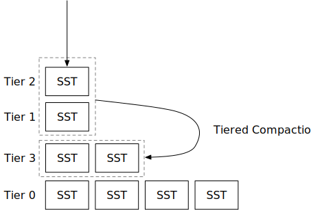

# Tiered Compaction Strategy



In this chapter, you will:

* Implement a tiered compaction strategy and simulate it on the compaction simulator.
* Incorporate tiered compaction strategy into the system.

The tiered compaction we talk about in this chapter is the same as RocksDB's universal compaction. We will use these two terminologies interchangeably.

To copy the test cases into the starter code and run them,

```
cargo x copy-test --week 2 --day 3
cargo x scheck
```

<div class="warning">

It might be helpful to take a look at [week 2 overview](./week2-overview.md) before reading this chapter to have a general overview of compactions.

</div>

## Task 1: Universal Compaction

In this chapter, you will implement RocksDB's universal compaction, which is of the tiered compaction family compaction strategies. Similar to the simple leveled compaction strategy, we only use number of files as the indicator in this compaction strategy. And when we trigger the compaction jobs, we always include a full sorted run (tier) in the compaction job.

### Task 1.0: Precondition

In this task, you will need to modify:

```
src/compact/tiered.rs
```

In universal compaction, we do not use L0 SSTs in the LSM state. Instead, we directly flush new SSTs to a single sorted run (called tier). In the LSM state, `levels` will now include all tiers, where **the lowest index is the latest SST flushed**. Each element in the `levels` vector stores a tuple: level ID (used as tier ID) and the SSTs in that level. Every time you flush L0 SSTs, you should flush the SST into a tier placed at the front of the vector. The compaction simulator generates tier id based on the first SST id, and you should do the same in your implementation.

Universal compaction will only trigger tasks when the number of tiers (sorted runs) is larger than `num_tiers`. Otherwise, it does not trigger any compaction.

### Task 1.1: Triggered by Space Amplification Ratio

The first trigger of universal compaction is by space amplification ratio. As we discussed in the overview chapter, space amplification can be estimated by `engine_size / last_level_size`. In our implementation, we compute the space amplification ratio by `all levels except last level size / last level size`, so that the ratio can be scaled to `[0, +inf)` instead of `[1, +inf]`. This is also consistent with the RocksDB implementation.

When `all levels except last level size / last level size` >= `max_size_amplification_percent * 100%`, we will need to trigger a full compaction.

After you implement this trigger, you can run the compaction simulator. You will see:

```shell
cargo run --bin compaction-simulator tiered
```

```
--- After Flush ---
L3 (1): [3]
L2 (1): [2]
L1 (1): [1]
--- Compaction Task ---
compaction triggered by space amplification ratio: 200
L3 [3] L2 [2] L1 [1] -> [4, 5, 6]
--- After Compaction ---
L4 (3): [3, 2, 1]
```

With this trigger, we will only trigger full compaction when it reaches the space amplification ratio. And at the end of the simulation, you will see:

```
--- After Flush ---
L73 (1): [73]
L72 (1): [72]
L71 (1): [71]
L70 (1): [70]
L69 (1): [69]
L68 (1): [68]
L67 (1): [67]
L40 (27): [39, 38, 37, 36, 35, 34, 33, 32, 31, 30, 29, 28, 27, 26, 25, 24, 23, 22, 13, 14, 15, 16, 17, 18, 19, 20, 21]
```

The `num_tiers` in the compaction simulator is set to 3. However, there are far more than 3 tiers in the LSM state, which incurs large read amplification.

The current trigger only reduces space amplification. We will need to add new triggers to the compaction algorithm to reduce read amplification.

### Task 1.2: Triggered by Size Ratio

The next trigger is the size ratio trigger. For all tiers, if there is a tier `n` that `size of all previous tiers / this tier >= (100 + size_ratio) * 100%`, we will compact all `n` tiers. We only do this compaction with there are more than `min_merge_width` tiers to be merged.

With this trigger, you will observe the following in the compaction simulator:

```
L207 (1): [207]
L204 (3): [203, 202, 201]
L186 (15): [185, 178, 179, 180, 181, 182, 183, 184, 158, 159, 160, 161, 162, 163, 164]
L114 (31): [113, 98, 99, 100, 101, 102, 103, 104, 105, 106, 107, 108, 109, 110, 111, 112, 42, 43, 44, 45, 46, 47, 48, 49, 50, 51, 52, 53, 54, 55, 56]
```

There will be fewer 1-SST tiers and the compaction algorithm will maintain the tiers to have smaller to larger sizes by size ratio. However, when there are more SSTs in the LSM state, there will still be cases that we have more than `num_tiers` tiers. To limit the number of tiers, we will need another trigger.

### Task 1.3: Reduce Sorted Runs

If none of the previous triggers produce compaction tasks, we will do a compaction to reduce the number of tiers. We will simply take the top-most tiers to compact into one tier, so that the final state will have exactly `num_tiers` tiers (if no SSTs are flushed during the compaction).

With this compaction enabled, you will see:

```
L427 (1): [427]
L409 (18): [408, 391, 392, 393, 394, 395, 396, 397, 398, 399, 400, 401, 402, 403, 404, 405, 406, 407]
L208 (31): [207, 192, 193, 194, 195, 196, 197, 198, 199, 200, 201, 202, 203, 204, 205, 206, 58, 59, 60, 61, 62, 63, 64, 65, 66, 67, 68, 69, 70, 71, 72]
```

None of the compaction result will have more than `num_tiers` tiers.

**Note: we do not provide fine-grained unit tests for this part. You can run the compaction simulator and compare with the output of the reference solution to see if your implementation is correct.**

## Task 2: Integrate with the Read Path

In this task, you will need to modify:

```
src/compact.rs
src/lsm_storage.rs
```

As tiered compaction does not use the L0 level of the LSM state, you should directly flush your memtables to a new tier instead of as an L0 SST. You can use `self.compaction_controller.flush_to_l0()` to know whether to flush to L0. You may use the first output SST id as the level/tier id for your new sorted run. You will also need to modify your compaction process to construct merge iterators for tiered compaction jobs.

## Related Readings

[Universal Compaction - RocksDB Wiki](https://github.com/facebook/rocksdb/wiki/Universal-Compaction)

## Test Your Understanding

* What is the estimated write amplification of leveled compaction? (Okay this is hard to estimate... But what if without the last *reduce sorted run* trigger?)
* What is the estimated read amplification of leveled compaction?
* What are the pros/cons of universal compaction compared with simple leveled/tiered compaction?
* How much storage space is it required (compared with user data size) to run universal compaction?
* Can we merge two tiers that are not adjacent in the LSM state?
* What happens if compaction speed cannot keep up with the SST flushes for tiered compaction?
* What might needs to be considered if the system schedules multiple compaction tasks in parallel?
* SSDs also write its own logs (basically it is a log-structured storage). If the SSD has a write amplification of 2x, what is the end-to-end write amplification of the whole system? Related: [ZNS: Avoiding the Block Interface Tax for Flash-based SSDs](https://www.usenix.org/conference/atc21/presentation/bjorling).
* Consider the case that the user chooses to keep a large number of sorted runs (i.e., 300) for tiered compaction. To make the read path faster, is it a good idea to keep some data structure that helps reduce the time complexity (i.e., to `O(log n)`) of finding SSTs to read in each layer for some key ranges? Note that normally, you will need to do a binary search in each sorted run to find the key ranges that you will need to read. (Check out Neon's [layer map](https://neon.tech/blog/persistent-structures-in-neons-wal-indexing) implementation!)

We do not provide reference answers to the questions, and feel free to discuss about them in the Discord community.

{{#include copyright.md}}
