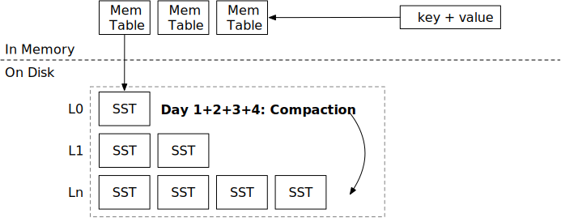

# Leveled Compaction Strategy

In this chapter, you will:

* Implement a leveled compaction strategy and simulate it on the compaction simulator.
* Incorporate leveled compaction strategy into the system.

## Task 1: Leveled Compaction

In chapter 2 day 2, you have implemented the simple leveled compaction strategies. However, the implementation has a few problems:

* Compaction always include a full level. Note that you cannot remove the old files until you finish the compaction, and therefore, your storage engine might use 2x storage space while the compaction is going on (if it is a full compaction). Tiered compaction has the same problem. In this chapter, we will implement partial compaction that we select one SST from the upper level for compaction, instead of the full level.
* SSTs may be compacted across empty levels. As you have seen in the compaction simulator, when the LSM state is empty, and the engine flushes some L0 SSTs, these SSTs will be first compacted to L1, then from L1 to L2, etc. An optimal strategy is to directly place the SST from L0 to the lowest level possible, so as to avoid unnecessary write amplification.

In this chapter, you will implement a production-ready leveled compaction strategy. The strategy is the same as RocksDB's leveled compaction.

### Task 1.1: Compute Target Sizes

### Task 1.2: Decide Base Level

### Task 1.3: Decide Level Priorities

**Note: we do not provide fine-grained unit tests for this part. You can run the compaction simulator and compare with the output of the reference solution to see if your implementation is correct.**

## Task 2: Integrate with the Read Path

## Test Your Understanding

* Finding a good key split point for compaction may potentially reduce the write amplification, or it does not matter at all?
* Imagine that a user was using tiered (universal) compaction before and wants to migrate to leveled compaction. What might be the challenges of this migration? And how to do the migration?
* What if the user wants to migrate from leveled compaction to tiered compaction?
* What needs to be done if a user not using compaction at all decides to migrate to leveled compaction?

We do not provide reference answers to the questions, and feel free to discuss about them in the Discord community.

{{#include copyright.md}}
