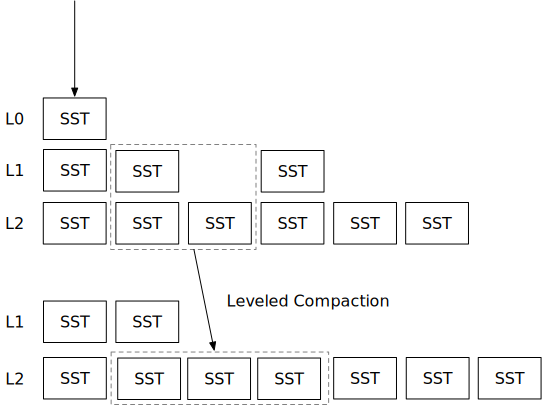

<!--
  mini-lsm-book © 2022-2026 by Alex Chi Z is licensed under CC BY-NC-SA 4.0
-->

# Leveled Compaction Strategy



By the end of this chapter, you will be able to:

* Implement dynamic leveled compaction and simulate it with the compaction simulator.
* Select a base level, rank overfull levels, and compact one upper-level SST with all overlapping lower-level SSTs.
* Incorporate leveled compaction into the engine's read and compaction paths.
* Explain why normal execution and manifest recovery require different result-application steps.

To copy the test cases into the starter code and run them:

```
cargo x copy-test --week 2 --day 4
cargo x scheck
```

<div class="warning">

Read the [Week 2 overview](./week2-overview.md) before beginning this chapter for an introduction to compaction and amplification.

</div>

## Before You Begin

Simple leveled compaction established the basic level structure, but it rewrites whole levels and moves new data through levels whose target size is zero. This chapter makes both task selection and result application depend on SST sizes and key ranges.

Keep these invariants in mind:

1. L0 may overlap and is ordered newest to oldest. Every lower level is sorted by first key and contains non-overlapping SST ranges.
2. The first level with a positive target size is the base level. L0 compaction targets it directly and has priority over size-based tasks.
3. A non-L0 task selects exactly one upper-level SST and every lower-level SST whose inclusive key range overlaps it.
4. The upper source is newer and wins duplicate keys. Tombstones are discarded only when the lower level is the bottom-most level.
5. Applying the result removes exactly the selected files and restores first-key order in the lower level. During manifest replay, the SST objects are not loaded yet, so sorting must be deferred until recovery opens them.

> **Predict before coding:** The selected upper SST covers `[100, 200]`; the lower level contains `[50, 99]`, `[100, 150]`, `[151, 250]`, and `[251, 300]`. Which lower SSTs belong in the task? If the task is being replayed from the manifest before SST metadata is loaded, when can the output files be sorted by first key?

## Task 1: Leveled Compaction

On Day 2, you implemented simple leveled compaction. That strategy has two important limitations:

* Each task includes an entire level. Because input files cannot be removed until the output is complete and durable, full-level compaction can temporarily double the space used by the selected data. Tiered compaction has the same problem. Partial compaction reduces peak space by selecting one upper-level SST at a time.
* New data moves through empty levels. Starting from an empty tree, simple leveled compaction first moves L0 to L1, then L1 to L2, and so on. Sending L0 directly to the lowest level with a positive target size avoids these unnecessary rewrites.

In this chapter, you will implement a more realistic leveled compaction strategy based on RocksDB's design. You will need to modify:

```
src/compact/leveled.rs
```

To run the compaction simulator,

```
cargo run --bin compaction-simulator leveled
```

### Task 1.1: Compute Target Sizes

This strategy needs each SST's size and inclusive first-to-last key range. The simulator supplies mock SST metadata.

First compute the target size of each level. With `base_level_size_mb = 200` and six levels below L0, an empty LSM tree has these targets:

```
[0 0 0 0 0 200MB]
```

Until the bottom level exceeds 200 MB, every intermediate level has a target size of zero. Small databases do not benefit from populating those levels.

Once the bottom level reaches the base size, work upward by dividing each lower target by `level_size_multiplier`. If the bottom contains 300 MB and the multiplier is 10, the targets are:

```
0 0 0 0 30MB 300MB
```

At most *one* level may have a positive target below `base_level_size_mb`. If the bottom level contains 30 GB, the targets are:

```
0 0 30MB 300MB 3GB 30GB
```

Notice in this case L1 and L2 have target size of 0, and L3 is the only level with a positive target size below `base_level_size_mb`.

### Task 1.2: Decide Base Level

To avoid moving SSTs through empty levels, compact L0 with the first level whose target size is positive. For example, given these targets:

```
0 0 0 0 30MB 300MB
```

We will compact L0 SSTs with L5 SSTs if the number of L0 SSTs reaches the `level0_file_num_compaction_trigger` threshold.

Now, you can generate L0 compaction tasks and run the compaction simulator.

```
--- After Flush ---
L0 (1): [23]
L1 (0): []
L2 (0): []
L3 (2): [19, 20]
L4 (6): [11, 12, 7, 8, 9, 10]

...

--- After Flush ---
L0 (2): [102, 103]
L1 (0): []
L2 (0): []
L3 (18): [42, 65, 86, 87, 76, 77, 78, 79, 80, 81, 82, 83, 84, 85, 61, 62, 52, 34]
L4 (6): [11, 12, 7, 8, 9, 10]
```

The number of levels in the compaction simulator is 4. Therefore, the SSTs should be directly flushed to L3/L4.

### Task 1.3: Decide Level Priorities

After checking the L0 trigger, compute each lower level's priority as `current_size / target_size`. Only ratios greater than 1.0 are eligible. Compact the level with the highest priority into the next level. For example:

```
L3: 200MB, target_size=20MB
L4: 202MB, target_size=200MB
L5: 1.9GB, target_size=2GB
L6: 20GB, target_size=20GB
```

The priority of compaction will be:

```
L3: 200MB/20MB = 10.0
L4: 202MB/200MB = 1.01
L5: 1.9GB/2GB = 0.95
```

L3 and L4 are over their targets, while L5 is not. L3 has the highest priority, so the controller selects an L3-to-L4 task. After that task completes, L4 might become eligible for compaction into L5.

### Task 1.4: Select SST to Compact

To avoid compacting a full level, select only the oldest SST in the chosen upper level. SST IDs increase monotonically, so the smallest ID identifies the oldest file.

There are other ways of choosing the compacting SST, for example, by looking into the number of delete tombstones. You can implement this as part of the bonus task.

After choosing the upper SST, find every lower-level SST whose key range overlaps it. The task contains exactly one upper SST and all of those lower SSTs.

When compaction completes, remove the selected files and insert the outputs in the correct lower-level position. In every level except L0, keep SST IDs ordered by first key.

Running the compaction simulator, you should see:

```
--- After Compaction ---
L0 (0): []
L1 (4): [222, 223, 208, 209]
L2 (5): [206, 196, 207, 212, 165]
L3 (11): [166, 120, 143, 144, 179, 148, 167, 140, 189, 180, 190]
L4 (22): [113, 85, 86, 36, 46, 37, 146, 100, 147, 203, 102, 103, 65, 81, 105, 75, 82, 95, 96, 97, 152, 153]
```

The sizes of the levels should be kept under the level multiplier ratio. And the compaction task:

```
Upper L1 [224.sst 7cd080e..=33d79d04]
Lower L2 [210.sst 1c657df4..=31a00e1b, 211.sst 31a00e1c..=46da9e43] -> [228.sst 7cd080e..=1cd18f74, 229.sst 1cd18f75..=31d616db, 230.sst 31d616dc..=46da9e43]
```

...should contain only one SST from the upper level.

**Note: we do not provide fine-grained unit tests for this part. You can run the compaction simulator and compare with the output of the reference solution to see if your implementation is correct.**

## Task 2: Integrate with the Read Path

In this task, you will need to modify:

```
src/compact.rs
src/lsm_storage.rs
```

The integration is similar to simple leveled compaction. Update both `get` and `scan`, as well as the iterators used to execute compaction.

## Chapter Checkpoint

Your controller should now compute dynamic target sizes, send L0 directly to the base level, and otherwise select one SST from the most overfull eligible level. Applying a result must preserve non-overlap and first-key order without requiring SST metadata during manifest replay.

For one simulator task, calculate the target sizes and priorities by hand. Verify the chosen upper SST and enumerate every overlapping lower SST using inclusive endpoints. Then replay the same task with `in_recovery = true` and explain why sorting at that point would fail.

## Related Readings

[Leveled Compaction - RocksDB Wiki](https://github.com/facebook/rocksdb/wiki/Leveled-Compaction)

## Test Your Understanding

### Correctness and Scheduling

* Why does L0 compaction take priority over a lower level with a larger size score?
* Construct an overlap example that fails if endpoint equality is treated as non-overlapping.
* Why must output SSTs be merged with untouched lower-level SSTs and sorted by first key?
* What information is unavailable while manifest records are being replayed, and what phase of recovery makes it available?
* If a new L0 file appears while an L0-to-base-level task runs, how does result application retain it?

### Amplification and Design

* What is the estimated write amplification of leveled compaction?
* What is the estimated read amplification of leveled compaction?
* Finding a good key split point for compaction may potentially reduce the write amplification, or it does not matter at all? (Consider that case that the user write keys beginning with some prefixes, `00` and `01`. The number of keys under these two prefixes are different and their write patterns are different. If we can always split `00` and `01` into different SSTs...)
* Imagine that a user was using tiered (universal) compaction before and wants to migrate to leveled compaction. What might be the challenges of this migration? And how to do the migration?
* And if we do it reversely, what if the user wants to migrate from leveled compaction to tiered compaction?
* What happens if compaction speed cannot keep up with the SST flushes for leveled compaction?
* What must the system consider before scheduling multiple compaction tasks in parallel?
* What is the peak storage usage for leveled compaction? Compared with universal compaction?
* Is it true that with a lower `level_size_multiplier`, you can always get a lower write amplification?
* What needs to be done if a user not using compaction at all decides to migrate to leveled compaction?
* Some people propose to do intra-L0 compaction (compact L0 tables and still put them in L0) before pushing them to lower layers. What might be the benefits of doing so? (Might be related: [PebblesDB SOSP'17](https://www.cs.utexas.edu/~vijay/papers/sosp17-pebblesdb.pdf))
* Consider the case that the upper level has two tables of `[100, 200], [201, 300]` and the lower level has `[50, 150], [151, 250], [251, 350]`. In this case, do you still want to compact one file in the upper level at a time? Why?

We do not provide reference answers to these questions, so feel free to discuss them in the Discord community.

## Bonus Tasks

* **SST Ingestion.** A common optimization of data migration / batch import in LSM trees is to ask the upstream to generate SST files of their data, and directly place these files in the LSM state without going through the write path.
* **SST Selection.** Instead of selecting the oldest SST, you may think of other heuristics to choose the SST to compact.

{{#include copyright.md}}
