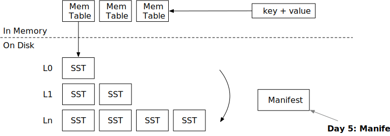

# Manifest



In this chapter, you will:

* Implement encoding and decoding of the manifest file.
* Recover from the manifest when the system restarts.

To copy the test cases into the starter code and run them,

```
cargo x copy-test --week 2 --day 5
cargo x scheck
```

## Task 1: Manifest Encoding

The system uses a manifest file to record all operations happened in the engine. Currently, there are only two types of them: compaction and SST flush. When the engine restarts, it will read the manifest file, reconstruct the state, and load the SST files on the disk.

There are many approaches to storing the LSM state. One of the easiest way is to simply store the full state into a JSON file. Every time we do a compaction or flush a new SST, we can serialize the entire LSM state into a file. The problem with this approach is that when the database gets super large (i.e., 10k SSTs), writing the manifest to the disk would be super slow. Therefore, we designed the manifest to be a append-only file.

In this task, you will need to modify:

```
src/manifest.rs
```

We encode the manifest records using JSON. You may use `serde_json::to_vec` to encode a manifest record to a json, write it to the manifest file, and do a fsync. When you read from the manifest file, you may use `serde_json::Deserializer::from_slice` and it will return a stream of records. You do not need to store the record length or so, as `serde_json` can automatically find the split of the records.


The manifest format is like:

```
| JSON record | JSON record | JSON record | JSON record |
```

Again, note that we do not record the information of how many bytes each record has.

After the engine runs for several hours, the manifest file might get very large. At that time, you may periodically compact the manifest file to store the current snapshot and truncate the logs. This is an optimization you may implement as part of bonus tasks.


## Task 2: Write Manifests

You can now go ahead and modify your LSM engine to write manifests when necessary. In this task, you will need to modify:

```
src/lsm_storage.rs
src/compact.rs
```

For now, we only use two types of the manifest records: SST flush and compaction. SST flush record stores the SST id that gets flushed to the disk. Compaction record stores the compaction task and the produced SST ids. Every time you write some new files to the disk, first sync the files and the storage directory, and then write to the manifest and sync the manifest. The manifest file should be written to `<path>/MANIFEST`.

To sync the directory, you may implement the `sync_dir` function, where you can use `File::open(dir).sync_all()?` to sync it. On Linux, directory is a file that contains the list of files in the directory. By doing fsync on the directory, you will ensure that the newly-written (or removed) files can be visible to the user if the power goes off.

Remember to write a compaction manifest record for both the background compaction trigger (leveled/simple/universal) and when the user requests to do a force compaction.

## Task 3: Flush on Close

In this task, you will need to modify:

```
src/lsm_storage.rs
```

You will need to implement the `close` function. If `self.options.enable_wal = false` (we will cover WAL in the next chapter), you should flush all memtables to the disk before stopping the storage engine, so that all user changes will be persisted.

## Task 4: Recover from the State

In this task, you will need to modify:

```
src/lsm_storage.rs
```

Now, you may modify the `open` function to recover the engine state from the manifest file. To recover it, you will need to first generate the list of SSTs you will need to load. You can do this by calling `apply_compaction_result` and recover SST ids in the LSM state. After that, you may iterate the state and load all SSTs (update the sstables hash map). During the process, you will need to compute the maximum SST id and update the `next_sst_id` field. After that, you may create a new memtable using that id and increment the id by one.

If you have implemented leveled compaction, you might have sorted the SSTs every time you apply the compaction result. However, with manifest recover, your sorting logic will be broken, because during the recovery process, you cannot know the start key and the end key of each of the SST. To resolve this, you will need to read the `in_recovery` flag of the `apply_compaction_result` function. During the recovery process, you should not attempt to retrieve the first key of the SST. After the LSM state is recovered and all SSTs are opened, you can do a sorting at the end of the recovery process.

Optionally, you may include the start key and the end key of each of the SSTs in the manifest. This strategy is used in RocksDB/BadgerDB, so that you do not need to distinguish the recovery mode and the normal mode during the compaction apply process.

You may use the mini-lsm-cli to test your implementation.

```
cargo run --bin mini-lsm-cli
fill 1000 2000
close
cargo run --bin mini-lsm-cli
get 1500
```

## Test Your Understanding

* When do you need to call `fsync`? Why do you need to fsync the directory?
* What are the places you will need to write to the manifest?
* Consider an alternative implementation of an LSM engine that does not use a manifest file. Instead, it records the level/tier information in the header of each file, scans the storage directory every time it restarts, and recover the LSM state solely from the files present in the directory. Is it possible to correctly maintain the LSM state in this implementation and what might be the problems/challenges with that?
* Currently, we create all SST/concat iterators before creating the merge iterator, which means that we have to load the first block of the first SST in all levels into memory before starting the scanning process. We have start/end key in the manifest, and is it possible to leverage this information to delay the loading of the data blocks and make the time to return the first key-value pair faster?
* Is it possible not to store the tier/level information in the manifest? i.e., we only store the list of SSTs we have in the manifest without the level information, and rebuild the tier/level using the key range and timestamp information (SST metadata).

## Bonus Tasks

* **Manifest Compaction.** When the number of logs in the manifest file gets too large, you can rewrite the manifest file to only store the current snapshot and append new logs to that file.
* **Parallel Open.** After you collect the list of SSTs to open, you can open and decode them in parallel, instead of doing it one by one, therefore accelerating the recovery process.

{{#include copyright.md}}
