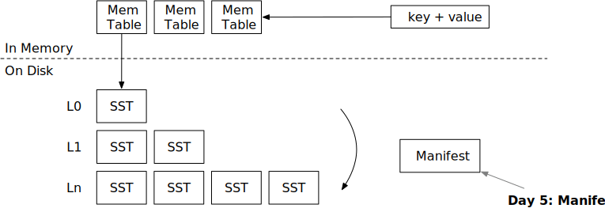

<!--
  mini-lsm-book © 2022-2025 by Alex Chi Z is licensed under CC BY-NC-SA 4.0
-->

# Manifest



By the end of this chapter, you will be able to:

* Encode and append structural changes to the manifest.
* Order SST, directory, and manifest synchronization so recovery never references an SST that was not made durable.
* Replay manifest records, open the live SSTs, and restore the next unused file ID.
* Flush all memtables during a clean close when WALs are disabled.

To copy the test cases into the starter code and run them:

```
cargo x copy-test --week 2 --day 5
cargo x scheck
```

## Before You Begin

Until this chapter, `LsmStorageState` is authoritative only while the process is running. The SST files survive a restart, but filenames alone do not say which files are live, which level or tier owns them, or which compaction replaced them.

Keep these invariants in mind:

1. The manifest is an ordered, append-only log of structural state changes. Replaying every record from an empty state must reconstruct the same live file layout.
2. An SST file and its directory entry must be durable before a manifest record is allowed to reference it.
3. A file made obsolete by a durable manifest record may be deleted afterward. Recovery must tolerate the old file still being present because it is no longer part of the logical state.
4. Manifest replay determines the live SST IDs before the engine opens SST metadata. Leveled SSTs are sorted by first key only after all live files have been opened.
5. `next_sst_id` must be greater than every ID observed in recovered SSTs and, after Day 6, memtables.

> **Predict before coding:** The engine has written and synced a new SST but crashes before appending its flush record. What state should recovery produce, and what kind of file is left behind? Now reverse the unsafe order: the manifest is synced before the new SST's directory entry. What can recovery attempt to open after a power loss?

## Task 1: Manifest Encoding

The system uses a manifest to record structural operations in the engine. For now, there are two record types: compaction and SST flush. On restart, the engine reads the manifest, reconstructs the logical state, and opens the referenced SST files.

One simple design would rewrite the complete state as JSON after every flush or compaction. That approach becomes expensive when the database contains thousands of SSTs, so Mini-LSM uses an append-only manifest instead.

In this task, you will need to modify:

```
src/manifest.rs
```

Encode each record as JSON with `serde_json::to_vec`, append it, and synchronize the manifest. During recovery, `serde_json::Deserializer::from_slice` can stream adjacent JSON values without an explicit record length.


The manifest format is like:

```
| JSON record | JSON record | JSON record | JSON record |
```

At this stage, the format does not store each record's byte length. Day 7 will add explicit framing and checksums.

Over time, the manifest can become large. A production engine can periodically replace it with a snapshot of the current state followed by a fresh log; this is a bonus task.


## Task 2: Write Manifests

Now append manifest records whenever the LSM structure changes. You will need to modify:

```
src/lsm_storage.rs
src/compact.rs
```

For now, the manifest has two record types: SST flush and compaction. An SST flush record stores the ID written to disk. A compaction record stores the task and its output SST IDs. Whenever an operation creates files, first sync those files and the storage directory. Only then append the corresponding manifest record and sync the manifest. Delete obsolete input files after that record is durable, then sync the directory again. The manifest file should be written to `<path>/MANIFEST`.

Implement `sync_dir` with `File::open(dir).sync_all()?`. Synchronizing a file persists its contents; synchronizing the directory persists additions and removals of filenames.

Append a compaction record for both background compaction and a user-requested full compaction.

## Task 3: Flush on Close

In this task, you will need to modify:

```
src/lsm_storage.rs
```

Implement `close`. When `self.options.enable_wal` is false, flush every non-empty memtable before stopping the engine so a clean shutdown preserves all writes.

## Task 4: Recover from the State

In this task, you will need to modify:

```
src/lsm_storage.rs
```

Modify `open` to replay the manifest into an initially empty LSM state. Apply flush and compaction records to recover the live SST IDs, then open those files and populate the `sstables` map. Track the maximum ID, create a new memtable with the next ID, and advance `next_sst_id` again.

Leveled compaction normally sorts result IDs by first key. During manifest replay, however, the SST objects and their key ranges are not loaded yet. Honor `apply_compaction_result`'s `in_recovery` flag and defer sorting. Once every live SST is open, sort each leveled run by first key.

Alternatively, store each SST's key range in the manifest, as systems such as RocksDB and BadgerDB do. Result application could then use the same ordering logic during recovery and normal execution.

You may use the mini-lsm-cli to test your implementation.

```
cargo run --bin mini-lsm-cli
fill 1000 2000
close
cargo run --bin mini-lsm-cli
get 1500
```

## Chapter Checkpoint

After a clean close without WALs, the engine should have no non-empty memtables. Reopening it should replay the manifest, open exactly the referenced SSTs, restore leveled ordering after metadata becomes available, and allocate an ID greater than every recovered file ID.

Write down the durable events for one flush and one compaction. Insert a hypothetical crash after each event and determine whether recovery sees the old state or the new state. Both outcomes can be valid at some boundaries; a manifest state that references a missing file is not.

## Test Your Understanding

### Recovery and Durability

* When do you need to call `fsync`? Why do you need to fsync the directory?
* What are the places you will need to write to the manifest?
* Why must newly created SSTs and their directory entries be synced before the manifest record that references them?
* Why is it safe for an obsolete SST to remain on disk after the compaction record is durable? Is it safe to delete the SST before that point?
* During recovery, why can leveled compaction results not be sorted by first key while manifest records are being replayed?
* Construct a record sequence containing flushes and compactions, replay it by hand, and compute the next unused SST ID.

### Alternative Designs

* Consider an alternative implementation of an LSM engine that does not use a manifest file. Instead, it records the level/tier information in the header of each file, scans the storage directory every time it restarts, and recover the LSM state solely from the files present in the directory. Is it possible to correctly maintain the LSM state in this implementation and what might be the problems/challenges with that?
* Currently, we create all SST/concat iterators before creating the merge iterator, which means that we have to load the first block of the first SST in all levels into memory before starting the scanning process. We have start/end key in the manifest, and is it possible to leverage this information to delay the loading of the data blocks and make the time to return the first key-value pair faster?
* Is it possible not to store the tier/level information in the manifest? i.e., we only store the list of SSTs we have in the manifest without the level information, and rebuild the tier/level using the key range and timestamp information (SST metadata).

## Bonus Tasks

* **Manifest Compaction.** When the number of logs in the manifest file gets too large, you can rewrite the manifest file to only store the current snapshot and append new logs to that file.
* **Parallel Open.** After you collect the list of SSTs to open, you can open and decode them in parallel, instead of doing it one by one, therefore accelerating the recovery process.

{{#include copyright.md}}
