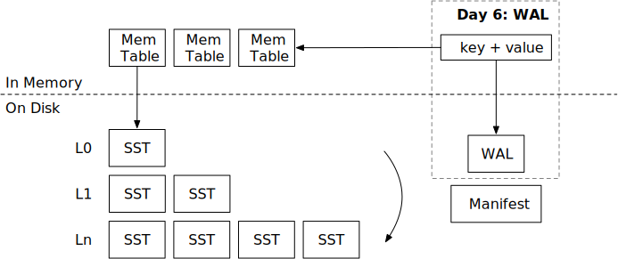

# Write-Ahead Log (WAL)



In this chapter, you will:

* Implement encoding and decoding of the write-ahead log file.
* Recover memtables from the WALs when the system restarts.

To copy the test cases into the starter code and run them,

```
cargo x copy-test --week 2 --day 6
cargo x scheck
```

## Task 1: WAL Encoding

In this task, you will need to modify:

```
src/wal.rs
```

In the previous chapter, we have implemented the manifest file, so that the LSM state can be persisted. And we implemented the `close` function to flush all memtables to SSTs before stopping the engine. Now, what if the system crashes (i.e., powered off)? We can log memtable modifications to WAL (write-ahead log), and recover WALs when restarting the database. WAL is only enabled when `self.options.enable_wal = true`.

The WAL encoding is simply a list of key-value pairs.

```
| key_len | key | value_len | value |
```

You will also need to implement the `recover` function to read the WAL and recover the state of a memtable.

Note that we are using a `BufWriter` for writing the WAL. Using a `BufWriter` can reduce the number of syscalls into the OS, so as to reduce the latency of the write path. The data is not guaranteed to be written to the disk when the user modifies a key. Instead, the engine only guarantee that the data is persisted when `sync` is called. To correctly persist the data to the disk, you will need to first flush the data from the buffer writer to the file object by calling `flush()`, and then do a fsync on the file by using `get_mut().sync_all()`. Note that you *only* need to fsync when the engine's `sync` gets called. You *do not* need to fsync every time on writing data.

## Task 2: Integrate WALs

In this task, you will need to modify:

```
src/mem_table.rs
src/wal.rs
src/lsm_storage.rs
```

`MemTable` has a WAL field. If the `wal` field is set to `Some(wal)`, you will need to append to the WAL when updating the memtable. In your LSM engine, you will need to create WALs if `enable_wal = true`. You will also need update the manifest using the `ManifestRecord::NewMemtable` record when new memtable is created.

You can create a memtable with WAL by using the `create_with_wal` function. WAL should be written to `<memtable_id>.wal` in the storage directory. The memtable id should be the same as the SST id if this memtable gets flushed as an L0 SST.

## Task 3: Recover from the WALs

In this task, you will need to modify:

```
src/lsm_storage.rs
```

If WAL is enabled, you will need to recover the memtables based on WALs when loading the database. You will also need to implement the `sync` function of the database. The basic guarantee of `sync` is that the engine is sure that the data is persisted to the disk (and will be recovered when it restarts). To achieve this, you can simply sync the WAL corresponding to the current memtable.

```
cargo run --bin mini-lsm-cli -- --enable-wal
```

Remember to recover the correct `next_sst_id` from the state, which should be `max{memtable id, sst id}` + 1. In your `close` function, you should not flush memtables to SSTs if `enable_wal` is set to true, as WAL itself provides persistency. You should wait until all compaction and flush threads to exit before closing the database.

## Test Your Understanding

* When should you call `fsync` in your engine? What happens if you call `fsync` too often (i.e., on every put key request)?
* How costly is the `fsync` operation in general on an SSD (solid state drive)?
* When can you tell the user that their modifications (put/delete) have been persisted?
* How can you handle corrupted data in WAL?

We do not provide reference answers to the questions, and feel free to discuss about them in the Discord community.

{{#include copyright.md}}
