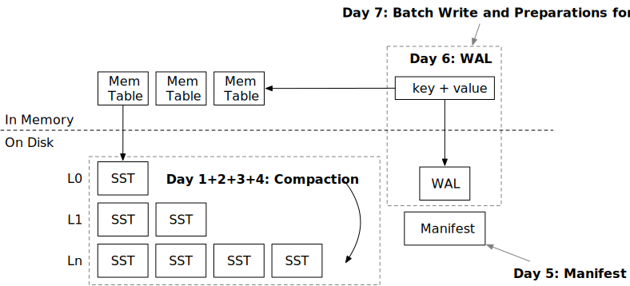
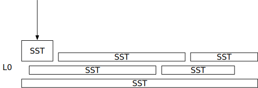
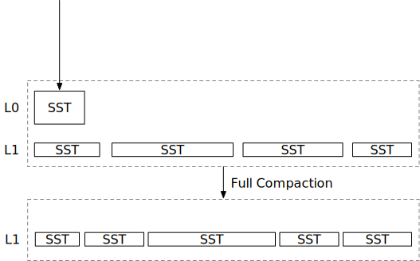
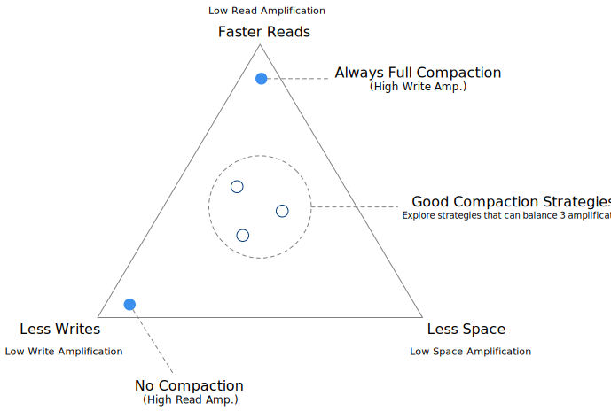
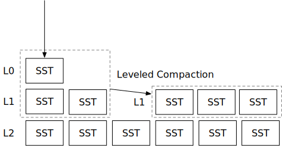
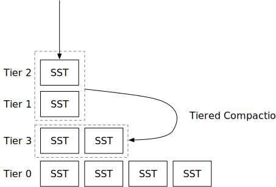

<!--
  mini-lsm-book © 2022-2026 by Alex Chi Z is licensed under CC BY-NC-SA 4.0
-->

# Week 2 Overview: Compaction and Persistence



In Week 1, you built the core structures of an LSM storage engine and implemented its read and write interfaces. This week, you will organize SSTs on disk, compare compaction strategies, and make the engine recoverable. The first four chapters progress from the mechanics of one compaction to increasingly realistic scheduling policies. The final three chapters persist the LSM state and unflushed writes, then protect every on-disk format with checksums.

| Chapter | Before | After |
| --- | --- | --- |
| [Day 1: Compaction Implementation](./week2-01-compaction.md) | Every flushed SST remains in L0. | The engine can merge L0 and L1 into a non-overlapping sorted run and read through it efficiently. |
| [Day 2: Simple Leveled Compaction](./week2-02-simple.md) | Compaction runs only when requested explicitly. | A background controller maintains several levels using file-count ratios. |
| [Day 3: Tiered/Universal Compaction](./week2-03-tiered.md) | Every strategy writes new SSTs through L0. | The engine can maintain newest-to-oldest tiers and trade read and space amplification for fewer rewrites. |
| [Day 4: Leveled Compaction](./week2-04-leveled.md) | Simple leveled compaction rewrites entire levels and moves data through empty levels. | Dynamic target sizes and partial compaction reduce unnecessary rewrites and peak space usage. |
| [Day 5: Manifest](./week2-05-manifest.md) | The LSM's file layout exists only in memory. | An append-only manifest reconstructs the durable SST layout after a restart. |
| [Day 6: Write-Ahead Log (WAL)](./week2-06-wal.md) | Unflushed writes survive only a clean close. | WAL-backed memtables make acknowledged, synchronized writes recoverable after a crash. |
| [Day 7: Batch Write and Checksums](./week2-07-snacks.md) | Writes are submitted one at a time, and corrupted files may be consumed silently. | The engine accepts write batches and verifies the integrity of its SSTs, manifest, and WALs. |

## How to Use This Week

Compaction code can produce plausible-looking output while violating version order, retaining stale files, or deleting tombstones too early. Persistence code can pass restart tests while still using an unsafe write order. Treat each chapter as an exercise in preserving invariants, not only as an exercise in matching simulator output.

For each chapter:

1. Write down the ordering and ownership invariants before implementing the task.
2. Predict the next compaction task or recovered state for the chapter's small example.
3. Run the focused tests and compare simulator output with the reference implementation where instructed.
4. Trace one overwrite and one deletion through the new structure. For persistence chapters, also trace a crash between each pair of durable writes.
5. Answer the correctness questions with a concrete state, execution, or corrupted byte sequence.

The simulator measures useful structural properties, but it does not prove that reads return the newest value or that concurrent flushes are retained. Likewise, a successful reopen test exercises only a few possible crash points. Use the chapter checkpoints to review the cases that automated validation does not cover.

## Compaction and Read Amplification

Let us begin with compaction. In the previous part, you flushed each memtable to an L0 SST. Imagine that you have written gigabytes of data and now have 100 overlapping SSTs. Without filters, one point read might need to probe all 100 files. **Read amplification** is the amount of physical read work required for one logical read; in this simplified example, it is the number of blocks read from disk.

To reduce read amplification, we can merge the L0 SSTs into files with non-overlapping key ranges. A point lookup then needs to inspect at most one candidate SST in that group. The merge-and-rewrite process is **compaction**, and an ordered collection of non-overlapping SSTs is a **sorted run**.

To make this process clearer, let us take a look at this concrete example:

```
SST 1: key range 00000 - key 10000, 1000 keys
SST 2: key range 00005 - key 10005, 1000 keys
SST 3: key range 00010 - key 10010, 1000 keys
```

The three SSTs have overlapping key ranges, so a lookup for key 02333 might probe all of them. After compaction, the engine might produce these three SSTs:

```
SST 4: key range 00000 - key 03000, 1000 keys
SST 5: key range 03001 - key 06000, 1000 keys
SST 6: key range 06000 - key 10010, 1000 keys
```

The engine merges SSTs 1, 2, and 3, resolves duplicate keys, and splits the sorted result to avoid producing one oversized file. The three output SSTs have non-overlapping ranges, so a lookup for key 02333 needs to inspect only SST 4.

## Two Extremes of Compaction and Write Amplification

The example suggests two extremes: never compact, or run a full compaction after every flush.

Compaction consumes CPU and I/O because it reads input files and writes replacement files. Never compacting avoids rewrites but causes high read amplification. Always running full compaction lowers read amplification but repeatedly rewrites the entire database.



<p class="caption">No Compaction at All</p>



<p class="caption">Always compact when new SST being flushed</p>

**Write amplification** is the ratio of total physical bytes written to the logical bytes flushed into the LSM tree. With no compaction, the ratio is 1x because each SST is written once and never rewritten. Compacting everything after every flush has very high write amplification: after 100 equal-sized flushes, the engine rewrites approximately 2 + 3 + ... + 100 SSTs' worth of data. It therefore writes about 5,000 SSTs' worth for 100 SSTs of logical input, or roughly 50x write amplification.

A good compaction strategy balances read, write, and space amplification. A general-purpose LSM storage engine cannot minimize all three simultaneously unless it can exploit a specific workload pattern. Because compaction happens in the background, the engine can select a strategy and tune its parameters as the workload changes. Compaction policy is therefore an explicit choice about which costs to trade for others.



A common production workload begins with a high-throughput bulk ingest and later shifts to small online transactions. During ingestion, the engine can favor low write amplification. Before serving the online workload, it can retune compaction for lower read amplification and reorganize the existing data.

For a time-series workload, users might append and expire data in time order. Such a pattern can have low amplification even with little compaction. In practice, observe the workload and its requirements rather than selecting a policy from aggregate ratios alone.

## Compaction Strategies Overview

Compaction strategies control the number and sizes of sorted runs to keep read amplification within a chosen bound. They generally fall into two categories: leveled and tiered.

In leveled compaction, the user specifies a maximum number of levels, excluding L0. Each level is one sorted run. A compaction merges data from two adjacent levels and places the output in the lower one, so a relatively small sorted run is often merged into a much larger run. Target level sizes grow geometrically according to a configured multiplier.



In tiered compaction, each flush can create a new sorted run, or tier, and the engine merges tiers to control their count. The policy often merges runs of similar sizes, reducing write amplification compared with repeatedly merging a small run into a large one. Allowing too many tiers, however, increases read amplification. This course implements RocksDB's universal compaction, a tiered strategy.



## Space Amplification

The most intuitive measure of **space amplification** is the physical space used by the LSM engine divided by the logical size of the live user data. Tombstones and obsolete versions consume space until compaction can remove them.

The engine cannot know the exact logical data size without scanning for obsolete versions. One practical estimate divides the total SST size by the last level's size. This estimate assumes a steady-state workload whose logical size remains roughly constant: the bottom level approximates an older complete snapshot, while upper levels contain subsequent changes. After a full compaction moves all live data to the bottom, the estimate approaches 1x.

Compaction also requires temporary space because its input files cannot be removed before the output is complete and durable. A full compaction may therefore require free space comparable to the current database size.

The compaction simulator visualizes each scheduling decision and reports its amplification statistics. The tests check only a few structural properties, so inspect the simulator output closely and compare it with the reference implementation.

## Persistence

After implementing the compaction algorithms, you will add two persistence components: the manifest, which records structural changes to the LSM tree, and the WAL, which preserves memtable updates before they are flushed to SSTs. Together they let the engine reconstruct both its on-disk layout and its unflushed state after a restart.

If you do not want to explore every compaction policy, complete Days 1 and 2 and then continue to persistence. Universal compaction and dynamic leveled compaction are not required to build a working Week 2 engine.

## Snack Time

After implementing compaction and persistence, we will have a short chapter on implementing the batch write interface and checksums.

Before moving to Week 3, check that you can explain:

- how every compaction input is ordered and why the newest version wins;
- when a tombstone may be discarded and why dropping it earlier can resurrect a value;
- how leveled and tiered policies trade read, write, and space amplification;
- how a compaction result is installed without losing an L0 flush that completed concurrently;
- which facts belong in the manifest and which bytes belong in a WAL;
- the required durable-write order for creating and deleting files;
- what each checksum covers and how a decoder finds that exact byte range.

{{#include copyright.md}}
